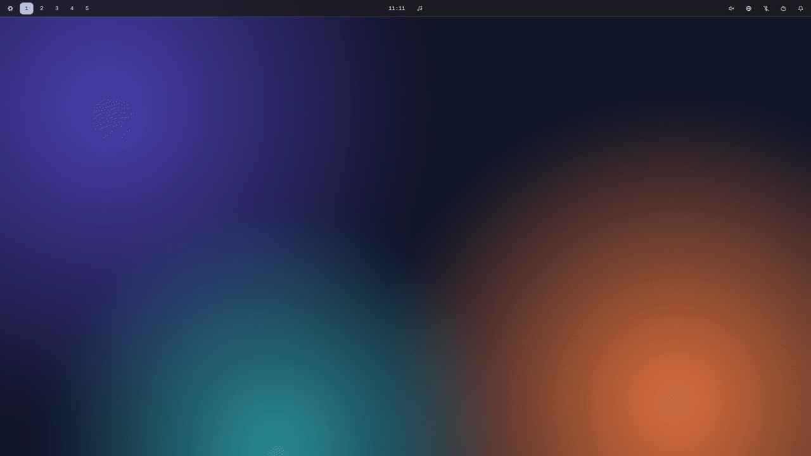
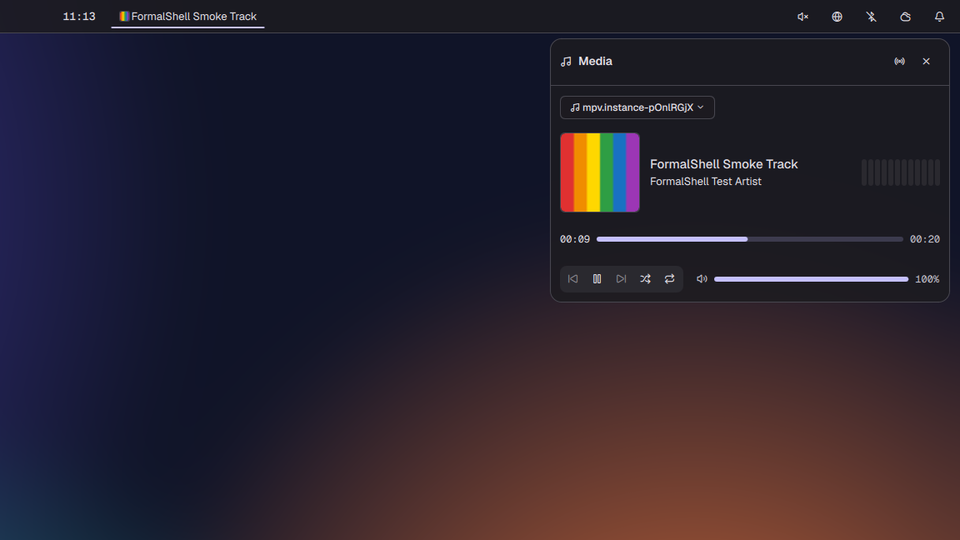
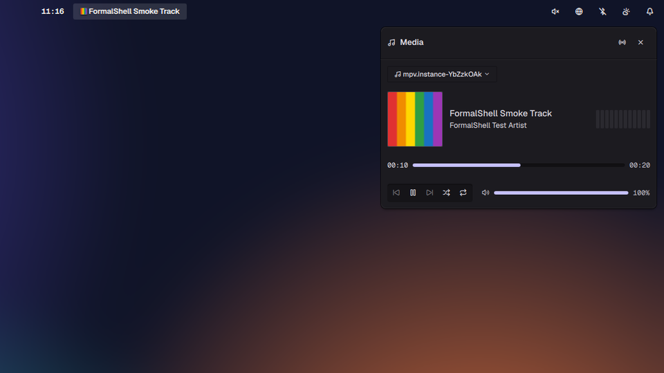
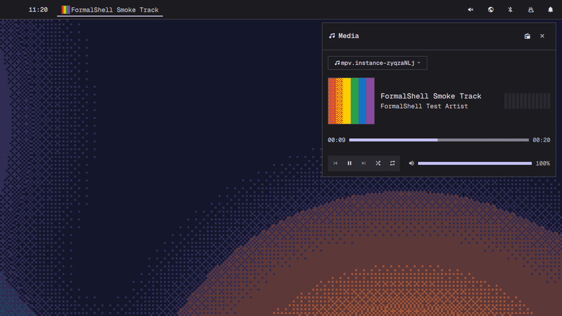
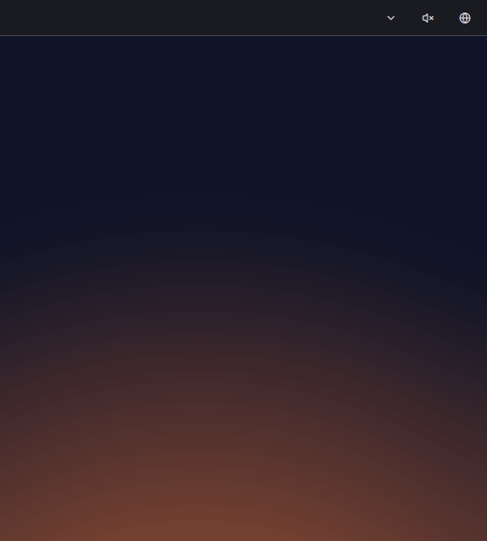
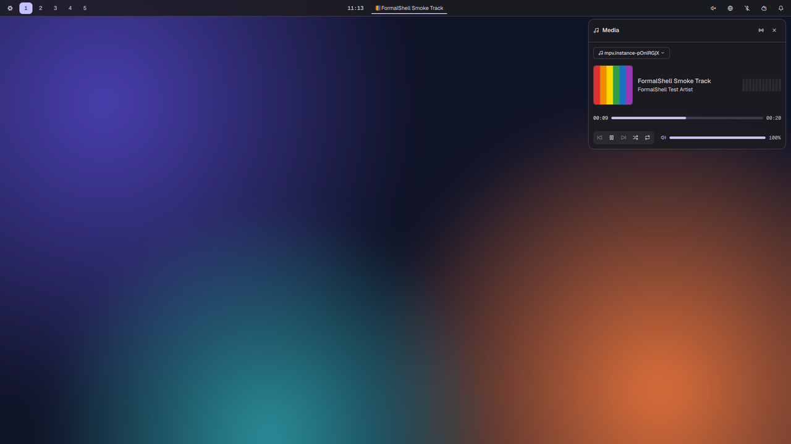
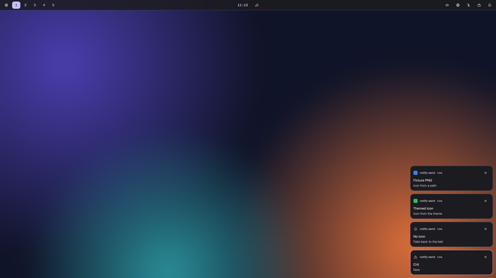
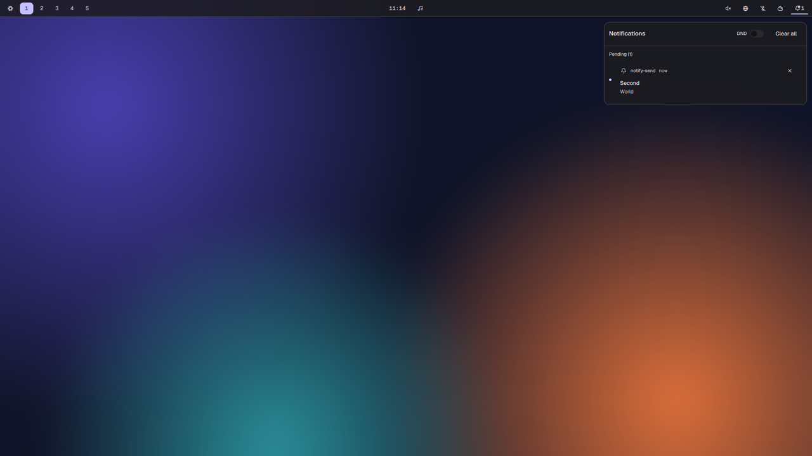
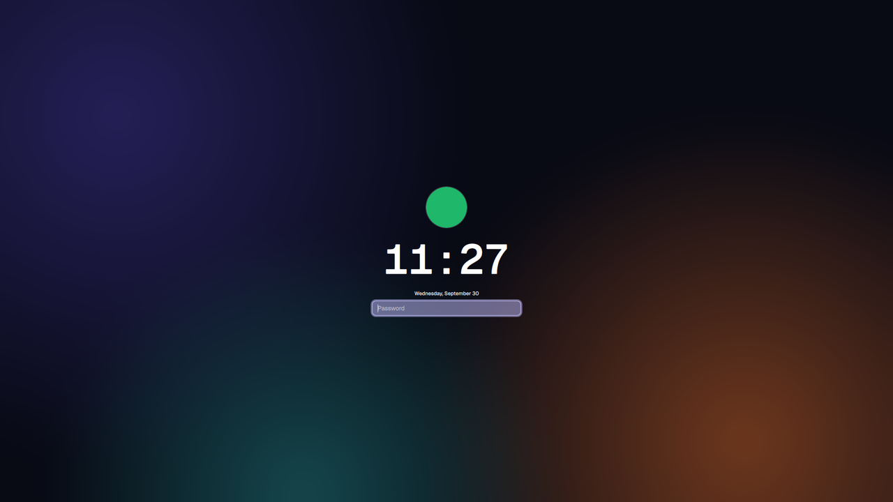
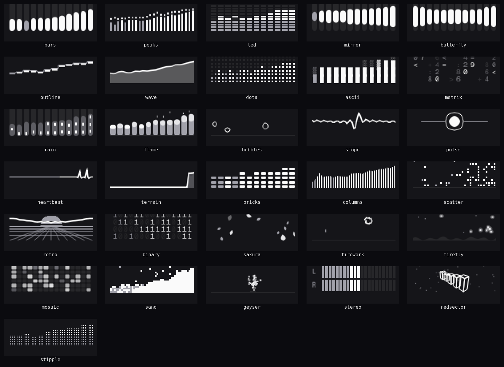

```

  ▄▄▄▄▄▄▄                       ▄▄   ▄▄▄▄▄              ▄▄ ▄▄
 █▀██▀▀▀                         ██ ██▀▀▀▀█▄ █▄          ██ ██
   ██        ▄    ▄              ██ ▀██▄  ▄▀ ██          ██ ██
   ███▀▄███▄ ████▄███▄███▄ ▄▀▀█▄ ██   ▀██▄▄  ████▄ ▄█▀█▄ ██ ██
 ▄ ██  ██ ██ ██   ██ ██ ██ ▄█▀██ ██ ▄   ▀██▄ ██ ██ ██▄█▀ ██ ██
 ▀██▀ ▄▀███▀▄█▀  ▄██ ██ ▀█▄▀█▄██▄██ ▀██████▀▄██ ██▄▀█▄▄▄▄██▄██
```

[](https://github.com/FormalSnake/FormalShell/actions/workflows/ci.yml)
[](flake.nix)
[](https://quickshell.org/)
[](#install)
[](docs/SWITCHOVER.md)
[](LICENSE)

A desktop shell for [Hyprland](https://hypr.land), written in QML on
[QuickShell](https://quickshell.org/). One process draws the bar, launcher,
panels, notifications, lock screen, greeter and screensaver, and every colour
comes from your wallpaper through matugen. Everything is reachable from the
keyboard and drivable over IPC.



**Pre-alpha.** [`docs/SWITCHOVER.md`](docs/SWITCHOVER.md) tracks what has run
on real hardware and what has only run in a VM.

## Themes

`theme.preset` picks one of three looks. The palette follows the wallpaper in
all of them.

| `metamorphosis` (default) | `pantheon` | `retro` |
| :---: | :---: | :---: |
|  |  |  |
| shadcn chrome, translucent cards that bud off the bar's line | elementary OS 8: raised controls, sunken fields, cards on a soft cast | square, mono, Nerd Font glyphs, dithered imagery |



## What's in it

- Launcher: apps, clipboard history, calculator, emoji, `nix run`,
  your keybinds, wallpapers, Wi-Fi, Bluetooth, audio devices, radio,
  toggles, and a `select`/`input` mode that replaces dmenu.
- Bar: workspaces with live window previews, now playing, tray, and a
  chevron that tucks cells away into a second bar. Top, bottom, left or right.
- Panels: audio, network, Bluetooth, calendar, weather, power, displays,
  system monitor, media with synced lyrics and 31 visualizer styles, iPhone
  and AirPods, and more.
- Notifications: toasts, a history centre, grouping and DND.
- Alt+Tab switcher with window thumbnails.
- Capture: screenshots with a region picker, screen recording, OCR and a
  colour picker.
- Lock screen and greeter over PAM, and a [ttfx](https://github.com/omacom-io/ttfx)
  screensaver.
- Night light, caffeinate, reminders, polkit agent, LocalSend, AirPlay.

A widget with nothing behind it says so (`NO ADAPTER`, `NO PLAYER`) instead of
inventing data. That holds for every screenshot here.

| | |
| :---: | :---: |
| <br>Now playing | <br>Notifications |
| <br>Notification centre | <br>Lock screen |



## Install

FormalShell is a Nix flake with three modules: home-manager for the shell,
NixOS for the system pieces it needs (PAM for the lock screen, geoclue,
NetworkManager, bluez, upower, power-profiles-daemon, pipewire, polkit), and
an optional greeter.

```nix
{
  inputs.formalshell.url = "github:FormalSnake/FormalShell";

  outputs = { nixpkgs, home-manager, formalshell, ... }: {
    nixosConfigurations.mymachine = nixpkgs.lib.nixosSystem {
      system = "x86_64-linux";
      modules = [
        formalshell.nixosModules.formalshell
        { services.formalshell.enable = true; }

        home-manager.nixosModules.home-manager
        {
          home-manager.users.me = {
            imports = [ formalshell.homeModules.default ];
            programs.formalshell = {
              enable = true;
              package = formalshell.packages.x86_64-linux.default;
            };
          };
        }
      ];
    };
  };
}
```

The home-manager module starts the shell as a systemd user service on
`graphical-session.target`. Every service the NixOS module enables is
`mkDefault`, so your own config wins.

Optional login screen:

```nix
imports = [ formalshell.nixosModules.formalshell-greeter ];
services.formalshell-greeter = {
  enable = true;
  package = formalshell.packages.x86_64-linux.formalshell-greeter;
  sessionCommand = [ "Hyprland" ];
};
```

Then wire up Hyprland. The default binds, blur layer rules and palette reads
ship as a Lua file: copy
`<store-path>/share/formalshell/examples/hyprland/formalshell.lua` to
`~/.config/hypr/`, fill in `<store-path>` at its `fs_call` line, and load it:

```lua
-- ~/.config/hypr/hyprland.lua
dofile(os.getenv("HOME") .. "/.config/hypr/formalshell.lua")
```

## Usage

| chord | does |
| --- | --- |
| `Super+Space` | launcher |
| `Super+Alt+Space` | apps |
| `Super+Ctrl+V` | clipboard history |
| `Super+Ctrl+E` | emoji |
| `Super+Ctrl+Space` | wallpaper picker |
| `Super+Ctrl+A` / `W` / `B` | audio / network / Bluetooth panel |
| `Super+Ctrl+L` | lock |
| `Print` | screenshot |
| `Alt+Tab` | window switcher |
| `Super+K` | every bind, searchable |

Everything else goes through IPC:

```sh
alias fs='qs ipc --any-display -p <store-path>/share/formalshell call'

fs wallpaper set ~/Pictures/wall.jpg   # recolours the whole desktop
fs theme mode toggle                   # dark / light
fs panel toggle calendar
fs notifications toggleDnd
```

Config is `~/.config/formalshell/settings.json`, or
`programs.formalshell.settings` from home-manager. The shell only reads it;
its own state goes to `$XDG_STATE_HOME/formalshell/state.json`.

```jsonc
{
  "theme": { "preset": "pantheon", "mode": "auto" },
  "bar": { "position": "bottom" }
}
```

[`docs/USAGE.md`](docs/USAGE.md) has every config key, IPC verb and bind.

## Development

```sh
nix develop   # qs, qmllint, qmltestrunner, matugen, just
just build
just test     # headless qmltestrunner over tests/
just lint     # nix flake check
just smoke --menu --showcase
```

`just smoke` boots the shell in a throwaway nested Hyprland session on a
private D-Bus, drives the surfaces its flags name, screenshots them and tears
down, so the lock screen and notification server never touch your real
session. Each flag is a file under [`dev/smoke.d/`](dev/smoke.d/). On a Mac,
`just vm-smoke` runs the same thing in a headless NixOS VM.

## Credits

Built on [QuickShell](https://quickshell.org/). The architecture and much of
the interaction language come from [Omarchy](https://github.com/basecamp/omarchy)'s
`quattro` branch. Service patterns borrowed from
[DankMaterialShell](https://github.com/AvengeMedia/DankMaterialShell) (MIT,
attributed in each ported file).

MIT licensed. See [`LICENSE`](LICENSE).
