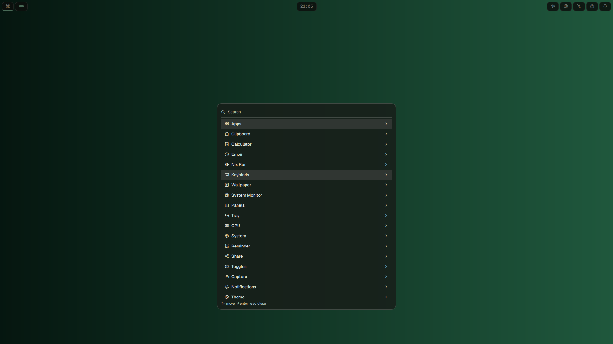
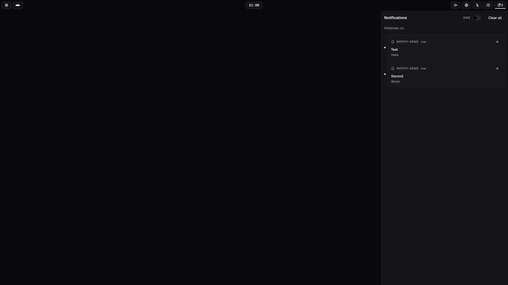
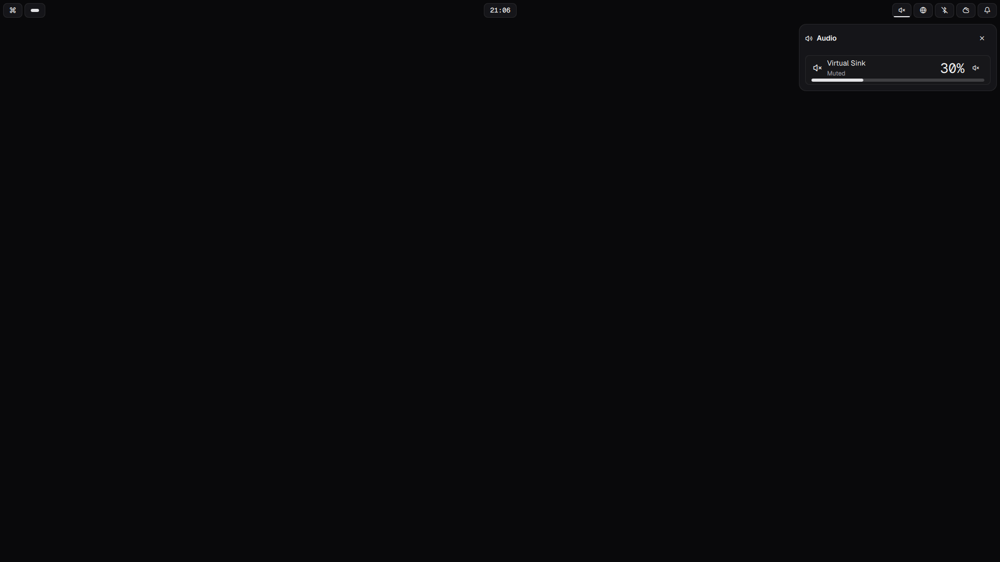
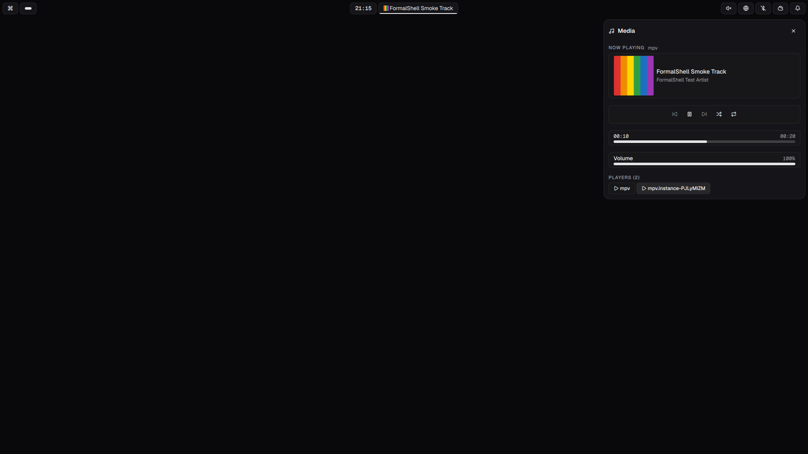
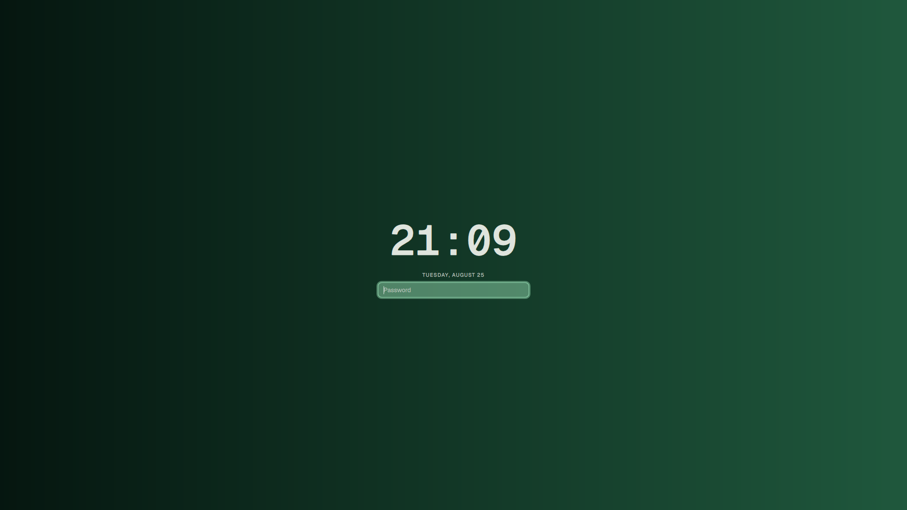
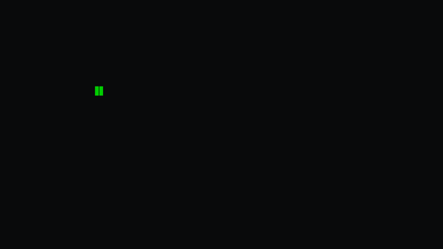
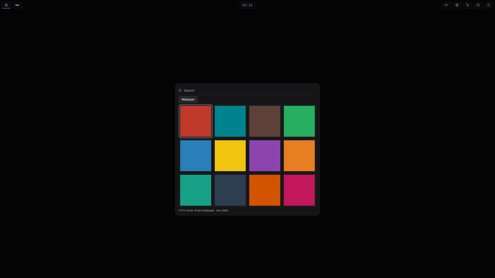

# Using FormalShell

Every surface the shell puts on screen, what you can configure about it, and
what you can drive over IPC. The product overview is in
[`README.md`](../README.md); the development and verification loop is in
[`CLAUDE.md`](../CLAUDE.md).

- [Conventions](#conventions)
- [Bar](#bar)
- [Theming](#theming)
- [Menu](#menu)
- [Notifications](#notifications)
- [OSD](#osd)
- [Panels](#panels)
- [System monitor](#system-monitor)
- [Clipboard](#clipboard)
- [Quake console](#quake-console)
- [Calendar](#calendar)
- [Now playing](#now-playing)
- [Lock screen](#lock-screen)
- [Polkit](#polkit)
- [Night light](#night-light)
- [Screensaver](#screensaver)
- [Hot corners](#hot-corners)
- [Picker](#picker)
- [Screenshots](#screenshots)
- [Text and color capture](#text-and-color-capture)
- [Screen recording](#screen-recording)
- [Reminders](#reminders)
- [Plugins](#plugins)
- [Instance lock](#instance-lock)

## Conventions

**Config.** The shell reads `~/.config/formalshell/settings.json` and never
writes to it. Every JSON sample below is a fragment of that file, so merge it
into what you already have. On NixOS the same fragment goes through the
home-manager module, which generates the file for you:

```jsonc
// ~/.config/formalshell/settings.json
{ "motion": { "enabled": false } }
```

```nix
# home-manager
programs.formalshell.settings.motion.enabled = false;
```

Attribute paths are the reason most of the Nix samples below fit on one line.
Anything the shell needs to remember for itself (wallpaper, mode, frecency,
pending reminders) goes to `$XDG_STATE_HOME/formalshell/state.json` instead,
which is the shell's file, not yours.

**IPC.** Everything is driven through QuickShell's IPC, and the full
invocation is a mouthful, so define it once:

```sh
# <store-path> is the installed shell, e.g. /nix/store/...-formalshell-0.1
alias fs='qs ipc --any-display -p <store-path>/share/formalshell call'
```

Every example from here on is written against that alias: `fs menu summon`,
`fs theme status`, and so on.

**Binds** need the whole thing spelled out:

```conf
bind = SUPER, Space, exec, qs ipc --any-display -p <store-path>/share/formalshell call menu summon
```

## Keybinds

Every default bind ships as
[`docs/examples/hyprland/formalshell.conf`](examples/hyprland/formalshell.conf),
next to the blur layer rules and the `source` line for the colours file. A
nix install carries the same file at
`<store-path>/share/formalshell/examples/hyprland/formalshell.conf`. Copy it
beside your own config, fill in `<store-path>` once at the `$fs` line, and
source it:

```conf
# ~/.config/hypr/hyprland.conf
source = ~/.config/hypr/formalshell.conf
```

Fifty binds in three groups. Utilities:

| chord | action |
| --- | --- |
| `SUPER+SPACE` | `menu toggle`, the root launcher |
| `SUPER+ALT+SPACE` | `menu summon apps` |
| `SUPER+CTRL+E` | `menu summon emoji` |
| `SUPER+CTRL+C` | `menu summon capture` |
| `SUPER+CTRL+O` | `menu summon toggles` |
| `SUPER+CTRL+S` | `menu summon share` |
| `SUPER+CTRL+R` | `menu summon reminder` |
| `SUPER+ESCAPE` | `menu summon system` |
| `SUPER+K` | `menu summon keybinds`, this table as the shell sees it |
| `SUPER+CTRL+Q` | `menu summon calc` |
| `SUPER+CTRL+SPACE` | `menu summon wallpaper`, the picker grid |
| `SUPER+SHIFT+CTRL+SPACE` | `menu summon theme` |
| `SUPER+CTRL+A` / `B` / `W` / `P` / `D` / `ALT+D` | `panel toggle audio` / `bluetooth` / `network` / `power` / `display` / `calendar` |
| `SUPER+CTRL+1..9` | `panel toggleAt n` |
| `SUPER+comma` / `SHIFT` / `ALT` / `SHIFT+ALT` | `notifications dismissOne` / `dismissAll` / `invokeLast` / `showHistory` |
| `SUPER+CTRL+comma` | `notifications toggleDnd` |
| `SUPER+CTRL+I` | `screensaver stayAwakeToggle`, the idle inhibitor |
| `SUPER+CTRL+N` | `nightlight toggle` |
| `SUPER+SHIFT+SPACE` | `bar chevron toggle` |
| `SUPER+CTRL+L` | `lock lock` |
| `PRINT` | `screenshot pick smart default`, the picker with the toolbar |
| `SUPER+CTRL+PRINT` | `capture text`, OCR straight to the clipboard |
| `ALT+PRINT` | `record toggle screen none` |

Media keys change the value first and then tell the OSD to show it, because
brightness is read on demand and has no signal of its own to watch:
`XF86AudioRaiseVolume` / `LowerVolume` / `Mute` run `wpctl` then
`osd volume`, `XF86MonBrightnessUp` / `Down` run `brightnessctl` then
`osd brightness`, and `XF86AudioPlay` / `Pause` / `Next` / `Prev` go
straight to `media playPause` / `next` / `previous`. All of them are bound
with Hyprland's `l` flag so they keep working over the lock screen.

Clipboard is one bind, `SUPER+CTRL+V` for `menu summon clipboard`.

Three of Omarchy's chords have no matching verb in this shell yet, so they
are bound to the nearest one: `SUPER+CTRL+SPACE` opens the wallpaper picker
instead of advancing to the next wallpaper, `SUPER+SHIFT+SPACE` collapses
the bar's chevron group instead of hiding the whole bar, and `SUPER+CTRL+I`
toggles Stay Awake, which is the idle inhibitor rather than the screensaver
itself.

## Bar

Three regions, `left`, `center` and `right`, each independently reorderable.
You need no config at all to get the default arrangement:

```jsonc
// ~/.config/formalshell/settings.json
{
  "bar": {
    "layout": {
      "left": ["launcher", "workspaces", "activeWindow"],
      "center": ["clock", "nowPlaying"],
      "right": ["battery", "audio", "network", "bluetooth", "weather", "tray", "bell", "indicators", "custom:cpu"]
    },
    "modules": [
      { "id": "cpu", "type": "command", "command": ["my-cpu-script"], "interval": 5000, "timeout": 5000 }
    ]
  }
}
```

```nix
# home-manager
programs.formalshell.settings.bar = {
  layout = {
    left = [ "launcher" "workspaces" "activeWindow" ];
    center = [ "clock" "nowPlaying" ];
    right = [ "battery" "audio" "network" "bluetooth" "weather" "tray" "bell" "indicators" "custom:cpu" ];
  };
  modules = [
    { id = "cpu"; type = "command"; command = [ "my-cpu-script" ]; interval = 5000; timeout = 5000; }
  ];
};
```

The default arrangement is exactly what you see above minus `custom:cpu`.
Everything else is opt-in and never shows up until you name it: `chevron`,
`github`, `usage`, `tailscale`, `visualizer`, `microphone`,
`keyboardLayout`, `systemUpdate`, `airpods`, `dualsense`, `display`,
`monitor`.

Naming a region replaces it wholesale, so spell out the builtins you still
want alongside the new one. Two cells are easy to lose that way: `bell` in
the right region, and `launcher` at the head of the left region, which is the
only way to open the menu with a mouse.

```jsonc
// ~/.config/formalshell/settings.json
{
  "bar": {
    "layout": {
      "right": ["microphone", "keyboardLayout", "systemUpdate", "battery", "audio", "network", "bluetooth", "weather", "tray", "bell", "indicators"]
    }
  },
  "systemUpdate": { "flakeDir": "/home/youruser/.config/nix" }
}
```

```nix
# home-manager
programs.formalshell.settings = {
  bar.layout.right = [
    "microphone" "keyboardLayout" "systemUpdate" "battery" "audio"
    "network" "bluetooth" "weather" "tray" "bell" "indicators"
  ];
  systemUpdate.flakeDir = "/home/youruser/.config/nix";
};
```

A region you leave out falls back to its default (leaving out `bar`
entirely does the same for all three). A region set to `[]` stays empty. An
unknown name, or a `"custom:<id>"` with no matching module, is dropped with
a console warning rather than taking the bar down. `"plugin:<id>"` places a
drop-in bar plugin, see [Plugins](#plugins).

### Custom modules

`bar.modules[]` entries are placed by `"custom:<id>"` and come in two types.

**`command`** runs an argv array every `interval` ms (default 5000) and
parses stdout as Waybar-compatible JSON:
`{"text": "…", "tooltip": "…", "class": "…"}`. `text` is the cell, `tooltip`
is that cell's hover card, used verbatim. `class: "warning"` fills the cell
with the accent, `"critical"` or `"urgent"` fills it with the urgent color,
anything else renders plain. A non-zero exit, a run past `timeout` (ms,
default 5000), malformed JSON, or a binary that isn't there all render the
same `MODULE ERROR` cell with no tooltip, never a stale value.

**`qml`** loads an absolute `source` path into a `Loader`. A file that fails
to parse or import becomes the same `MODULE ERROR` cell. A file that loads
gets exactly the engine access any builtin widget has (`qs.Core`,
`qs.Services`, `Process`), so this is isolation of load failures, not a
sandbox.

### What each cell does

**Workspaces** shows one cell per visible workspace, sorted by the
compositor's own per-output ordinal. A workspace renders only if it holds a
window or is focused, so nine persistent named workspaces with two windows
open show two cells, not nine.

**Active window** leads with the focused window's themed icon and app name,
title following in dim. No matching desktop entry falls back to the raw app
id with the title in front; nothing focused hides the cell.

**Tray** renders every `org.kde.StatusNotifierItem` on the session bus as
its own cell. Left click activates, middle click secondary-activates, right
click opens the item's DBusMenu. Items whose `ItemIsMenu` flag says so get
the menu on left click too. The menu is drawn by the shell as a card
under the cell: disabled rows dim, a checked row takes the cursor fill, and
submenus expand in place instead of cascading. The strip has no length limit
of its own; bounding a long tray is the chevron's job.

**Chevron** collapses the cells on one side of itself behind a single cell,
and expands them again on click. In a left or center region it governs what
follows it; in a right region it governs what precedes it, so the group
opens inward and nothing outboard of the chevron ever moves.

```jsonc
// ~/.config/formalshell/settings.json
{ "bar": { "layout": { "right": ["bluetooth", "weather", "tray", "bell", "indicators", "chevron", "battery", "audio", "network"] } } }
```

```nix
# home-manager
programs.formalshell.settings.bar.layout.right = [
  "bluetooth" "weather" "tray" "bell" "indicators" "chevron" "battery" "audio" "network"
];
```

Only the first chevron in a region survives, and a chevron with nothing on
its governed side is dropped, both with a warning: a control that collapses
nothing is worse than no control.

```sh
fs bar chevron status              # which regions collapse, and what is hidden now
fs bar chevron toggle              # expand | collapse | toggle | status
fs bar chevronAt expand right      # spell out the region when several regions have one
```

**Bell** is always visible: a bell glyph, bell-off while DND is on, plus a
count of whatever is sitting in the pending tier. Left click toggles the
notification center, right click flips DND.

**Indicators** appear only while something is true, and the slot vanishes
otherwise. In order: a live screen recording (the one urgent-filled cell
here, click to stop, elapsed time in the tooltip so a ticking label can't
relayout the bar), the soonest pending reminder as a countdown (`12:30 / 3`
once more than one is set, click fires the summary), stay-awake, and night
light.

**Weather** shows a condition glyph and the rounded current temperature
(`14°`), refreshed every `weather.intervalMs` (default 900000) and on every
panel open. The glyph has day and night variants and picks by your local
clock. Before the first fetch, or with no location fix, the cell stays a dim
glyph rather than inventing a reading.

**GitHub** polls one `gh api graphql` call every `github.intervalMs`
(default 300000) for open PRs you authored and open issues assigned to you,
rendered as `N/M`. Click opens the panel rather than a browser. No `gh` on
PATH hides the cell; `gh` present but logged out reads `NO AUTH`; anything
else reads `NO GH`.

**Tailscale** is one glyph, dim while stopped, normal while connected,
polling `tailscale status --json` every `tailscale.intervalMs` (default
60000). Missing binary or unreachable daemon keeps the cell hidden until
some real answer lands. Anything short of `Running`, `NeedsLogin` included,
stays dim.

**Usage** shows the worst rate-limit window across Claude Code and Codex,
each toggleable with `usage.claude` and `usage.codex` (both default true),
polled every `usage.intervalMs` (default 900000). At 90% or more the cell
goes fully urgent. Clicking a stale Claude leg also refreshes its OAuth pair
before the panel opens.

**Visualizer** puts a live six-bar ASCII spectrum (`▁▂▃▄▅▆▇█`) next to
`nowPlaying`, driven by a shared `cava` process reading real audio over
PipeWire. It exists only while something is genuinely playing, a bar showing
it is on screen, and motion is enabled; otherwise the process is killed and
the row falls back to its flat baseline rather than freezing on a last
frame. No `cava` on PATH reads `NO CAVA`.

The generated `cava.conf` is tuned rather than left at defaults, none of it
configurable: `autosens` off in favour of a fixed 800% sensitivity (auto-gain
renormalizes a quiet passage to full scale, so nothing appears to respond),
`monstercat = 1.5` so six bars read as one spectrum, `noise_reduction = 35`
to catch transients, and a 12kHz top cutoff so the last bar has cymbals to
draw. Levels map to glyphs by square root, and anything under level 2 snaps
flat.

**Microphone** is one glyph for the default capture source. Click mutes,
middle click opens the audio panel, and there is no percentage or wheel
handler because a mic reads as on or off. No capture device at all reads
`NO MIC`, and the cell stays visible, since hiding a cell you opted into
would be the lie.

**Keyboard layout** shows the short form of the active layout, read-only.
Hyprland's `switchxkblayout` needs a device name that has never been verified
against real hardware, so click-to-cycle is not wired up. Fewer than two
configured layouts hides the cell. A compositor that can't be asked reads
`NO LAYOUT`. The value is polled every 2 seconds per output, since Hyprland
publishes no layout event, so an N-monitor session spawns N processes per
tick.

**System update** counts how many of a flake's direct inputs are behind
upstream and fills the cell with the warning color while any are. It answers
exactly one question, *are my flake inputs behind their upstream refs*, and
not *does my running system differ from a rebuild*. Unset `flakeDir` reads
`NO FLAKE` forever rather than checking something else.

```jsonc
// ~/.config/formalshell/settings.json
{ "systemUpdate": { "flakeDir": "/home/youruser/.config/nix", "intervalMs": 10800000 } }
```

```nix
# home-manager
programs.formalshell.settings.systemUpdate = {
  flakeDir = "/home/youruser/.config/nix";
  intervalMs = 10800000;
};
```

Three hours is the default cadence because learning upstream's rev costs one
network round trip per input: a GitHub API call per github input, a
`git ls-remote` per git forge. Unauthenticated GitHub allows 60 requests an
hour per IP, and a 403 lands in the unknown bucket rather than in `current`.
Input types with no cheap probe (`path`, `tarball`, `indirect`, sourcehut)
stay `?`.

**AirPods** shows an earbuds glyph and the worse of the two buds as `NN%`.
The case is left out of that number (a full case next to a dead bud would
read backwards) but joins the tooltip's `L 97 / R 99 / CASE 80`. With no
`librepods` daemon running the cell is hidden entirely, so a host with no
AirPods pays nothing.

**DualSense** shows a gamepad glyph and battery percent, polled every 30
seconds, hidden with no controller present, warning-filled at 20% or less
and urgent at 10% or less. The panel behind it is read-only: the shell never
writes the lightbar or the player LEDs.

**Display** is a single monitor glyph with no value text, since the display
panel is a consult surface with no one number to summarize. It is always
visible once placed. `bar.widgets.display.showLabel` (default on) adds a
`DISPLAY` caption.

**Monitor** shows `CNN% MNN%` for CPU and memory, adding `GNN%` only when
some GPU actually reports a busy fraction (amdgpu, or NVIDIA with
`nvidia-smi` on PATH; i915 and xe never do). Any of them can render as a
dash on the first tick, because a delta needs two samples.
`bar.widgets.monitor.showLabel` (default off) adds a `MONITOR` caption.

### Tooltips

Hovering a cell for 400ms opens a card 6px under it naming what the cell is
and what it currently reads. It tracks the value live rather than freezing
at hover time, flips above the cell when there is no room below it, and
passes clicks and hovers straight through to whatever is underneath. The
400ms is a delay rather than an animation, so `motion.enabled: false` keeps
it.

The card anchors to whatever owns it, in any window: a bar cell, a row
inside a panel, or a panel header's own icon button (the close button reads
`Close`). A panel being open no longer suppresses it.

Cells that carry one: workspaces (`WORKSPACE 2 / 3 WINDOWS`), audio, battery
(percent plus `FULL IN 1H 20M` or `2H 5M LEFT` when UPower has an estimate),
network (`WI-FI / <ssid> 62%`, `NETWORK / WIRED`, `NETWORK / OFFLINE`),
bluetooth, weather, now playing (artist plus the full title the cell is
scrolling), bell, every tray item (its own SNI tooltip text, another
process's words, never reworded), github, tailscale, the stay-awake and
night-light glyphs, and `command` modules. Unavailable states ride along as
themselves: `BLUETOOTH / NO ADAPTER`, `GITHUB / NOT AUTHENTICATED`,
`WEATHER / UNAVAILABLE`. A cell with nothing to say shows no card.

### Clicks

| Widget | Left | Right | Middle / scroll |
| --- | --- | --- | --- |
| Clock | Calendar panel | Cycle the format ring | Middle: calendar panel |
| Weather | Forecast panel | Refresh | Middle: forecast panel |
| Audio | Audio panel | Mute | Scroll: volume |
| Battery | Power panel | Toggle the percentage | Middle: power panel |
| Network | Network panel | Toggle the Wi-Fi radio | Middle: network panel |
| Bluetooth | Bluetooth panel | Toggle the adapter radio | Middle: bluetooth panel |
| Now playing | Media panel | Next track | Scroll: previous/next |
| Microphone | Mute | none | Middle: audio panel |

### Tray IPC

```sh
fs tray status              # {"items":[…]}
fs tray activate <id>       # same as left-clicking the cell
fs tray menu <id>           # same as right-clicking it
fs tray menucursor <delta>  # move the open menu's cursor
fs tray menuactivate        # Enter on the cursor row
```

## Theming

Colors come out of your wallpaper, with no restart anywhere in the loop:

1. `wallpaper set` persists the path to `state.json`.
2. `ThemeEngine` builds a merged matugen config (your own
   `~/.config/matugen/config.toml`, the shell's template registrations, your
   `[templates.*]` blocks, then any `*.toml` in
   `~/.config/formalshell/matugen.d/`) and runs matugen against the image.
   Runs are serialized, and a wallpaper change mid-run supersedes the
   pending one rather than killing the one in flight.
3. The output is published atomically to
   `$XDG_STATE_HOME/formalshell/theme.json`,
   `$XDG_CONFIG_HOME/hypr/formalshell-colors.conf` and
   `$XDG_CONFIG_HOME/hypr/formalshell-colors.lua`.
4. The shell's color singleton watches `theme.json`, so every token
   recolors on the next paint. Hyprland re-reads a `source`d colours file
   itself; for the Lua one the shell runs `hyprctl reload` once per publish,
   and only when `HYPRLAND_INSTANCE_SIGNATURE` is set.

With no wallpaper set, `theme.json` is written from the bundled shadcn zinc
palette instead, in the variant matching the current mode, so
`theme mode toggle` flips the whole shell through the same file write a
matugen run uses.

```sh
fs wallpaper set /path/to/image.jpg
fs theme mode toggle          # dark <-> light
fs theme status               # {"wallpaper":…,"mode":…,"themeJsonPresent":…}
```

`theme.json` is the entire contract: shadcn's own role names, each with a
static fallback, merged per key, so an older file missing newer roles still
works:

| role | meaning |
| --- | --- |
| `background` | canvas |
| `foreground` | content ink |
| `card` | panel and popup surface step, with `cardForeground` |
| `popover` | tooltip and tray-menu surface step, with `popoverForeground` |
| `primary` | the wallpaper's own color, with `primaryForeground` |
| `secondary` | a neutral fill step, with `secondaryForeground` |
| `muted` | a dimmer neutral fill, with `mutedForeground` for meta ink |
| `accent` | the neutral hover fill (not the wallpaper color), with `accentForeground` |
| `destructive` | critical and error, with `destructiveForeground` |
| `warning` | degraded and low, the second loud color, with `warningForeground` |
| `border` | rules and control borders |
| `input` | text-field borders |
| `ring` | the keyboard-focus halo, carries the wallpaper color |
| `chart1`..`chart5` | a five-step ramp for graphs |

Anything that writes those keys themes the shell. matugen is the
shipped default, and a pywal template ships alongside it
(`shell/Theme/templates/pywal-theme.json.tmpl`): drop it at
`~/.config/wal/templates/pywal-theme.json`, run `wal -i <image>`, and point
its output at `$XDG_STATE_HOME/formalshell/theme.json`. The file watch picks
up any writer.

`formalshell-colors.conf` is the same palette in hyprlang, written to your
own Hyprland config directory so window borders track the wallpaper:

```conf
$primary = rgb(9ecafc)
$primaryForeground = rgb(00325a)
$background = rgb(101418)
$foreground = rgb(e0e2e8)
$border = rgb(42474e)
$destructive = rgb(ffb4ab)
$warning = rgb(bdc9d3)
```

Source it once, above anything that uses the variables. Hyprland watches
every file it sourced, so each rewrite reloads the borders on its own and
nothing calls back into the compositor:

```conf
# ~/.config/hypr/hyprland.conf
source = ~/.config/hypr/formalshell-colors.conf

general {
    col.active_border = $primary
    col.inactive_border = $border
}
```

The file exists from the shell's first run whether or not a wallpaper is
set: with none, the bundled zinc palette renders the same seven variables,
so the `source` line never points at nothing.

Hyprland 0.55 replaced hyprlang with Lua, and a `hyprland.lua` cannot
`source` hyprlang, so the same seven roles also ship as
`formalshell-colors.lua`, a table a `dofile` returns:

```lua
-- ~/.config/hypr/hyprland.lua
local colors = {
  primary = "rgb(9ecafc)",
  border = "rgb(42474e)",
  destructive = "rgb(ffb4ab)",
}
local ok, loaded = pcall(dofile, os.getenv("HOME") .. "/.config/hypr/formalshell-colors.lua")
if ok and type(loaded) == "table" then colors = loaded end

hl.config({
  general = { col = { active_border = colors.primary, inactive_border = colors.border } },
})
```

Keep the literal table as a fallback: the file is absent until the shell's
first run, and `pcall` is what stops that from killing the rest of the
config. A `dofile`d file is not a `source`d one, so Hyprland does not watch
it; the shell runs `hyprctl reload` itself after every publish, which is
what re-runs the config and picks the new colours up. That call only fires
when `HYPRLAND_INSTANCE_SIGNATURE` is set, so nothing spawns a doomed
`hyprctl` under niri.

### Radius, icons and translucency

`theme.radius` sets the corner radius root every surface derives its
`sm`/`md`/`lg`/`xl` steps from (shadcn's own `--radius`, default 10).
`theme.icons` picks which glyph set `Icon { name: "…" }` renders: `lucide`
(the default, the bundled Lucide icon font) or `nerd` (the same mono font
every other glyph in the shell already uses). A name missing from a set
falls back to that set's own `circle-help`.

`theme.surfaceOpacity` (0 to 1, default 0.85) is the alpha of the bar
cells, the panels and the launcher card. The shell blurs nothing itself:
that alpha is what lets a compositor blur read through. On Hyprland, copy
this repo's `docs/examples/hyprland/formalshell.conf` next to your own
config and source it: it turns the blur on and points it at the
`formalshell:bar`, `formalshell:panel` and `formalshell:menu` layer
namespaces, and it carries the whole default bind set (fill in the
`<store-path>` at the top of the file first). Under a compositor with blur
off the same alpha reads as a tint. Toasts, the OSD, the notification
centre and the lock screen stay opaque either way.

```conf
# ~/.config/hypr/hyprland.conf
source = ~/.config/hypr/formalshell.conf
```

The shell asks fontconfig for `sans-serif` and `monospace` and never names
a family, so the pair of faces is yours to pick. Geist Sans and Geist Mono
are what the design targets:

```jsonc
// ~/.config/formalshell/settings.json
{ "theme": { "radius": 10, "icons": "lucide", "surfaceOpacity": 0.85 } }
```

```nix
# home-manager
programs.formalshell.settings.theme = { radius = 10; icons = "lucide"; surfaceOpacity = 0.85; };

# NixOS
fonts.packages = [ pkgs.geist-font ];
fonts.fontconfig.defaultFonts.sansSerif = [ "Geist" ];
fonts.fontconfig.defaultFonts.monospace = [ "Geist Mono" ];
```

### Wallpaper dither

The wallpaper renders through a 90s limited-palette pass: six colors are
derived from the image by median cut, each cell takes its nearest one, and a
4×4 Bayer dither mixes it with its second nearest in proportion to how far
between the two it sits. A photo comes out as flat bands with dithered
transitions, and a solid wallpaper stays perfectly flat, since its own color
is in its own palette and there is nothing to mix it with.

The grid is sized in screen pixels rather than source pixels: cells are the
screen's long edge over 480, floored at 2px, so a 4000px photo and a 1200px
one land on the same grid, and a 4K screen gets bigger cells instead of four
times as many. The image is cover-cropped first with nearest-neighbor, so
the scale never introduces a color the file didn't have.

matugen reads the wallpaper file itself, never this rendering, so the dither
can't influence the color scheme. It is off by default: the wallpaper draws
as the file has it. Turn it on for the limited-palette look, and raise the
palette for a subtler pass, since more colors means less of the image dithers
at all:

```jsonc
// ~/.config/formalshell/settings.json
{ "wallpaper": { "dither": true, "ditherColors": 12 } }
```

```nix
# home-manager
programs.formalshell.settings.wallpaper = { dither = true; ditherColors = 12; };
```

`lock.dither` is the same pass over the lock screen's own backdrop, with the
same default.

### Motion

Transitions run off a small set of tokens: 100ms for hover fills, 130ms for
surfaces entering and leaving, one ease-out curve, opacity plus a 6px
translate. No scale, no bounce, and end states are pixel-identical to the
unanimated shell. Full-bleed selection swaps are states rather than
transitions and stay instant.

Two carve-outs. A new wallpaper fades in over 400ms with the old one still
painted underneath instead of hard-cutting. The now-playing title scrolls at
about 30px/s with a 2 second hold at the loop start, but only when the title
actually overflows its cell and the bar is on screen.

Wayland has no `prefers-reduced-motion` to inherit, so the shell has its own
switch. It zeroes every duration, including the wallpaper fade, and turns
the marquee back into a plain elide:

```jsonc
// ~/.config/formalshell/settings.json
{ "motion": { "enabled": false } }
```

```nix
# home-manager
programs.formalshell.settings.motion.enabled = false;
```

## Menu

One keyboard-driven surface is the app launcher, the system menu, and a
dmenu replacement at once. Summon it, type, press Enter.



### The tree

The shipped tree is `shell/Menu/default-menu.jsonc`, a flat object keyed by
dotted id, so `system.power.reboot` implies `system` and `system.power` and
creates them as submenus if you never declared them. A node's kind comes
from its keys: `action` runs a command, `target` links to another node,
`provider` is filled in at build time (the `apps` node is how every
installed `.desktop` entry becomes a row), and anything else is a plain
submenu.

`when` and `checked` are shell conditions, batched into one process per
condition when the menu opens and never per keystroke. `when: "false"` hides
a node outright; anything else has its exit code decide, which is how
`system.logout` guards on `test -n "$HYPRLAND_INSTANCE_SIGNATURE"`.

Typing at any level searches the whole tree, with one exception. A node
marked `"routeOnly": true` is searched only while you are standing inside
it; from the root, the route row itself matches but its children don't. The
shipped tree uses it for `Panels` and `Tray`, both of which name their rows
after things the launcher already lists somewhere else, so a search for
`equibop` returns the app once instead of once per route that mentions it.

Normal navigation never shows a row whose `when` hasn't resolved true, but
`menu summon <route>` reaches a node by id and skips that check. Landing on
a level whose own condition isn't satisfied gives you one dim
`UNAVAILABLE` row rather than children that would each exit 127 on Enter.
The condition keeps resolving in the background, so the row updates the
moment it lands.

### Overrides

`~/.config/formalshell/menu.jsonc` merges over the default tree per key, so
you override one field without redeclaring a node, and `"hidden": true`
removes a default entry and its whole subtree:

```jsonc
// ~/.config/formalshell/menu.jsonc
{
    "system.suspend": { "hidden": true },
    "system.custom-user-node": { "label": "My Script", "action": "~/bin/my-script" }
}
```

```nix
# home-manager, if you would rather keep it in the flake
xdg.configFile."formalshell/menu.jsonc".text = builtins.toJSON {
  "system.suspend".hidden = true;
  "system.custom-user-node" = { label = "My Script"; action = "~/bin/my-script"; };
};
```

Two keys are about how a node reads rather than what it does. `section` is
the heading its row sits under, which is how the root splits into
`Suggestions` and `Commands`, and `prompt` is what the search field says
while you are standing inside that node. Both override per key like any
other field, so moving your own row into the suggestions block is one line:

```jsonc
// ~/.config/formalshell/menu.jsonc
{
    "system.custom-user-node": { "section": "Suggestions", "prompt": "Search my scripts" }
}
```

Rows are never reordered to build a group, so a `section` only reads as one
block while the entries carrying it are declared together.

For the common case of an extra entry under `System`, there is a config key
and no jsonc needed. `confirm: true` makes the row wait for a second Enter
(`CONFIRM <label>?`) before it runs:

```jsonc
// ~/.config/formalshell/settings.json
{
  "menu": {
    "customPowerButtons": [
      { "label": "Windows", "icon": "󰖳", "command": "systemctl reboot --boot-loader-entry=auto-windows", "confirm": true }
    ]
  }
}
```

```nix
# home-manager
programs.formalshell.settings.menu.customPowerButtons = [
  { label = "Windows"; icon = "󰖳"; command = "systemctl reboot --boot-loader-entry=auto-windows"; confirm = true; }
];
```

### Apps

Rows show the entry's display name and its icon-theme icon rendered at the
glyph cell's size, radius 0, no border. An icon the theme can't resolve
leaves the row without a leading image rather than drawing a broken box.

Enter on an app that already has a window focuses that window instead of
starting a second copy, and pressing it again cycles that app's windows.
Such a row carries a dim `FOCUS` note. Matching runs the same comparison
QuickShell does, in the same order: the desktop entry's `startupClass`
exactly, then case-insensitively, then its id. First tier to hit wins.

There is deliberately no fuzzy fallback. Electron and wrapper-launched apps
routinely report an app id unrelated to their `.desktop` name, and a fuzzy
miss just spawns (the old behaviour) while a fuzzy hit focuses the wrong
window.

Rows are ordered by launch frecency, a per-entry count with a 14-day
half-life, persisted to `state.json` as `appLaunches` and capped at the 200
best records. It only decides the order equal-scoring rows are declared in,
so a better match still wins outright and a fresh profile browses apps in
the system's own order.

`DesktopEntry.execute()` reports nothing back, so Enter baselines the window
count and focused window, then watches for two seconds. A new window or a
focus change inside that window is the feedback. Only a grace period that
passes with nothing new gets you a `LAUNCHING <app>` notification, which is
all that is actually known: a slow cold start, a second instance handing its
argv to an existing window, and an `Exec` line that died instantly look
identical from outside. Success is never claimed, and neither is failure.

### Getting around

The card centers on the focused output, its top edge starting at 30% of the
output height, over a plain black scrim at half opacity. The input row is a
search icon, the text field, and a 1px rule underneath; a breadcrumb chip for
each level below the root sits under that rule, one chip per step, hidden
outright at the root where the field is already the whole surface. The empty
field reads `Type a command or search...` at the root and the level's own
prompt inside one (`Search apps`, `Search emoji`, `Type an expression`), and
a level or a query with nothing to show says `No results found.` rather than
leaving the card blank.

The list sits just inside the card's padding and its rows are rounded, so
the cursor row's `accent` fill stops short of the card edge instead of
running into it. A hovered row fills the same way; there is no rule between
rows and no separate focus ring, since the cursor is the only thing a modal
surface needs to mark.

Rows come in groups, each under an uppercase heading with a hairline rule
above it: `Suggestions` then `Commands` at the root, `Recent` then `Apps`
inside the apps route once you have launched something, `Results` for a
query that ranks the whole tree, and `Options` in select mode. A level whose
rows are all one group draws no heading at all, since its breadcrumb chip
already names it. Nothing is reordered to make a group: the heading appears
wherever the run of rows changes, which is why the root's own grouping is a
matter of the order entries are declared in `default-menu.jsonc`.

A row's icon is a name, not a hardcoded glyph: `Menu/icons.js` maps the
shipped route ids onto Lucide names, rendered through whichever set
`theme.icons` selects. A route id missing from that map, an emoji row, a
provider row carrying its own glyph, or an entry from your own `menu.jsonc`,
falls back to the row's own glyph string in the mono font.

A row's right edge carries a hint in mono, where it has one: the chord that
summons that route directly (`Super+Ctrl+E` on `Emoji`), or, for a route
whose children are a listing rather than a handful of commands, how many
rows it holds. The chords are the ones in
[`docs/examples/hyprland/formalshell.conf`](examples/hyprland/formalshell.conf),
not a read of your live bindings: they are what the shipped config binds, and
a test fails the build if the two ever disagree. Rebind a route and the hint
still names the shipped chord, so change both or drop the entry from
`shell/Menu/hints.js`.

The bottom row of the card names what Enter will do to the row under the
cursor, then the keys that always apply. The verb comes from the row's own
kind: Select, Open, Enter, Run, Choose (`Set Wallpaper` on the wallpaper
route), Copy, Paste or Share on clipboard and emoji rows, or `Confirm
<label>` once a confirm-gated row is armed. A row that can't be activated
leaves the verb out rather than naming one that would do nothing. On a plain
app row at the root the line reads:

```
↑↓ move  ⏎ open  esc back
```

`move` covers the row list; on a grid (wallpaper, emoji) it becomes
`←→↑↓`, since the cursor moves in two dimensions there. `esc` reads `back` wherever there is a
level to pop, `close` at the root, and `cancel` in select/input mode. Two
more hints show only when they mean something: `Tab` names the picker's
other Dark/Light set while its switcher is up, and `Shift+Enter` opens the
app row under the cursor on the discrete GPU, on a machine that has one.
Clicking the left half of the footer does what Enter does; the key legends
on the right are legends, not buttons.

| Key | Does |
| --- | --- |
| `↑` / `↓` | Move the cursor a row, or a whole row of cells on a grid; scrolls an app view's own content when the view has no row cursor of its own |
| `←` / `→` | Move the cursor a column, on the wallpaper and emoji grids only; the text field's own cursor everywhere else |
| `Page Up` / `Page Down` | Scroll an app view's content by a page, one row kept for context; text field navigation everywhere else |
| `Home` / `End` | Jump an app view's content to its start or end; text field navigation everywhere else |
| `Enter` | Submit (input mode); otherwise activate the row under the cursor |
| `Shift+Enter` | Launch the app row under the cursor on the discrete GPU |
| `Escape` | Cancel and close (select/input mode); pop a level, or close at the root (menu mode) |
| `Backspace` | Pop a level, only when the search field is empty |
| `Tab` / `Shift+Tab` | Swap the picker's Dark/Light set, only while its switcher is showing |

Hover moves the cursor only when the pointer is genuinely what moved. Qt
re-delivers hover to whatever row slides under a parked pointer, which
otherwise yanks the keyboard cursor to wherever your mouse happens to be
resting on every keystroke. Typing, arrows, a level change and close all
re-arm the gate, and the first real pointer movement takes the cursor back.

The card's top edge is fixed at 30% of the output height and only its bottom
edge moves, so a row count that changes on every keystroke grows the card
downward instead of shifting it under your eye. It stays clamped to fit on
screen whatever the row count does, and the list scrolls past roughly 60% of
the output height.

### Toggles

The root `Toggles` node holds four live checkmark rows: night light
(`toggles.nightlight`, hidden unless `wlsunset` is on PATH), stay awake
(`toggles.stay-awake`), do not disturb (`toggles.dnd`) and dark mode
(`toggles.dark-mode`). Activating one flips it and leaves the menu open, so
the checkmark changes under the cursor.

Those checkmarks are in-process state, not a polled command. A `checked`
value prefixed `@state:` is answered from the snapshot the menu already
holds, so it repaints in the same event loop turn the toggle does. The list
of legal paths is closed: `nightlight.active`, `screensaver.stayAwake`,
`notifications.dnd`, `theme.dark`. Anything else resolves false rather than
falling through to the command cache, so a typo shows an unchecked box
instead of a stale one, and a hand-written `menu.jsonc` gets no route into
the QML engine that way. `@state:` works on `checked` only; a `when`
carrying it is refused and the node hides.

`"keepOpen": true` works on any action row, not just these four, and is what
makes a toggle worth looking at:

```jsonc
// ~/.config/formalshell/menu.jsonc, a fifth toggle of your own
{
    "toggles.my-vpn": {
        "label": "Work VPN",
        "action": "sh -c 'nmcli con up work-vpn'",
        "checked": "nmcli -t -f NAME con show --active | grep -qx work-vpn",
        "keepOpen": true
    }
}
```

That `checked` is an ordinary shell condition, resolved by one process on
menu open like any other. Only the four `@state:` paths are in-process.

**If your `menu.jsonc` predates the `Toggles` node**, three ids changed. An
override keyed on an old one does not error, it goes inert: it lands on a
node nothing declares, so nothing changes and nothing warns.

| Old id | New id |
| --- | --- |
| `theme` | `toggles` |
| `theme.mode-toggle` | `toggles.dark-mode` |
| `system.stay-awake` | `toggles.stay-awake` |

A keybind wired to `menu summon theme` degrades the same quiet way, opening
the menu at root. `menu summon toggles` is the replacement.

### Built-in routes

**Wallpaper** is a level like any other, except the menu draws it as the
[picker](#picker) grid: image cells from `picker.directory`, the search
field filtering by filename, Enter setting the wallpaper. There is no
separate picker surface, so `picker summon` and `menu summon wallpaper` land
in the same place.

**Panels** lists one row per registered popout and Enter opens it, so a
panel stays reachable with its bar cell opted out. **Tray** does the same
for live SNI items, Enter taking the same action a left click on the cell
would. An empty tray renders one dim `NO TRAY ITEMS` row.

**Clipboard** and **Share > Pick From History** draw as a split route
instead of a plain row list: the row list keeps the left half of the card,
and a bordered inner card on the right previews the row under the
cursor, either its full text or, on a capture, the image itself at true
color, since menu thumbnails are never dithered.

The launcher is the front door for everything, which is why `System` also
carries `Console` and `Screensaver` rows, a `Plugins` submenu (`List
Plugins`, `Reload Plugins`), and why there are root `Notifications` (`Clear
All`, `Mark All Seen`, `Dismiss Popups`), `Theme` (`Retheme`, `Dark Mode`,
`Light Mode`) and `Capture` nodes. `tests/tst_menu_reachability.qml` fails
the build the moment a panel ships without a route, so this stays true
rather than being true today.

A route can host a whole view instead of a row list, which is the Raycast
model: the launcher as a window manager for small apps. `Menu/appviews.js`'s
registry is the seam, one line plus one QML file under
`Surfaces/Menu/views/`, and `monitor` is the route registered today (see
[System monitor](#system-monitor)). A view opts into each piece of chrome by
declaring it: `property string query` for the live search field, `property
Flickable scrollTarget` for what the arrows scroll, `function viewKey(key,
modifiers)` to claim keys ahead of the menu's own handler, and `property var
viewActions` plus `function viewActivate(index)` to put its own verbs in the
action bar. `monitor` uses all four: its own field filters the process
table, and `viewKey` claims `Ctrl+Enter` to arm a kill and send it on the
next matching press, `Ctrl+R` to arm a restart the same way, and `Ctrl+S` to
cycle the sort column, each named in the footer through `viewActions`.

**Calculator.** A root query that parses as arithmetic (`+ - * / % ^`,
parentheses, unary minus, decimals, through a real recursive-descent parser,
never `eval`) leads the results with a `= <result>` row tagged `CALC`. Enter
copies and closes. `menu summon calc` opens a surface showing only that live
result. A parse failure is silent: no row, no error row.

**Emoji.** `menu summon emoji`, or `:e <query>` from anywhere, fuzzy
searches a vendored Unicode dataset (Emoji 17.0, regenerate with
`dev/gen-emoji.sh`, never edit by hand). It draws as a grid of eight
columns, not a row list: the glyph fills the cell, the arrows move in two
dimensions, hover fills the cell and the cursor rings it, and the name of
whatever the cursor is on reads under the grid. Enter copies the char and, after
the surface closes and a 150ms settle, pastes it into whatever window focus
returned to. That is the same paste the clipboard history does, on the same
`clipboard.paste` and `clipboard.pasteChord` keys (see
[Clipboard](#clipboard)): set `paste` to false and Enter copies only.
No `wtype` or no virtual-keyboard protocol degrades to the copy that
already happened, with one console warning.

**Nix package runner.** `menu summon nix`, or `:nix <query>`, runs a
debounced `nix search nixpkgs <query> --json` as you type, showing attr name
and version with a dimmed description. Enter spawns the package in a
throwaway terminal (`nix run nixpkgs#<attr>` with a `read` holding the
window open) and fires a `NIX RUN <attr>` notification straight away, since
a real first search can spend tens of seconds warming evaluation caches.
Every other state is one dim row: `SEARCHING`, `NO RESULTS`,
`SEARCH FAILED`, `NO NIX`.

**Keybinds.** `menu summon keybinds`, or `:k <query>`, lists your
compositor's own bindings: the chord in content ink, padded into a column,
action and arguments dimmed behind it. Capped at 200 rows, with route-local
ranking (exact chord, chord or action prefix, word start, substring) rather
than the whole-tree scorer, because a hundred keybind rows in the root
search would drown everything else.

The source is `hyprctl binds`, whose table already has your `source` lines
and submaps expanded, so there is no config path to configure and no include
chain to walk. Deliberately not `hyprctl binds -j`: Hyprland 0.56.0's JSON
encoder writes every value from `modmask` on under the previous key's name
and emits `allow_input_capture` with no value at all, so the reply is not
JSON. The text table carries the same binds correctly.

Rows are inert notes and that is the point, not a missing feature. A bind
acts on the focused window, and when you press Enter the focused window is
the menu, so running one from here would fire it at whatever the compositor
hands focus back to. This surface is for remembering a chord, not pressing
it. Unavailable states get one dim row each: `NO BINDS` when the table is
empty, `BINDS UNAVAILABLE` when the call itself failed.

**Share** appears only when `localsend_app` is on PATH, checked live rather
than by config, so no LocalSend means no `Share` node at all.
`Clipboard` shares the newest entry (text gets written to a temp file
first), `Pick From History` lists the same clipboard rows but shares the
chosen one instead of copying it, and `Receive` opens LocalSend empty. An
empty clipboard renders a dim `Nothing To Share`. LocalSend has no headless
send mode: only a bare path that exists on disk pre-populates its selection,
dash-prefixed args are silently skipped, and the GUI still owns picking a
device and starting the transfer. Package and firewall notes are in
[`SWITCHOVER.md`](SWITCHOVER.md).

### Menu IPC

```sh
fs menu toggle                # no route: root summon if closed, close if open
fs menu summon clipboard      # any node id or alias, "" for root
fs menu close
fs menu refresh               # re-read both jsonc files after an editor save
fs menu status                # {isOpen, level, scrollTop, placeholder, sections, columns, rows}
fs menu activate <index>      # Enter on that row
fs menu filter <text>         # type into the search field
```

`toggle` takes no argument on purpose: it is the verb to bind a bare menu
key to, and a keybind passing no route to a route-taking toggle gets
rejected by IPC arity checking before the handler ever runs.

`status`'s `scrollTop` is how far the live view is scrolled, in pixels: the
row list, either grid or an app view's table, whichever owns the level,
0 at the top. `placeholder` is what the empty field currently says,
`sections` the group headings in the order they appear, `rows` how many rows
or cells the level is showing, and `columns` how many cells wide it is: `1`
for a row list, the grid's own count on the wallpaper and emoji routes,
which is the only way to tell a grid from a list without measuring pixels.

`select` and `input` are the dmenu replacement. `qs ipc call` is
synchronous but can't block on a UI answer, so both correlate by a
caller-supplied token and hand the answer back through a file:

```sh
fs menu select "Pick a window" ' ["a","b","c"]' tok1
fs menu input "Rename to" tok2

cat $XDG_STATE_HOME/formalshell/menu-selection.txt
# => {"token":"tok1","value":"b"}
# => {"token":"tok1","cancelled":true}     Escape, or superseded by another open
```

The leading space in `' ["a","b","c"]'` is required. CLI11 auto-splits any
positional argument that starts with `[` and ends with `]`, which shreds the
array into extra arguments before the handler sees it. The space defeats
that check and `JSON.parse` tolerates it.

## Notifications

A mako replacement: a freedesktop notification server, a three-tier model
(`popups`, `pending`, `past`), toasts that are independent bordered cards,
and a history center you can summon.



A notification lands in `popups` unless DND is on, in which case it goes
straight to `pending`. The popup cap is 4, and the oldest overflows into
`pending` rather than disappearing. A popup that times out moves to
`pending` unseen. Opening the center marks everything pending as seen and
moves it to `past`, which prunes itself after 15 minutes.

Timeouts honour the sender's own `expire_timeout` where it falls inside the
band, and clamp it otherwise: 5s floor for low urgency, 8s otherwise, 30s
cap either way, and never for `urgency: critical`, which stays until you
deal with it. Hovering a popup pauses its countdown and it resumes when you
leave.

### Cards

Summary clamps to two lines and body to three, rendered as styled text so a
raw `\n` can become a line break. The server does not advertise body markup
support, so a sender's own `&`, `<` and `>` show as literal text rather than
being misparsed into tags that silently eat the rest of the body. ``
tags are always stripped, since the icon slot already carries any real
image. Chromium-derived senders (Chrome, Brave, Vivaldi, Edge, Opera) get
the leading bare-URL line those browsers glue to the front of a body
stripped too, which is what turns a GitHub web notification back into
something readable.

The icon slot resolves four things in order, first hit wins: the
notification's own `image-data`/`image-path` hint, its `app_icon` (an
absolute path or a themed icon name), the desktop entry named by its
`desktop-entry` hint or matching the sender's name, and the card's own bell
when none of those land. A picture sits in a small bordered frame; the bell
is drawn in the icon font like every other glyph. A themed name no installed
icon theme carries counts as a miss and the walk continues, so a session
with no icon theme at all gets bells rather than broken images.

### Toast stack

`notifications.position` picks the corner, default `bottom-right`, also
`top-right`, `bottom-left` and `top-left`. An unrecognised value falls back
to the default.

```jsonc
// ~/.config/formalshell/settings.json
{ "notifications": { "position": "top-right" } }
```

```nix
# home-manager
programs.formalshell.settings.notifications.position = "top-right";
```

Toasts render compact there and collapse into a sonner-style depth stack:
the newest sits full size at the front (a sticky critical one wins that slot
regardless of arrival order), and up to two older popups peek a fixed sliver
out from behind it, each a real card sized narrower by a whole step rather
than scaled down. Hovering the stack, or `notifications expand on`, reflows
it into a full column and pauses every visible countdown until you leave.
The layer surface itself is the whole output and never changes size while
toasts are up, so only the cards move: a compositor that animates layer
geometry has nothing here to animate against the shell's own motion, and
everything outside the cards clicks through to what is under it.
The history center keeps its own right-anchored placement and full-size
cards wherever the toasts are.

### History center

The center hangs off the right edge, one screen padding in, the same padding
below the bar and above the bottom of the output. It is as tall as the
history it holds: a couple of rows is a couple of rows tall, and a long one
stops at the bottom padding and scrolls the row list inside instead of
running off the screen. Clicking anywhere outside it, or on another output,
closes it.

### Grouping

Identical notifications collapse into one card carrying a repeat count
(`Signal / 2m ago / x4`). Identical means same app name and same summary,
compared case and whitespace insensitively. Body is deliberately not in the
key: the case this exists for is a chat app firing one summary with a
different body per message, and keying on body would degenerate to no
grouping exactly there.

The popup cap of 4 counts groups, so five repeats of one thing can never
evict four unrelated toasts. Grouping is derived at render time and never
stored, so every notification keeps its own server id and its own timeout,
each member expires on its own clock, and its sender still gets told when it
closes. Hovering a grouped card pauses every member, and dismissing it
dismisses all of them.

### DND

The bypass is deliberately narrow: only `urgency: critical` notifications
sent by the literal `notify-send` CLI get through. A chat app marking its
own notifications critical does not, because the check is on the sender's
app name and never inferred from urgency alone.

DND persists in `state.json`, so it survives a restart instead of quietly
resetting to off. The bar's bell cell drives the same machinery with a
pointer, and the center's `CLEAR ALL` drops everything listed there
(`pending` and `past`) while leaving live popups alone.

```sh
fs notifications showHistory    # toggle the center
fs notifications status         # dnd, pending, popups, centerOpen, and the
                                # center card's height/cap
fs notifications toggleDnd      # returns "on" | "off"
fs notifications dndState
fs notifications markAllSeen    # drain pending into past
fs notifications dismissAll     # clear popups
fs notifications clearPending
fs notifications clear          # both of the above
fs notifications invokeLast     # fire the newest entry's default action
fs notifications dismissOne     # drop the front popup, leave the rest
fs notifications expand on      # reflow the stack, pause expiry
fs notifications expand off
```

## OSD

One bottom-centred pill for volume, brightness and media: an icon, a
progress track and the percentage in mono. It is the same width whatever it
is showing, and the readout column is measured against `100%` rather than
the live value, so a ticking percentage or a swapped track title never
reflows the card. A muted sink keeps its pre-mute number on the readout but
draws the crossed speaker and an empty track, since the icon answers
"will I hear this" and the number answers "where is the slider".

Volume and mute show themselves on any change to the default sink, whether
it came from here, `wpctl`, `pavucontrol` or a hardware key. Brightness and
media have no such signal to hook, so they only ever show over IPC:

```sh
fs osd volume       # show with the current audio state
fs osd brightness   # re-read brightness, then show
fs osd media "Artist - Track"
fs osd close
fs osd state        # {"visible":…,"kind":…,"mediaText":…}
```

Brightness is read on demand, so a brightness key should change it and then
poke the OSD:

```kdl
binds {
    XF86MonBrightnessUp { spawn "sh" "-c" "brightnessctl set 5%+ && qs ipc --any-display -p <store-path>/share/formalshell call osd brightness"; }
}
```

## Panels

Sixteen popouts share one component: a card on the top layer,
anchored under the bar cell that opened it, closing on Escape and on a click
outside. Opened over IPC with no cell to anchor to, it falls back to the
bar's right region, because Wayland gives clients no global coordinates to
anchor against.



On a multi-monitor rig a click on any other screen closes the panel too. The
compositor only routes pointer input to the backdrop on the panel's own
output, so a transparent twin window exists on each other screen for as long
as the panel is open, purely to catch that click. Single-monitor sessions
spawn none.

Focus is taken on every open rather than merely declared. wlroots only hands
an `OnDemand` surface focus once input is routed there, which is after a
click, so a panel summoned from a keybind used to come up with Escape dead.
Each open takes focus exclusively and settles back 75ms later, which is
short on purpose: Hyprland routes every pointer event to an
exclusive-focus surface regardless of which output the cursor is over.

| Panel | Backed by | Bar cell |
| --- | --- | --- |
| `audio` | PipeWire | `audio` |
| `calendar` | local `.ics` plus EDS | `clock` |
| `network` | NetworkManager | `network` |
| `bluetooth` | BlueZ | `bluetooth` |
| `power` | UPower, power-profiles-daemon | `battery` |
| `weather` | open-meteo plus a location fix | `weather` |
| `media` | MPRIS | `nowPlaying` |
| `github` | one `gh api graphql` poll | `github` |
| `usage` | Anthropic OAuth usage, `codex app-server` | `usage` |
| `tailscale` | `tailscale status --json` | `tailscale` |
| `appmenu` | the focused window's desktop entry | `activeWindow` |
| `systemupdate` | `flake.lock` plus one probe per input | `systemUpdate` |
| `display` | the compositor's own output contract | `display` |
| `airpods` | the librepods daemon | `airpods` |
| `dualsense` | sysfs, read-only | `dualsense` |
| `monitor` | `/proc`, `/sys/class/drm`, `nvidia-smi` | `monitor` |

Every bar cell draws a 2px `primary` line inside its bottom edge while its
panel is open. Panels that
poll do it in the panel rather than the widget, so opening one over IPC
works fully even when its bar cell was never placed; the widget stays the
switch for background polling.

**Audio** is a mixer. `OUTPUT` is a master slider for the default sink with
a `MUTE` cell, followed by one selectable row per sink. `INPUT` is the same
for sources and is omitted whole when there is no capture hardware. `APPS`
lists real playback streams with their own 0 to 1.5 overdrive track and a
notch at 1.0, omitted when nothing is playing. Up and Down walk one cursor
across every row, `h` and `l` step the slider under it by 5%, `m` mutes,
Enter switches default on a device row and mutes everywhere else. The wheel
works over any track and over the bar cell.

**Network** groups connections under `WIRED` and `WI-FI`, with a power
toggle, rows sorted connected then known then by signal, and strength drawn
as a five-segment block bar rather than a slider, since a slider means a
continuous value you can set. Clicking a connected row disconnects. A
secured network with no saved credentials expands an inline passphrase row
(Escape collapses just the prompt), and 802.1x networks get an identity
field above it. The passphrase goes to `nmcli` over stdin, never argv. No
`nmcli` on PATH reads `NO NMCLI` rather than failing silently. Known
disconnected rows reveal `FORGET` on hover.

`SPEED TEST` measures download then upload against Cloudflare's endpoints
for a fixed five seconds each, sampling
`/sys/class/net/<iface>/statistics` while parallel `curl` transfers run, and
kills its workers by PID between phases and when the panel closes. No
resolvable interface reads `NO NETWORK`, no `curl` reads `NO CURL`.

`SHARE` expands a scannable QR code for the network this machine is already
on, drawn as real squares rather than block glyphs, because a scanner reads
the grid's geometry and a monospace cell is 2:1. The payload carries the
passphrase, so it reaches `qrencode` over stdin and lives exactly as long as
the expanded row. Unavailable states: `NO QRENCODE`, `NOT CONNECTED`,
`ENTERPRISE CANNOT SHARE` (802.1x authenticates against a server, so there
is no shared secret to encode), and `ERROR`, never a partial matrix.

`PASSWORD` reveals the saved secret for that network, for reading out to
someone. Nothing is read speculatively: the read happens when you press
`SHOW`, and the text is dropped on `HIDE`, on close, and on roaming. It is
never logged, never written to disk, and no IPC verb can reach it, because
an IPC reply is exactly the surface a secret must never touch. Until then
the row shows a fixed-width mask unrelated to the real length. Other states:
`OPEN NETWORK`, `ENTERPRISE`, `NO NMCLI`, `NO PASSWORD SAVED`.

**Bluetooth** groups devices under `CONNECTED`, `PAIRED` and `AVAILABLE`.
Discovery is nudged back on every second while the panel is open, since
BlueZ rejects `StartDiscovery` while the adapter is powering up and lets
discovery lapse on its own, and it stops when the panel closes. A connected
row disconnects, a paired row connects, an available row runs
pair, trust, connect. A 20 second fallback turns a stuck action into
`TIMED OUT`, since there is no failure signal to key off. Paired rows reveal
`FORGET` and a `TRUST`/`UNTRUST` toggle on hover.

Trust is the one action here that cannot confirm itself: the toolkit stores
the value and signals before it pushes the D-Bus write, and a rejected write
is warned about rather than rolled back, so reading the property back proves
nothing. The row stays `TRUSTING…` for a two second settle and then reads
`bluetoothctl info <address>` for real: agreement clears it, disagreement
fails it to `TRUST FAILED`, and a missing `bluetoothctl` fails it to
`UNVERIFIED` rather than inventing an outcome. Other states: `NO ADAPTER`,
`TURN ON TO SCAN`, `SCANNING…`.

**Power** pairs a status row (an honest `AC POWER` cell rather than a lying
0% on a desktop) with a keyboard-navigable profile picker under
power-profiles-daemon, a breathing pulse while genuinely charging, and dim
rows for time to full, time to empty and charge rate wherever UPower
actually reports them.

```jsonc
// ~/.config/formalshell/settings.json
{ "battery": { "warnPercent": 10, "criticalPercent": 5 } }
```

```nix
# home-manager
programs.formalshell.settings.battery = { warnPercent = 10; criticalPercent = 5; };
```

Crossing `warnPercent` while discharging fires a `LOW BATTERY` toast;
`criticalPercent` fires a sticky one that bypasses DND, and the bar cell
goes fully urgent at that point. Both thresholds re-arm the moment the
battery starts charging, so unplugging again while still low warns again.

**Weather** shows current conditions and a forecast list, one row per
daily period, falling back to `NO LOCATION` or `UNAVAILABLE` with the
specific failure code rather than a stale forecast.

**GitHub** lists open PRs you authored and open issues assigned to you, the
first 15 of each, every row a title plus a dimmed repo slug. Clicking opens
the URL and closes the panel. States: `NO GH`, `NO AUTH`, `LOADING`, and a
dim `NONE` under an empty section.

**Usage** shows a `CLAUDE` and a `CODEX` section, each toggleable with
`usage.claude` and `usage.codex`, each a tier row then one row per
rate-limit window with a percent, a fill that turns urgent at 90%, and a
`RESETS 2H 14M` line. Claude reads the OAuth token from
`~/.claude/.credentials.json`, which is never logged and never exposed on
any IPC or debug surface. No credentials reads `NO AUTH` without probing.

An expired token is its own state, `STALE`, not `NO AUTH`: the access token
lives about 12 hours while the refresh token lives about 10 days, and only a
`claude` run refreshes the pair on disk, so a machine that hasn't run Claude
Code today is still logged in with a token this shell cannot use. The shell
never redeems that refresh token itself, since Anthropic rotates it on use
and doing so would log you out of your own CLI. It runs `claude auth status
--json` instead, the cheapest invocation that makes the CLI refresh its own
pair, which calls no model and costs no usage. The second line then reads
`STALE / REFRESHING`, `STALE / NO CLAUDE CLI`, `STALE / RUN CLAUDE AUTH
LOGIN` or `STALE / RUN CLAUDE TO REFRESH`, and the state always settles on
the server's answer rather than on what the CLI claimed.

The Claude rows are not a fixed set: anything in the response shaped like a
rate window renders, so a bucket the API adds tomorrow appears with no code
change. Labels derive from the key (`five_hour` to `5-HOUR`, `seven_day_opus`
to `WEEKLY OPUS`), ordered `5-HOUR`, `WEEKLY`, then the rest alphabetically.
A window with null utilization is skipped rather than drawn as 0%. Codex
speaks JSON-RPC to `codex app-server` over stdin and stdout, matching replies
by id; missing binary reads `NO CODEX`, any RPC failure reads `ERROR`.

**Tailscale** pairs a `STATUS` cell (`CONNECTED` or `STOPPED`) and your own
hostname and IP with a `MACHINES` list, one row per peer. Clicking a row
copies that IP. Enter or a click on `STATUS` runs `tailscale up` or `down`;
a non-operator user gets an inline `NOT OPERATOR` rather than a pretend
success (see [`SWITCHOVER.md`](SWITCHOVER.md) for
`tailscale set --operator=$USER`). States: `NO TAILSCALE`, `NEEDS LOGIN`,
`LOADING`.

**App menu** is the focused app's menu, in the place its name already sits.
It is sourced entirely from what the desktop already publishes: the desktop
entry's own `Actions=` become `ACTIONS` rows, the compositor's window list
filtered by app id becomes `WINDOWS` rows (the current one carries the
selected fill, click another to focus it), plus a `Close window` row.

It is deliberately not a global menu bar. Reading an app's real File and
Edit menus needs `org.gtk.Menus` (GTK4 apps that set a menubar, which
libadwaita apps do not), the DBusMenu registrar (keyed by X11 window id, so
XWayland only), or the kde-appmenu protocol (KWin only), and none of them
are reachable from QML here. States: `NO WINDOW`, `NO DESKTOP ENTRY`,
`NO ACTIONS`.

The bar cell keeps naming its app while any panel is open. Both compositors
drop their focused window the moment a layer surface takes keyboard focus,
which used to empty the cell and reflow the bar's left region on every
panel open, so the last focused window is held across that gap, bounded by
the focused workspace so an empty workspace still reads as empty.

**System update** lists a flake's direct inputs, one row each: name, locked
rev, and whether upstream has moved. Reading `flake.lock` costs nothing and
re-reads for free the moment you run `nix flake update` yourself; the
upstream probes are queued one at a time. Only direct inputs are walked,
since a nixpkgs pinned in by a `follows` is not yours to update. States:
`NO FLAKE`, `NO LOCK`, `CHECKING`, `NO NETWORK`, and `?` for an input type
with no cheap probe, counted separately in the summary (`2 BEHIND / 1 ?`).

**Display** lists every connected output: name, an `ON`/`OFF` toggle, a
status line (`2560x1440@59.95 / 1.5X`, `MIRRORS DP-1`, or `DISABLED`), make
and model where reported, and a `SCALE` track from 1x to 3x in 0.25 steps.
Press or wheel the track to commit one value (there is no drag to scrub,
because every step is a real output reconfiguration), or use Up and Down,
Enter to toggle, `h` and `l` to scale.

`BRIGHTNESS` below it carries the internal backlight plus one row per
DDC-capable external monitor `ddcutil` can reach. Detection runs once per
open rather than in a poll loop, since `ddcutil`'s I2C round trips take
seconds. Nothing controllable collapses it to `NO BACKLIGHT`. `MIRROR`
points every other enabled output at the focused one.

Everything goes through the compositor backend contract, never `hyprctl`
from the panel, and an open panel re-reads every 5 seconds because Hyprland's
monitor events never mention the disabled outputs this panel exists to switch
back on. States: `NO OUTPUTS`, `MIRROR UNSUPPORTED` (a backend with no
mirroring primitive), `SINGLE DISPLAY`, and a dimmed `ON` cell on the last
enabled output, since the compositor would happily leave you with nothing on
screen and no surface left to undo it from.

**AirPods** talks to the `librepods` daemon, an unrelated GPL-3.0 project
you run yourself (see [`SWITCHOVER.md`](SWITCHOVER.md)). The service watches
the daemon's own `status.json`, which it removes on quit, so the absent file
is the daemon-down signal and no liveness probe is needed. States first:
`NO DAEMON` with no file, `NO AIRPODS` for a running daemon that has never
seen a battery packet. Past those: the device name and a state line, a
`BATTERY` section with up to three rows (left, right, case, each with an
`IN EAR` or `CHARGING` hint), a `LISTENING MODE` section listing only the
modes the device actually has, and on Pro models `Conversation awareness`
and `One-bud ANC` toggles. `EAR DETECTION` cycles the daemon's host-side
pause policy, so it stays visible whenever anything about the device is
known.

**DualSense** is a read-only sysfs readout, tagged `READ ONLY` in the title
band: battery percent as the headline, a `LIGHTBAR` swatch with its hex, and
five `PLAYER LEDS` dots, each row shown only while its sysfs node was
readable. No controller reads `NO CONTROLLER`.

### The main display

`display.outputPriority` names which screen the shell treats as the main
one, in preference order. The first entry with a connected output wins, so
the list below reads "the desk monitor while it's plugged in, the laptop
panel when it isn't":

```jsonc
// ~/.config/formalshell/settings.json
{ "display": { "outputPriority": ["HDMI", "internal"] } }
```

```nix
# home-manager
programs.formalshell.settings.display.outputPriority = [ "HDMI" "internal" ];
```

An entry matches a connector by exact name (`HDMI-A-1`), by the port it
hangs off (`HDMI`, `DP-2`, anchored so `DP` never means the `eDP` your
laptop panel is on), or by the aliases `internal` (`eDP`, `LVDS`, `DSI`) and
`external` (anything else). The list is re-applied whenever outputs change,
so unplugging the main monitor hands the title down the list and plugging it
back in takes it again. Unset, it is the focused output. It is read
everywhere one screen has to be picked: the screensaver's animated head, the
monitor panel's `MAIN DISPLAY` row, the launcher's monitor view, and this
panel's own marker (which only appears with more than one output, since
naming the only screen there is says nothing).

### Keyboard

Every panel takes keys through the same catcher. Escape closes, Up/Down walk
the cursor, `hjkl` do the same, Tab and Shift+Tab wrap through the panel's
sections, Enter and Space activate the cursor row, `x` deletes where a row
has a delete. The cursor is the ring, and it stays hidden until the first
navigation key or the first hover, so a panel opened with the pointer shows
no stale position. A panel with one section ignores Tab; a panel whose rows
carry no action ignores Enter.

| Panel | Enter | `x` | Left/Right | Tab |
| --- | --- | --- | --- | --- |
| `audio` | Make the device default, press the device pick, or mute a stream | none | Volume by 5% on the row under the cursor, or walk the device pick | none |
| `bluetooth` | Connect or disconnect the device | Forget, on a paired row | Move the cursor | `PAIRED` / `AVAILABLE` |
| `network` | Connect or disconnect, or run the speed test | none | Move the cursor | Networks / speed test |
| `power` | Apply the profile under the ring | none | Walk the profile group | none |
| `calendar` | Select the day | none | Move across the week (`[` and `]` step the month) | none |
| `weather` | none | none | Move the cursor | none |
| `display` | Enable or disable the output, or toggle mirroring | none | Output scale one notch, or brightness by 5% | none |
| `media` | Press the transport button, play/pause, or switch player | none | Seek, or player volume, in the tracks section | Transport / tracks / `PLAYERS` |
| `monitor` | Open the full monitor view | none | Move the cursor | Metrics / open view |
| `appmenu` | Run the action, focus that window, or close it | none | Move the cursor | none |
| `usage` | Refresh both providers | none | Move the cursor | none |
| `github` | Open the PR or issue and close the panel | none | Move the cursor | none |
| `systemupdate` | Re-check the inputs | none | Move the cursor | Inputs / check |
| `tailscale` | Toggle the connection, or copy the row's IP | none | Move the cursor | none |
| `airpods` | The row's own action: set the noise mode, toggle awareness or one-bud, cycle ear detection | none | Adaptive noise level by 5 | none |
| `dualsense` | none | none | Move the cursor | none |

`audio` also takes `m` to mute the row under the cursor. `PLAYERS` only
exists in `media` while a second MPRIS player is on the bus.

Where a row holds a `ButtonGroup` (the power profiles, the audio device pick
with two or three devices, the media transport) the group is one cursor stop:
Left and Right walk its buttons and Enter presses the one under the ring,
rather than each button being a row of its own. Where a row holds a `Switch`
(an output's enable, the mirror), Enter on the row flips the same switch the
pointer does.

### Panel IPC

```sh
fs panel open audio
fs panel toggle network
fs panel toggleAt 3   # the nth panel cell of the right region
fs panel close        # whichever is open
fs panel state        # "" | "audio" | … | "plugin:<id>"
```

An unknown name returns `error: unknown panel '<name>'` rather than a silent
no-op.

`toggleAt` counts the right region's cells from the screen centre outward,
skipping the ones that open no panel (tray, bell, indicators) and counting
the ones a collapsed chevron is currently hiding, so with the default layout
1 to 5 are power, audio, network, bluetooth and weather; past the end it
answers `no panel at <n>`. `docs/examples/hyprland/formalshell.conf` binds
1..9 to `SUPER+CTRL+1..9`.

```kdl
binds {
    Mod+A { spawn "qs" "ipc" "--any-display" "-p" "<store-path>/share/formalshell" "call" "panel" "toggle" "audio"; }
}
```

Network:

```sh
fs network status        # {wifiEnabled, networks: [{name, known, connected, stateChanging, secured, signal}]}
fs network connect FORMALTEST somepassword   # empty string for open or already-known networks
fs network connectEap FORMALTEST-EAP user@domain somepassword
fs network forget FORMALTEST
fs network wifi true     # radio power
fs network speedtest
fs network speedstatus   # {running, phase, downMbps, upMbps, error}
```

`connect` and `connectEap` put the secret in argv, which is world-readable
through `/proc` on a multi-user box, so they exist for headless testing and
keybinds rather than as the interactive path. Type the passphrase into the
panel's own prompt instead. `speedtest` refuses to start a second
overlapping run, and `phase` is one of `idle`, `resolving`, `down`, `up`,
`done`.

Bluetooth:

```sh
fs bluetooth status    # {available, enabled, connected, devices: [{address, name, paired, trusted, connected}]}
fs bluetooth toggle
fs bluetooth power on  # or off
fs bluetooth trust AA:BB:CC:DD:EE:FF
fs bluetooth untrust AA:BB:CC:DD:EE:FF
```

Addresses match case-insensitively. `status` answers with
`available: false` where there is no adapter, `toggle` and `power` return
`error: no bluetooth adapter` in the same case, and `power` rejects anything
that isn't `on` or `off`. `devices[].trusted` reports what was asked for
whenever the toolkit and BlueZ disagree, so it is not proof a write landed;
`bluetoothctl info <address>` is.

AirPods:

```sh
fs airpods status                 # the parsed daemon state, or {"available":false}
fs airpods noise transparency     # off | anc | transparency | adaptive
fs airpods ca on                  # conversation awareness
fs airpods onebud off
fs airpods ear both               # one | both | off
fs airpods adaptive 40            # 0-100, only while noise mode is adaptive
```

Every verb is checked against an allow-list before the socket opens, so an
unknown mode or an unset `XDG_RUNTIME_DIR` comes back as
`error: refused '<verb>'`. There is no `dualsense` target, because that
panel is read-only.

### Dev gallery

Not a user surface: one sheet rendering the real shared components (cells,
meta labels, the type, spacing and color scales, the panel frame itself) so
a regression in any of them shows up in a single screenshot. It has no bar
cell and is not in the panel registry, so asking for it by name is the only
way in.

```sh
fs gallery open
fs gallery close
fs gallery toggle
fs gallery status
```

The tooltip paints here like everything else: hovering the TOOLTIP row
opens the real card over this panel, through the same lazy loader every
other cell uses.

## System monitor

Three surfaces over one data source: an opt-in bar cell, a compact panel,
and a full view inside the launcher. One collector script runs per tick and
GPU data rides the same tick rather than running a second one. The timer is
refcounted and only runs while something has subscribed, so a shell with the
cell off and every monitor surface closed spawns nothing at all.

```jsonc
// ~/.config/formalshell/settings.json
{ "monitor": { "intervalMs": 2000, "processIntervalMs": 2000 } }
```

```nix
# home-manager
programs.formalshell.settings.monitor = { intervalMs = 2000; processIntervalMs = 2000; };
```

Both are floored at 500ms. Every delta (CPU busy, per-core busy, network
rates) needs two samples, so the first tick after a subscribe reads as a
dash rather than a fabricated 0.

**The compact panel** is CPU and memory rows with a fill track each, one
line per GPU card, a `MAIN DISPLAY` row naming whatever
`display.outputPriority` resolves to, and a closing `OPEN SYSTEM MONITOR`
row that hands off to the full view.

**The full view** is `menu summon monitor`, or the `MONITOR` row at the
launcher's root. Two columns: CPU (aggregate plus one bar per core),
MEM, SWAP (`NO SWAP` where none is configured), LOAD and UPTIME on the left;
TEMPS, NET (per interface, `lo` excluded), DISK, then GPU on the right. Each
GPU block carries name, driver, PCI address, its connectors and which are
connected, so a hybrid machine shows which card is driving the main display,
and either live metrics or `NO METRICS`. A machine with no cards renders one
`NO GPU` row rather than an empty section.

### Process table

The process table is the bottom half of that same view, btop's layout: stats
above, table below, which is also what gives this route's search field
something to do. One line per process: pid, the kernel's own comm, the full
command line, CPU and resident memory. It polls on its own timer while the
route is open, over a two-fork collector that reads every `/proc/*/stat` in
one `cat` and every cmdline in one `grep`, never a fork per process.

- **The search field is the filter.** It narrows by process name, by command
  line (which is how `python` finds a script the kernel named after its
  interpreter), or by an exact pid.
- **CPU is a share of the whole machine**, matching the CPU TOTAL row above
  it: a process pinning one core of eight reads 12.5% where `htop` says
  100%. It is a delta, so it reads as a dash until the second poll, and a
  pid recycled onto a different process between polls reads as a dash too
  rather than carrying a delta against something that no longer exists.
- **Sort** with `^S` (CPU, memory, pid, name) or by clicking a column
  header. Every mode breaks ties on pid, so rows can't trade places under
  the cursor between polls.
- **Acting on a row takes two presses.** `Enter` arms and the row goes
  urgent under `CONFIRM TERM <name>`; `Enter` again sends it. `^Enter` arms
  `KILL`, `^R` arms `RESTART`, `Escape` cancels an armed action before it
  pops the route, and moving the cursor or retyping disarms.
- **Restart** means TERM, wait for the pid to actually leave `/proc`, then
  re-run the same argv from the same working directory. It re-runs a command
  line, not a session: the environment the process had does not come back. A
  process that ignores TERM is reported as still running after five seconds
  rather than escalated to KILL unasked, and nothing is relaunched.
- A kill that fails reports the kernel's own error text in the header rather
  than silently doing nothing.

### GPUs

A card comes from `/sys/class/drm/cardN/device`: driver, PCI ids, PCI
address, connector list. `boot_vga` decides which card is integrated, never
the card number, because a hybrid laptop happily enumerates its discrete GPU
as `card0`. Naming prefers `nvidia-smi`'s marketing name, then the ACPI
label, then vendor plus device id, then the card id.

Metrics are uneven because the kernel is:

- **amdgpu** reports utilization, VRAM used and total, temperature and power
  draw from sysfs and hwmon.
- **NVIDIA** needs `nvidia-smi` on PATH. Without it the card still lists its
  identity and outputs beside `NO METRICS`. `nvidia-smi` emits a literal
  `[N/A]` for fan speed on laptop GPUs, which renders as unavailable rather
  than a 0% fan.
- **Intel i915 and xe** have no unprivileged utilization counter at all, so
  those cards always show identity and outputs beside `NO METRICS`, however
  long the machine runs.

`Shift+Enter` on any app row launches it on the default discrete card; the
launcher's action bar names the key whenever the cursor is on an app and the
machine has one. On a single-GPU machine the hint is absent and the
accelerator falls through to a plain `Enter`, rather than offering a control
with nothing to do. The `GPU` route itself is informational: one row per
card, no app list. Since `DesktopEntry.execute()` can't carry an
environment, the launch path builds argv itself and strips Exec field codes
first: `nvidia-offload` if present, else `prime-run`, else the four
variables NixOS's own wrapper exports (`__NV_PRIME_RENDER_OFFLOAD`,
`__NV_PRIME_RENDER_OFFLOAD_PROVIDER`, `__GLX_VENDOR_LIBRARY_NAME`,
`__VK_LAYER_NV_optimus`). A non-NVIDIA target gets `DRI_PRIME=pci-<slot>`
in Mesa's PCI-slot form, never the positional `DRI_PRIME=1`, which is
ambiguous past two GPUs.

`gpu.mode` switches `supergfxctl` between integrated and hybrid, and exists
only when `supergfxctl` is on PATH. The switch needs a logout to take
effect, and the reply says so rather than implying it happened live.

```sh
fs monitor status            # {"cpu":{…},"mem":{…},"load":{…},"uptime":{…},"temps":{…},"net":{…},"disk":{…}}
fs monitor gpu               # {"available":…,"cards":[…],"gfxMode":{…},"tools":{…}}
fs monitor launch <desktopId> [card]   # card defaults to the first non-boot_vga one
fs monitor mode [integrated|hybrid]    # "" reports the current mode
fs monitor processes ""      # same filter the search field applies, CPU-sorted, 40 rows
fs monitor kill <pid> [TERM|KILL|HUP|INT]
fs monitor restart <pid>
```

`kill` replies that the signal was sent, never that the process died: the
exit status lands in the next `processes` dump's `lastAction`.

## Clipboard

Capture runs off a long-running `wl-paste --watch`, one process for text and
a second for images. A change forks a one-liner that forwards the selection
NUL-delimited, since clipboard text can contain newlines. Nothing is
captured at all when `wl-paste` reports `CLIPBOARD_STATE=sensitive`, which
it derives from the `x-kde-passwordManagerHint` mime. That is the whole
password-manager filter, nothing more elaborate.

History caps at 300 entries and de-duplicates by content: re-copying
something already in history moves it to the front keeping its original id
rather than inserting a duplicate. It persists to
`$XDG_STATE_HOME/formalshell/clipboard.json`.

Images stream to a temp file under `clipboard-images/` and are
content-addressed as `<sha256>.png`, so an identical image reuses the stored
file. Copying an image entry back writes the file as `image/png` rather than
re-emitting text. Eviction deletes any newly orphaned image, which is the
one place the service ever runs `rm`, and only on a path already confirmed
to be under `clipboard-images/`.

`menu summon clipboard` opens history as menu rows, newest first, and
typing filters them by their full text rather than searching the whole
menu tree. Image rows render a thumbnail with an `IMAGE` label and the
capture time.

Enter on a row copies the entry and then pastes it into whatever window
focus returns to, which is what Raycast does. The paste is a synthesized
`Ctrl+V` via `wtype`, fired once the menu surface has actually closed, so
it needs a compositor with virtual-keyboard-unstable-v1 and `wtype`
reachable; without either, the copy still happens and a warning is logged.
Two keys control it:

```jsonc
{
  "clipboard": {
    "paste": true,           // false copies only, no keystroke
    "pasteChord": "ctrl+v"   // "ctrl+shift+v" for a terminal-first session
  }
}
```

`pasteChord` is one key, optionally prefixed by modifiers from wtype's own
vocabulary: `shift`, `capslock`, `ctrl`, `logo`, `win`, `alt`, `altgr`.
That list is exact, and `logo` is the windows/command key: wtype rejects
`super` and `meta`. A chord naming something wtype does not know pastes
nothing and warns, rather than sending some other keystroke.

Both keys also govern the launcher's emoji rows, which copy and paste the
same way.

The row copies in-process; it does not shell out to `qs ipc`. The verb
below is the same operation for scripts and keybinds.

```sh
fs clipboard list          # newest first, with kind/path/mime on image entries
fs clipboard copy <id>
fs clipboard remove <id>
fs clipboard clear
```

## Quake console

One terminal that drops over whatever workspace you are on and goes away
again with the session inside it still running. The window is the
terminal's own, since this shell has no emulator to embed, so what the shell
owns is spawning it once, placing it, and moving it in and out of view.

Visibility is derived rather than stored: the console is showing when the
compositor reports its window on the focused workspace. A restarted shell
therefore adopts the console already running instead of spawning a second
one, and a console you moved yourself is wherever you left it.

`toggle` has three arms. No window yet: spawn the command, wait up to five
seconds for a window announcing the right app id, float it, place it, focus
it. Window on this workspace: park it. Window anywhere else, parked or on a
workspace you walked away from: bring it here and focus it. That last arm is
what makes one keybind work from anywhere.

Hiding uses Hyprland's special workspace: the console lives there
permanently and showing it is the compositor toggling that overlay in and
out, which is where the drop-down animation comes from. You never see it in
the bar's workspace strip, because the bar drops special workspaces from that
list entirely.

Placement is recomputed on every show: full width less one margin either
side, top edge under the bar, covering `console.share` of what is left.
Sizing it once at first map would leave a rescaled output with a console
that is no longer half of anything.

```jsonc
// ~/.config/formalshell/settings.json
{
  "console": {
    "command": ["ghostty", "--class=dev.formalshell.console"],
    "appId": "dev.formalshell.console",
    "share": 0.5
  }
}
```

```nix
# home-manager
programs.formalshell.settings.console = {
  command = [ "ghostty" "--class=dev.formalshell.console" ];
  appId = "dev.formalshell.console";
  share = 0.5;
};
```

`command` is argv with no shell interpolation, and it has to make the
terminal announce `appId`. Every emulator spells that flag differently
(`foot --app-id`, `alacritty --class`, `kitty --class`, `ghostty --class`),
which is why this is argv rather than a command name. Change one without the
other and the console never finds its own window, and says so rather than
spawning a second terminal on the next toggle. `share` is clamped to 0.2
through 1.

Seed it with whatever you want in there:
`["ghostty", "--class=dev.formalshell.console", "-e", "claude"]` gives you
an agent console.

```sh
fs console toggle
fs console show
fs console hide
fs console status   # {available, appId, windowId, visible, spawning}
```

`windowId` is `""` when no console window exists, because "there is no
console" and "the console is hidden" are different answers.

```kdl
binds {
    Mod+Plus { spawn "qs" "ipc" "--any-display" "-p" "<store-path>/share/formalshell" "call" "console" "toggle"; }
}
```

```conf
bind = SUPER, plus, exec, qs ipc --any-display -p <store-path>/share/formalshell call console toggle
```

**Keep it out of your layout.** The shell spawns the terminal and then
floats it, so for the frames in between it is an ordinary new window and
Hyprland tiles it into whatever you were looking at, reflowing twice. One
rule per compositor has it map floating from the start. Neither is required.

```conf
windowrule = float, class:^(dev.formalshell.console)$
windowrule = workspace special:formalshell-console silent, class:^(dev.formalshell.console)$
```

```kdl
window-rule {
    match app-id="^dev[.]formalshell[.]console$"
    open-floating true
}
```

## Calendar

A month grid with a year-progress bar under it, plus a dated list of the
selected day's events.

Every day cell is clickable: the rows below list that day's events and their
section label reads `TODAY` or the date. The selected cell takes the
selected fill and today's cell the active one, so both are visible when they
differ.
Clicking a padding day from an adjacent month selects it and aligns the view
to that month. Month navigation resets the selection to today rather than
clamping the day of month, and so does reopening the panel.

```sh
fs calendar select 2026-07-31   # strict YYYY-MM-DD, invalid dates rejected
fs calendar status              # {"open":…,"selected":…,"today":…,"view":…}
```

**Life progress.** Double-clicking the progress bar asks, through the menu's
own `input` mode rather than a new dialog, for a birth year and an expected
lifespan. Both persist to `state.json`, and both can be set declaratively,
in which case config wins over the stored value:

```jsonc
// ~/.config/formalshell/settings.json
{ "calendar": { "birthYear": 1996, "lifeExpectancy": 80 } }
```

```nix
# home-manager
programs.formalshell.settings.calendar = { birthYear = 1996; lifeExpectancy = 80; };
```

Once both resolve, the bar shows `LIFE` (percent of life lived) instead of
`YEAR`. Another double-click switches back.

### Events

Two backends are merged by UID.

**Local `.ics` files** come from a khal or vdir style directory. Unset means
no local files:

```jsonc
// ~/.config/formalshell/settings.json
{ "calendar": { "icsDir": "/home/youruser/.calendars", "eds": true } }
```

```nix
# home-manager
programs.formalshell.settings.calendar = {
  icsDir = "/home/youruser/.calendars";
  eds = true;
};
```

**EDS and GNOME Online Accounts** (`calendar.eds`, default true) read
Evolution Data Server over D-Bus through the `formalshell-eds` companion
CLI, which prints raw ICS into the same parser the local files use. Any
calendar EDS knows about, Google and Nextcloud accounts added through GNOME
Online Accounts included, shows up with no shell config at all. On NixOS the
host needs `services.gnome.evolution-data-server.enable` and
`services.gnome.gnome-online-accounts.enable`.

The CLI exists because EDS reaps its backend the moment the calling
connection closes, so the `OpenCalendar`, `Open`, `GetObjectList` handshake
has to run over one held bus connection and no chain of `gdbus` one-shots
can do it. Unreachable EDS degrades to ics-only after the first failed run:
one warning, no error cell, no retry storm.

```
formalshell-eds sources                       # JSON [{uid, displayName, backend}]
formalshell-eds events [--days N] [--source UID ...]   # raw ICS, yesterday..today+N (default 45)
formalshell-eds seed <summary> <YYYY-MM-DD>   # test helper, writes one real VEVENT
```

`events` exits 0 with no output when there are simply no events, and exits 1
with a stderr line only when the bus or EDS is unreachable. Both backends
refresh on an `icsDir` change, every 5 minutes, and on panel open.

Recurring events expand into concrete instances inside the query window:
`FREQ=DAILY/WEEKLY/MONTHLY/YEARLY`, `INTERVAL`, `COUNT`, `UNTIL`, `BYDAY` on
weekly rules, and `EXDATE` as simple date matches. Anything outside that
subset (`BYSETPOS`, `BYMONTHDAY`, ordinal `BYDAY` like `1MO`) leaves the
event as a single occurrence at its start, which is under-expansion rather
than a guessed instance.

## Now playing

The media service picks a player that is actually playing over the rest when
several are registered, otherwise the first one, otherwise nothing at all.
The bar cell is hidden entirely with no player present.



The panel shows album art, a `NOW PLAYING / <app>` row, title and artist, a
progress cell you can drag to seek where the player supports it, and
transport cells that invert on hover. Shuffle and loop are the outer two
cells of the transport cluster, the player's own volume is a second track
under it, `RAISE` sits in the title band, and a row per player appears above
the progress track once more than one is on the bus. Clicking one pins the
bar cell, the panel and the IPC routes to it until that player quits.

Every control is gated on the player's own capability flag, so a player that
implements none of them renders the panel it always did. A toggle that is on
carries the active fill, so a filled shuffle cell means shuffle is on, not
that your pointer is over it. Volume here is the player's own, unrelated to the sink
volume the audio panel owns.

**Liking a track is deliberately absent.** MPRIS has no set-rating call.
`xesam:userRating` is read-only metadata a player may publish and nothing
can write, so a like button would be a per-application D-Bus dialect, one
for each of Cider, YouTube Music and the rest, rather than a feature of the
protocol.

**Apple Music animated album art** is opt-in and off by default:

```jsonc
// ~/.config/formalshell/settings.json
{ "media": { "appleMusicArt": true } }
```

```nix
# home-manager
programs.formalshell.settings.media.appleMusicArt = true;
```

It resolves through iTunes Search plus amp-api's `editorialVideo` field, an
undocumented API, so every failure path (no match, an expired scraped token,
no network) falls back to the static art rather than erroring, and the
setting off means no network call happens at all. A hit downloads an MP4 to
`~/.cache/formalshell/applemusic-art/`, a miss is cached too so a track
without animated art is not re-fetched every play, and a 30-day prune runs
at startup. The muted loop plays while the panel is open or the bar's mini
cover is on screen, with one decode either way, and the bar's cover
dither-paints the same frames the panel grabbed instead of decoding its own.

```sh
fs media playPause
fs media next
fs media previous
fs media shuffle toggle   # on | off | toggle
fs media loop cycle       # none | track | playlist | cycle
fs media volume 30        # percent, the player's own
fs media raise
fs media players          # [{"id":…,"identity":…,"label":…,"isPlaying":…}]
fs media select org.mpris.MediaPlayer2.mpv
fs media status
```

A route acting on something the player doesn't implement answers with an
error naming it (`error: player does not support shuffle`) rather than `ok`
over a call that went nowhere, and `select` rejects a bus name no registered
player answers on.

## Lock screen

A real `WlSessionLock`, one surface per output, authenticating through PAM
directly with no external binary, against a dedicated `formalshell-lock`
service rather than `login`, whose console-specific checks a lock screen has
no business inheriting.



**A real deployment must declare
`security.pam.services.formalshell-lock = { };` system-side.** The
home-manager module cannot create a PAM service; only system config can.
`nixosModules.formalshell` does it for you, see
[`README.md`](../README.md#install).

The backdrop is the current wallpaper, drawn plain under a black scrim at
half opacity. `lock.dither` puts the retro dither pass over it for anyone who
wants it; it is off by default. The backdrop has never captured the screen: a
screencopy-based one was tried first and crashes the whole shell, which on a
security-critical surface means failing open, so it is not coming back.

On top of it is a centred column: the clock at three times the largest type
size, the date as a section label, and one input. Failed auth turns the
input's border destructive and prints the reason under it (`Wrong password`,
`PAM error`, `Account locked`), with no shake and no bounce. The greeter
draws the exact same column.

```jsonc
// ~/.config/formalshell/settings.json
{ "lock": { "blankAfterSeconds": 30, "fingerprintPamService": "", "dither": false } }
```

```nix
# home-manager
programs.formalshell.settings.lock = {
  blankAfterSeconds = 30;
  fingerprintPamService = "";
  dither = false;
};
```

The screen blanks after `lock.blankAfterSeconds` once locked, ignoring
inhibitors, because a locked screen should blank whatever an app claims. The
resume guard compares wall-clock time across a 1s ticker rather than
trusting a monotonic timer, so a suspend gap blanks immediately on wake
instead of trusting a stale countdown. `lock.fingerprintPamService` names a
reader and runs as a parallel PAM flow with its own conversation, so a
pending scan never blocks the password field and either can succeed. Empty
by default, in which case no fingerprint glyph appears at all.

### Using another locker

`lock.command` is an argv list naming an external locker. Set it and every
lock trigger in the shell spawns that instead of raising the built-in
surface: `lock lock` over IPC, `formalshell-lock-before-sleep`, the `lock`
hot corner, the `screensaver.lockAfterSeconds` chain and the launcher's Lock
row all go through one place. Empty (the default) keeps the built-in one.

```jsonc
// ~/.config/formalshell/settings.json
{ "lock": { "command": ["hyprlock"] } }
{ "lock": { "command": ["swaylock", "-f", "-c", "000000"] } }
{ "lock": { "command": ["loginctl", "lock-session"] } }
```

```nix
# home-manager
programs.formalshell.settings.lock.command = [ "hyprlock" ];
```

A foreign locker owns the session on its own terms and never reports back, so
`lock isLocked` answers `unknown` and `lock status` reports `external: true`
with a null `locked` while one is configured. Nothing else changes: the
keybind, the corner and the menu row all still work.

`formalshell-lock-before-sleep` wraps `lock lock` and always exits 0, so a
lock failure can never block suspend. `programs.formalshell.systemd.lockBeforeSleep`
(on by default) wires it to a user oneshot bound to `sleep.target`.

```sh
fs lock lock
fs lock isLocked   # "true" | "false" | "unknown" (an external locker)
fs lock status     # {"external":…,"locked":…,"secure":…,"authError":…,"blanked":…}
```

The greeter is optional in the same way. It ships as its own nix module
(`nixosModules.formalshell-greeter`, see
[`README.md`](../README.md#install)), so anyone already happy with SDDM or
GDM simply never enables it and loses nothing else in the shell.

There is deliberately no `unlock` verb. A headless "type this password"
shortcut would bypass exactly the input and PAM wiring a real unlock
exercises, so the smoke rig types the password with a real virtual keyboard
instead.

## Polkit

The shell registers a native polkit agent and shows one centred card over a
half-opacity scrim for as long as a real authentication request is in
flight: an `AUTHENTICATION REQUIRED` label, the requesting action's own
message, the identity being asked for under an `IDENTITY` label, a masked
field, and Cancel beside Authenticate. Enter submits and Escape cancels; a
wrong password puts the field into its error state with `Wrong password`
under it, and the field goes quiet while an attempt is in flight. The typed
password only ever reaches the agent's own submit call: never logged, never
mirrored into state, never visible on the debug dump.

```jsonc
// ~/.config/formalshell/settings.json
{ "polkit": { "enabled": true } }
```

```nix
# home-manager
programs.formalshell.settings.polkit.enabled = true;
```

The setting is checked before the agent is constructed, since registration
is attempted the instant one exists.

**Only one polkit agent can register per session.** If your desktop already
runs one, this agent stays unregistered, logs one line, and never has
anything to show. It does not fight the other agent for the name. See
[`SWITCHOVER.md`](SWITCHOVER.md) for what to drop from a host config first.

There is no IPC target, because a polkit request is raised by the OS rather
than by the shell, so there is nothing to summon.

## Night light

An opt-in warm-temperature filter driving a real `wlsunset` process. It is
fixed-temperature rather than a schedule: `wlsunset` has no such mode, so
the service uses its documented `SIGUSR1` runtime control to pin the low
temperature the moment it starts, each signal sent only after wlsunset's own
stderr confirms the previous one landed.

```jsonc
// ~/.config/formalshell/settings.json
{ "nightlight": { "startOn": false, "temp": 4000 } }
```

```nix
# home-manager
programs.formalshell.settings.nightlight = { startOn = false; temp = 4000; };
```

The bar's indicators slot shows a glyph while it is active. No `wlsunset` on
PATH, or a compositor with no gamma-control protocol, reports
`active: false` with `lastError` filled in rather than a silent no-op.

```sh
fs nightlight enable
fs nightlight disable
fs nightlight toggle
fs nightlight status   # {"active":…,"temp":…,"lastError":…}
```

## Screensaver

After `screensaver.timeoutSeconds` of idle, an ASCII banner converges into
place on a canvas in the shell's own mono font. No terminal window is
spawned anywhere.



The engine is [ttfx](https://github.com/omacom-io/ttfx), the same
terminal-effect binary Omarchy's screensaver runs, bundled and on the
wrapper's PATH. The shell runs it against a canvas measured in this screen's
own cells, splits its stdout on the cursor-up sequence it emits between
frames, and paints each frame's truecolor runs itself: the animation is
ttfx's, the glyph rendering is the shell's. That buys all 37 of its effects
and their colors, since each arrives in its own upstream gradient (decrypt
amber, matrix green, rain blue), which is what makes a random effect change
the color too.

The block characters the banner is built from are painted as rectangles on
the cell grid rather than as glyphs, so the banner is solid in whatever font
fontconfig resolves `monospace` to. A terminal fills part of its own cell to
draw one; a font is under no such obligation, and a face whose blocks are
inset from the advance box (or absent, leaving fontconfig to substitute one
that is) puts a stripe through the middle of the banner. Everything else on
the canvas is still the font's own glyph.

`beams` `binarypath` `blackhole` `bouncyballs` `bubbles` `burn` `colorshift`
`crumble` `decrypt` `errorcorrect` `expand` `fireworks` `highlight`
`laseretch` `matrix` `middleout` `orbittingvolley` `overflow` `pour` `print`
`rain` `randomsequence` `rings` `scattered` `slice` `slide` `smoke`
`spotlights` `spray` `swarm` `sweep` `synthgrid` `thunderstorm` `unstable`
`vhstape` `waves` `wipe`

Without ttfx on PATH the surface falls back to five hand-written convergence
effects in JS (`decrypt`, `rain`, `expand`, `slide`, `scatter`), pure
functions of a frame counter, drawn in the accent color. That fallback is
why the shell stays pure QML with nothing installed alongside it.
`screensaver frameInfo` says which engine is live.

```jsonc
// ~/.config/formalshell/settings.json
{
  "screensaver": {
    "timeoutSeconds": 300,
    "effect": "random",
    "frameRate": 60,
    "holdSeconds": 6,
    "guardMediaPlayback": true,
    "lockAfterSeconds": 0,
    "asciiPath": ""
  }
}
```

```nix
# home-manager
programs.formalshell.settings.screensaver = {
  timeoutSeconds = 300;
  effect = "random";
  frameRate = 60;
  holdSeconds = 6;
  guardMediaPlayback = true;
  lockAfterSeconds = 0;
  asciiPath = "";
};
```

`effect` defaults to `random`, picking a fresh one on every activation. Pin
it to any name the live engine knows; an unknown name falls back to random
with a warning rather than erroring. `frameRate` is how fast ttfx is asked
to produce frames, worth lowering on a machine where a full-screen canvas
can't keep up.

After converging, the banner holds for `holdSeconds`, then rerolls and
animates again, indefinitely, until real input dismisses it. `random` never
repeats the immediately previous effect, and a pinned name replays with a
fresh seed so the run still looks different. The loop takes no idle
inhibitor, so suspend fires exactly as it would otherwise.

`asciiPath` points at any UTF-8 text file to use instead of the bundled
logo. The path must be absolute: neither the config layer nor QuickShell's
file reader expands a leading `~`, so a tilde path silently falls back to
the bundled banner.

`guardMediaPlayback` is a live condition rather than a one-time check, so a
track starting or ending mid-idle flips it immediately either way. Any real
input dismisses the screensaver, and `lockAfterSeconds` (0 disables)
optionally chains into the lock screen after it has been showing that long.

**Which screen animates.** One does. Every other screen covers itself with
the same surface holding the converged banner, painted once. A frame is a
full-screen canvas repaint, a CPU rasterize plus a whole-surface texture
upload, and on a hybrid laptop also a cross-GPU copy for outputs the
compositor doesn't scan out on the shell's card, so animating every head is
what makes a screensaver stutter on a multi-monitor session.

The animating screen is the main display, `display.outputPriority`'s first
connected entry. It is resolved at activation and held for the run, since
re-resolving live would restart the effect from frame 0 on a screen already
past it. Outputs arriving or leaving do re-resolve, so unplugging the
animating screen hands the animation down the list. `screensaver status`
reports the resolved `mainOutput` even while inactive, so a multi-head
machine can be checked with a read instead of by covering it.

**Stay awake** is an explicit session-only toggle that holds the whole
screensaver and auto-lock chain, exactly like the media guard. It is never
persisted, so a restart always comes back off. The bar's coffee glyph binds
only to this toggle: a media player keeping the screensaver at bay shows no
glyph, because you didn't ask for it.

```sh
fs screensaver start
fs screensaver stop
fs screensaver stayAwakeOn
fs screensaver stayAwakeOff
fs screensaver stayAwakeToggle
fs screensaver status     # {"active":…,"isIdle":…,"guardMediaPlayback":…,"mediaPlaying":…,"stayAwake":…}
fs screensaver frameInfo  # {"engine":…,"effect":…,"convergenceFrame":…,"cycles":…}
```

## Hot corners

Throw the pointer into a screen corner and that corner fires its action.
Each active corner is its own tiny layer surface (`hotCorners.size` pixels
square, transparent, no content, on every output), so a corner set to
`none` maps nothing at all rather than sitting there inert over live pixels.

```jsonc
// ~/.config/formalshell/settings.json
{
  "hotCorners": {
    "enabled": true,
    "size": 4,
    "delayMs": 400,
    "topLeft": "none",
    "topRight": "none",
    "bottomLeft": "screensaver",
    "bottomRight": "lock"
  }
}
```

```nix
# home-manager
programs.formalshell.settings.hotCorners = {
  bottomLeft = "screensaver";
  bottomRight = "lock";
};
```

The four corner keys are `topLeft`, `topRight`, `bottomLeft` and
`bottomRight`. The defaults are the two shown above: `bottomLeft` shows the
screensaver, `bottomRight` locks. Both top corners default to `none`,
because the bar owns that edge and a trigger square up there would take the
leftmost pixels of the workspace cell (and the rightmost of the indicators
cell) out of the bar's own input region.

`size` is the trigger square in pixels (default 4, clamped to 64) and
`delayMs` the dwell before the action fires (default 400, clamped to
10000), so a pointer merely passing through a corner never locks the
session. A click on the square fires straight away: those pixels stop
reaching the window underneath either way, so a click there is deliberate.
`enabled: false` maps no corner surfaces at all.

A corner that has fired stays disarmed until the pointer has genuinely left
it and 400ms have passed since the action ended. Unlocking with the cursor
still parked in the corner therefore does not lock the session straight
back: the pointer the compositor hands over when the lock plate unmaps is a
hand-back, not an approach. Move out of the corner and back in and it fires
again as usual. An external locker (`lock.command`) never reports its own
unlock, so on that path the 400ms runs from the moment the corner fired and
the leave is the whole guard.

Three action names are built in: `none`, `screensaver` and `lock`. Beyond
those a corner takes any launcher action string, resolved by exactly the
same code the launcher's own rows go through:

```jsonc
// ~/.config/formalshell/settings.json
{
  "hotCorners": {
    "topLeft": "@ipc:theme.toggleMode",
    "topRight": "qs ipc --any-display -p <store-path>/share/formalshell call menu summon apps"
  }
}
```

`@ipc:<target>.<function>` (with an optional `:<argument>`) runs in the
shell's own process. The names are the ones the menu tree already uses:
`theme.toggleMode`, `nightlight.toggle`, `screensaver.stayAwakeToggle`,
`notifications.toggleDnd`, `notifications.showHistory`, `reminder.set`,
`reminder.show`, `reminder.clear`, `clipboard.copy:<id>` and
`clipssh.send:<alias>`. Anything else is a command line, spawned through
the compositor with `sh -c`, which is how a corner reaches an IPC verb that
has no `@ipc:` name of its own.

A bare word that is neither a built-in name nor one of those two forms is
read as a typo: the corner is left inert and one warning names it in the
log. So a single binary needs either its arguments or an absolute path
(`/usr/bin/hyprlock`), never a bare `hyprlock`.

There is no IPC target. A corner is a pointer gesture, and every action it
can fire is already reachable by its own verb or keybind.

## Picker

The picker is a route inside the menu rather than a surface of its own. The
`Wallpaper` row, `menu summon wallpaper` and `picker summon` all descend
into a level whose rows are the images in a directory, which the menu draws
as a grid of thumbnail cells with a 1px border and `radiusMd` corners; the
cursor is a ring around the cell rather than a fill, since the thumbnail
already covers it.



Everything else is the menu's: the search field filters by filename, the
arrow keys move the cursor in 2D, Enter confirms, Escape pops back out, and
the footer names what Enter will do.

```jsonc
// ~/.config/formalshell/settings.json
{ "picker": { "directory": "/home/youruser/Pictures/Wallpapers" } }
```

```nix
# home-manager
programs.formalshell.settings.picker.directory = "/home/youruser/Pictures/Wallpapers";
```

The listing is scanned on every entry into the route and dropped on the way
out, so a directory edited between visits is picked up and a visit's decoded
thumbnails don't outlive it. An empty or unset directory is an empty grid.

**Dark and Light variants.** The scan looks one level down for `Dark` and
`Light` subdirectories (either name, any case). If either exists, the grid
shows one variant at a time with a two-way `Dark` / `Light` switch between
the search field and the grid, `Tab` swaps it, and the route opens on
whichever matches the current mode. Files sitting directly in the directory
are not listed in that case. A directory with neither subdirectory is
listed flat and shows no switch, so nothing changes for a setup that
doesn't use them.

The route does two jobs. In **wallpaper mode** choosing an image makes the
same call `wallpaper set` makes, so the retheme pipeline runs through one
trigger path. In **select mode** (`picker select <dir> <token>`) it scans
any directory you point it at and writes the answer to
`$XDG_STATE_HOME/formalshell/picker-selection.txt`, the same handshake the
menu's `select` uses but a file of its own, so one answer can never satisfy
the other's poll.

```sh
fs picker summon                        # wallpaper mode
fs picker select /path/to/dir tok1      # select mode, correlated by token
fs picker choose /path/to/dir/img.png   # same as Enter or a click on that cell
fs picker variant light                 # same as Tab or the Dark / Light cells
fs picker close
fs picker status   # {"open":…,"mode":…,"directory":…,"count":…,"variant":…,"hasVariants":…,"cursor":…}

cat $XDG_STATE_HOME/formalshell/picker-selection.txt
```

Each cell decodes at its own on-screen size rather than the file's native
resolution, so a directory of 6000×4000 photos costs kilobytes per cell
rather than tens of megabytes, and the grid only decodes what is on screen.
Leaving the route drops the whole decoded set. If you want to check that on
your own machine, compare `smaps_rollup` before and after:

```sh
grep -E "Rss|Pss" /proc/$(pgrep -f quickshell)/smaps_rollup
```

The post-close reading should settle back near the pre-open one, and the
open reading should scale with how many cells are visible rather than with
the source files. Steady state with a 1080p wallpaper is usually 150 to
300MB RSS.

## Screenshots

One IPC target holds every capture. `full` grabs the whole output with no
interaction, `pick` opens the shell's own region picker (the one you want on
your main capture chord), and `region` runs bare `slurp` for anyone who
prefers it.

However the rectangle is chosen, the capture lands as
`<screenshot.directory>/screenshot-<timestamp>.png` and on the clipboard as
`image/png`, and a `SCREENSHOT SAVED` notification carries the path.

```jsonc
// ~/.config/formalshell/settings.json
{
  "screenshot": {
    "directory": "/home/youruser/Pictures/Screenshots",
    "editor": "tensaku-edit",
    "timeoutSeconds": 90
  }
}
```

```nix
# home-manager
programs.formalshell.settings.screenshot = {
  directory = "/home/youruser/Pictures/Screenshots";
  editor = "tensaku-edit";
  timeoutSeconds = 90;
};
```

The directory is created on first capture. `region`'s slurp overlay is
styled from the live theme, so pressing the bind visibly changes the screen
straight away. Escape or a right click inside slurp is a cancel rather than
an error: no toast, no `lastError`. An unanswered selection auto-cancels
after `timeoutSeconds` with a `SCREENSHOT CANCELLED` notification, so no
invisible slurp ever sits stuck for an hour.

The IPC reply is the path the capture is writing toward, not a completion
signal, since `qs ipc call` replies synchronously while slurp blocks on you
indefinitely. A real failure fires `SCREENSHOT FAILED` and lands in
`status()`'s `lastError`.

### The region picker

`pick` opens a full-screen overlay holding exclusive keyboard focus. Before
it maps, every output is grabbed and the surface renders those frames at
1:1, so screen content cannot shift while you choose, and the capture then
photographs that freeze with the chrome hidden for a frame. Nothing on
screen is live, and the overlay can never appear in its own screenshot.

Four modes, named the same as omarchy's so a ported keybind reads the same:
`smart` (freeform drag with window and display rectangles hinted, and a bare
click under 20px² snapping to whatever it landed in), `region` (freeform
only), `windows` (snap to a window), and `fullscreen` (the focused output,
no interaction at all).

The toolbar along the bottom is this shell's answer to macOS's Cmd+Shift+5
panel: bind `pick smart default` to `Mod+Shift+S` and you get the same
thing, one surface where you choose what to capture, whether to shoot or
record it, and commit.

| Cell | Key | Selects |
| --- | --- | --- |
| SHOT SCREEN | `1` | The display under the pointer, preselected to the focused one |
| SHOT WINDOW | `2` | A window, highlighted or named |
| SHOT REGION | `3` | Freeform drag, snapping on a bare click |
| REC SCREEN | `4` | The same display, recorded |
| REC WINDOW | `5` | The same window, recorded |
| REC REGION | `6` | The same rectangle, recorded |

The two halves are orthogonal: the group picks what the selection is, the
row picks whether `Return` shoots or records it. A record tool turns the
selection border urgent and the commit cell into RECORD, so the surface
never looks the same in both states.

| Key | Does |
| --- | --- |
| `Return` | Capture or record what is selected |
| `Ctrl+Return` | Capture the whole display under it |
| `Tab`, `Shift+Tab` | Cycle windows in reading order |
| Arrows | Move the selection spatially |
| `1` to `6` | Select a toolbar cell |
| `Escape`, right click | Cancel |

Recording starts through the same service `record start` uses: same
wf-recorder child, same destination, same `RECORDING SAVED` notification
with its `PLAY` and `GIF` actions, same `recording.audio` setting. Unlike a
shot, the picker unmaps itself before the recorder starts, because
wf-recorder records live content and an overlay still on screen would be the
first thing in the file.

A second argument picks what happens with the result: `default` saves to
disk and the clipboard then offers the editor, `copy` is clipboard only (so
no editor is offered, nothing touched disk), `save` writes the file and
stops. **Both arguments are required**: IPC arity is an exact-equality
check, so `screenshot pick smart` is rejected before the handler runs and a
keybind written that way silently does nothing.

**A window the compositor reports no box for cannot be taken.** Hyprland
reports a rectangle for every window it does not hide, so hovering or cycling
highlights it in place; an unfocused member of a tabbed group is the case
that has no box. grim crops with a rectangle and wf-recorder with nothing
else, so those windows can be neither shot nor recorded. Rather than drop
them from a list that names their neighbours, they stay in a card of title
over dim app id under a `CANNOT CAPTURE: NO COMPOSITOR GEOMETRY` header,
dimmed and unselectable. The split is on whether a rectangle exists, never on
a compositor name.

### Annotating

The `SCREENSHOT SAVED` notification carries an `EDIT` action, and clicking
the card body does the same. Both hand the PNG to `screenshot.editor`, as
does `screenshot edit` from a keybind. The default is
[Tensaku](https://tensaku.dev), a Wayland annotation editor this flake
packages; it takes its input as a flag rather than a positional argument,
which is what the `tensaku-edit` wrapper adapts. Any editor accepting
`<editor> <path>` works. A launch failure is its own `EDITOR FAILED`
notification and never reports the capture as failed, since by then the PNG
is saved and on the clipboard.

```sh
fs screenshot full                  # whole output, no interaction
fs screenshot pick smart default    # mode then processing, both required
fs screenshot pick windows copy     # snap to a window, clipboard only
fs screenshot region                # bare slurp rectangle, same pipeline
fs screenshot edit ""               # "" opens the last capture, a path opens that file
fs screenshot cancel
fs screenshot status                # {"capturing":…,"lastPath":…,"lastError":…,"lastCancelled":…}
fs screenshot pickerStatus          # {"open":…,"mode":…,"action":…,"tool":…,"drawableWindows":…,"namedWindows":…,"selection":…}
fs screenshot key tab               # drive the picker headlessly
```

`pickerStatus`'s `drawableWindows` and `namedWindows` are the capability
report: how many windows the picker can draw against how many it can only
name.

**Which one to bind.** `pick smart default` is the route with the toolbar,
keyboard window selection and recording, so it belongs on your main capture
chord. `region` and `full` are non-interactive: no toolbar, no recording.
`full` still earns a `Print` bind of its own. Binding `Mod+Shift+S` to
`region` and expecting the picker is the mistake that shipped for weeks on
one machine before anyone noticed the bind was wrong, not the shell.

```kdl
binds {
    Print { spawn "qs" "ipc" "--any-display" "-p" "<store-path>/share/formalshell" "call" "screenshot" "full"; }
    Mod+Shift+S { spawn "qs" "ipc" "--any-display" "-p" "<store-path>/share/formalshell" "call" "screenshot" "pick" "smart" "default"; }
    Shift+Print { spawn "qs" "ipc" "--any-display" "-p" "<store-path>/share/formalshell" "call" "screenshot" "pick" "region" "copy"; }
    Mod+Print { spawn "qs" "ipc" "--any-display" "-p" "<store-path>/share/formalshell" "call" "screenshot" "edit" ""; }
}
```

## Text and color capture

The third leg of the capture family, and its own target rather than more
verbs on `screenshot`, because the split is what each one leaves behind:

| Target | Leaves behind |
| --- | --- |
| `screenshot` | a PNG on disk, and on the clipboard |
| `capture` | nothing on disk: recognized text, or one pixel's color, on the clipboard |
| `record` | video |

**`capture text`** drags a region, grabs it, runs `tesseract` over the PNG
and puts the result on the clipboard, with a `TEXT COPIED` notification
carrying what it read. A region that held nothing readable is a real answer
rather than a failure: `NO TEXT FOUND`, no clipboard write, no `lastError`.

**`capture color`** picks one pixel with slurp's point mode, reads it back
through `grim -t ppm`, and copies `#RRGGBB`. grim plus coreutils rather than
a compositor call on purpose: Hyprland has no pick-colour request of its own
to use instead. `grim -t ppm` behaves identically everywhere and its output
needs no image library to read.

```jsonc
// ~/.config/formalshell/settings.json
{ "capture": { "ocrLanguage": "eng", "timeoutSeconds": 90 } }
```

```nix
# home-manager
programs.formalshell.settings.capture = { ocrLanguage = "eng"; timeoutSeconds = 90; };
```

Escape or a right click inside slurp is a decline, not an error. An
unanswered selection auto-cancels after `timeoutSeconds`, and `capture
cancel` does the same on demand.

`textAt` and `colorAt` run the same two pipelines against a rectangle you
already have. The argument is slurp's own format, `X,Y WxH`, quoted for the
space. `colorAt` reads the rectangle's top-left pixel, so `"640,360 1x1"` is
how you ask for one. They are separate verbs rather than an optional
argument because IPC arity is exact, and a defaulted parameter would break
the bare `capture text` a keybind actually calls.

```sh
fs capture text
fs capture color
fs capture textAt "0,0 1276x693"
fs capture colorAt "640,360 1x1"
fs capture cancel
fs capture status   # {"capturing":…,"mode":…,"lastHex":…,"lastText":…,"lastError":…,"lastCancelled":…}
```

`text` and `color` share one busy flag and one watchdog, so they can never
race each other for the pointer. Nothing coordinates this target with
`screenshot`'s own slurp, though: firing `screenshot region` and
`capture text` at the same moment puts two overlays on screen and the second
one gets the click. The menu's `CAPTURE` node carries both as rows.

## Screen recording

One `wf-recorder` child behind the `record` target. wf-recorder rather than
gpu-screen-recorder because gpu-screen-recorder captures through KMS, which
means nothing inside a nested compositor or on llvmpipe and so could never
be verified in the smoke rig. wf-recorder speaks
`wlr-screencopy-unstable-v1`, which Hyprland implements nested as well as on
real hardware, so the path that ships is the path that gets exercised.

Two scopes, `screen` (the focused output) and `region` (a slurp rectangle),
and three audio modes:

| Audio mode | Records |
| --- | --- |
| `none` | no audio flag at all |
| `desktop` | the default sink's own monitor |
| `desktopmic` | both, mixed |

`desktopmic` exists because wf-recorder stores exactly one audio source and
has no multi-device form. The shell builds a transient null sink plus two
loopbacks with `pactl`, records that, and unloads every module it loaded on
stop, including when a later setup step fails partway. Asking for it where
the default source is itself a monitor fails loudly
(`no microphone: the default source is a monitor`) rather than quietly
recording desktop audio twice. `pactl` is a host binary rather than one the
wrapper bundles, so a machine without it fails the setup step instead of
recording silence.

Stopping sends SIGTERM, one of wf-recorder's own graceful termination
signals, so the container is finalized rather than truncated. A recorder
that ignores it for five seconds is killed and the notification says
`RECORDING TRUNCATED` rather than reporting a save. Recordings land at
`<recording.directory>/screenrecording-<timestamp>.mp4`, and the
`RECORDING SAVED` notification carries a real frame from the finished file,
a `PLAY` action and a `GIF` action.

`record gif` is a two-pass ffmpeg transcode that writes next to its source
rather than into `recording.directory`, because the everyday case is an mp4
someone sent you sitting in `~/Downloads` and moving the result elsewhere is
friction.

| Key | Default | Meaning |
| --- | --- | --- |
| `recording.directory` | `~/Videos` | where recordings land, created on first use |
| `recording.framerate` | `30` | wf-recorder `-r` |
| `recording.codec` | `""` | wf-recorder `-c`, empty leaves its own default |
| `recording.audioBackend` | `""` | wf-recorder `--audio-backend`, only sent when a device is recorded |
| `recording.noDmabuf` | `false` | the fallback for a driver whose dmabuf path is broken |
| `recording.timeoutSeconds` | `90` | auto-cancel an unanswered `region` selection |
| `recording.audio` | `"none"` | audio mode the picker's REC tools start with |
| `recording.gifFps` | `12` | GIF frame rate |
| `recording.gifWidth` | `640` | GIF width, height follows the aspect |
| `recording.player` | `"xdg-open"` | what the `PLAY` action hands the file to |
| `recording.finalize` | `true` | trim the PipeWire warmup click and loudnorm the audio before the notification fires |
| `recording.maxHeight` | `0` | downscale height in pixels, `0` for no cap |
| `recording.webcam` | `false` | spawn an mpv overlay of a capture device before recording |
| `recording.webcamDevice` | `""` | a specific `/dev/video*`, empty auto-detects |
| `recording.webcamSize` | `"medium"` | `small`, `medium` or `large` |

```jsonc
// ~/.config/formalshell/settings.json
{ "recording": { "directory": "/home/youruser/Videos/screencasts", "framerate": 60 } }
```

```nix
# home-manager
programs.formalshell.settings.recording = {
  directory = "/home/youruser/Videos/screencasts";
  framerate = 60;
};
```

A webcam overlay anchors bottom-right of the captured region, sized as a
proportion of it so the camera takes up the same share of the frame at any
resolution. It needs floating placement from the compositor, which Hyprland
has. An unplaceable camera window landing mid-recording is
worse than no camera, so an unsupported compositor, a missing device, or a
placement that never settles all fall back to recording without one, with a
`WEBCAM UNAVAILABLE` or `WEBCAM UNPLACED` notification saying why.

```sh
fs record start screen none
fs record start region desktopmic
fs record startAt "0,0 1280x720" none    # a rectangle you already have
fs record startCapped screen none 720    # downscale regardless of recording.maxHeight
fs record toggle screen none
fs record stop            # also cancels a pending region selection
fs record gif ""          # transcode the last recording
fs record gif /path/to/clip.mp4
fs record status          # {"active":…,"scope":…,"audio":…,"path":…,"elapsedMs":…,"transcoding":…,"finalizing":…,"lastGifPath":…,"lastError":…}
```

Every argument is required by IPC arity, so pass `""` to take a default
rather than omitting it. `start` answers with the destination path rather
than a completion signal, the same contract `screenshot region` has. An
unknown scope or audio mode comes back as an error naming what is accepted,
never a silent fallback to something you did not ask for.

While a recording runs, the bar's indicators slot carries an urgent cell and
clicking it stops the recording. `active` is the live child process and
nothing else: never persisted (a crashed shell would leave a stale `true`
behind) and never derived from `pgrep`.

```kdl
binds {
    Mod+Shift+R { spawn "qs" "ipc" "--any-display" "-p" "<store-path>/share/formalshell" "call" "record" "toggle" "screen" "none"; }
}
```

**`record start window` does not exist**, and that is wf-recorder's
interface: it takes an output or a geometry, never a window id, so there is
nothing to bind to a window that would follow it.
Recording a window is still reachable through the picker's REC WINDOW tool,
which resolves the box and hands that rectangle to `startAt`. Know what that
is: a geometry snapshot taken once. Move the window mid-recording and the
frame stays where the window was.

## Reminders

A countdown plus a message, fired through the shell's own notification
stack.

```sh
fs reminder set 25m "coffee break"
fs reminder set 1h30 ""    # message falls back to reminders.defaultMessage
fs reminder show           # notification listing what is pending
fs reminder clear          # "ok: cleared 3"
fs reminder status         # {"count":…,"reminders":[{id,message,dueAt,remainingSeconds,remaining}]}
```

Both arguments to `set` are always required, because IPC arity is exact. It
answers with the stored entry including the wall-clock time it lands, and a
duration that doesn't parse is an error naming what was rejected rather than
a silent no-op.

**Duration syntax** is tokens of digits plus `h`, `m` or `s`, concatenated
with no spaces. A token with no unit takes the next unit smaller than the
one before it, and the first defaults to minutes:

| Written | Means |
| --- | --- |
| `10` | 10 minutes |
| `45s` | 45 seconds |
| `2h` | 2 hours |
| `1h30` | 1 hour 30 minutes |
| `5m30` | 5 minutes 30 seconds |
| `1h30m15s` | 1 hour 30 minutes 15 seconds |

There is deliberately no rule for a bare number after seconds, so `30s10` is
a parse failure rather than a silent reinterpretation. Whitespace inside the
duration is illegal too, since the message has already been split off by
then, so a space there is a typo. The ceiling is 30 days.

The menu's `Reminder > Set Reminder` row takes duration and message on one
line (`25m coffee break`) with the same grammar, and `Show Reminders` and
`Clear Reminders` sit beside it.

A due reminder is sent at critical urgency and marked as shell-authored,
which is exactly the narrow case the DND bypass exists for: you asked for
this one. That also makes its toast sticky. Every reminder shares the
summary `Reminder`, so two landing close together collapse into one card
with a repeat count and the newest message.

Pending reminders live in `state.json`, so one whose time passed while the
shell was down fires on the first tick after state loads. Firing late is
honest, dropping it silently is not, and with durations running to 30 days a
reboot mid-countdown is ordinary rather than exotic.

```jsonc
// ~/.config/formalshell/settings.json
{ "reminders": { "defaultMessage": "Time's up" } }
```

```nix
# home-manager
programs.formalshell.settings.reminders.defaultMessage = "Time's up";
```

While anything is pending the bar's indicators slot carries a countdown: the
soonest one alone, or `12:30 / 3` once there is more than one. Clicking it
fires the summary notification.

## Plugins

Drop-in QML loaded from `~/.config/formalshell/plugins/<id>/`, no rebuild
needed. A plugin is a directory holding a manifest and an entry file:

```
~/.config/formalshell/plugins/
  moon-phase/
    manifest.json
    MoonPhase.qml
```

```json
{
  "apiVersion": 1,
  "id": "moon-phase",
  "kind": "bar",
  "entry": "MoonPhase.qml",
  "name": "Moon Phase",
  "region": "right"
}
```

Exactly eight keys are legal:

| Key | Type | Required | Meaning |
| --- | --- | --- | --- |
| `apiVersion` | number | yes | must be `1`, anything else drops the plugin |
| `id` | string | yes | must equal the directory name; lowercase, digits, dashes |
| `kind` | string | yes | `bar`, `panel`, `overlay` or `service` |
| `entry` | string | yes | a path inside the plugin directory, never absolute |
| `name` | string | no | display name, defaults to `id` |
| `region` | string | `bar` only | `left`, `center` or `right`, default `right` |
| `keepLoaded` | bool | `panel` and `overlay` | keep content loaded while closed, default false |
| `width` | string | `panel` only | `narrow`, `default`, `wide` or `menu` |

`width` is an enum rather than a pixel count because every floating card in
the shell snaps to one of those four tokens, and a raw number would be the
first card in the language that doesn't.

The entry file is ordinary shell QML, running in this process, so the
shell's own imports resolve:

```qml
// ~/.config/formalshell/plugins/moon-phase/MoonPhase.qml
import QtQuick
import qs.Core
import qs.Components

Cell {
    standalone: true
    tooltipText: "MOON PHASE"

    Text {
        anchors.verticalCenter: parent.verticalCenter
        text: "WAXING GIBBOUS"
        color: parent.foreground
        font.family: Theme.fontFamily
        font.pixelSize: Theme.fontSize.body
    }
}
```

A `Cell` is not required, it is just what makes a bar plugin look like the
cells beside it. Any `Item` renders.

- **`bar`** is one cell in a region. Place it with `"plugin:<id>"` in
  `bar.layout` exactly like a builtin. A bar plugin named in no region is
  appended to the one its manifest asks for, id-sorted, so dropping the
  directory in is enough to see it. An explicit placement wins, and a plugin
  named somewhere is never appended twice.
- **`panel`** is a bar-anchored card opened with `panel open plugin:<id>`.
  It inherits the real panel: frame, title band, fade, Escape, click
  outside, and mutual exclusion with every other panel.
- **`overlay`** is a summoned centered card, opened the same way.
- **`service`** has no surface. It is instantiated once at load and left
  running.

The `plugin:` prefix means a plugin can never collide with a builtin panel
name, and duplicate ids are impossible since `id` must equal a directory
name.

**Write the content, not the window.** A bar, panel or overlay entry root is
a plain `Item` loaded into a host the shell owns. Layer, exclusive zone and
keyboard focus stay shell-side on purpose: a permanently exclusive surface
makes Hyprland route every pointer event on every output to it, killing
clicks shell-wide, and a third-party file getting that wrong would brick the
session. A bar plugin that wants to hide sets `shown` on its own root, the
same contract the builtins follow.

```sh
fs plugins list     # the resolved manifests
fs plugins status   # {"directory":…,"loaded":…,"count":…,"errors":[…],"warnings":[…]}
fs plugins reload
fs panel open plugin:moon-phase
```

Nothing watches the plugins directory, so a newly dropped plugin appears
after `plugins reload` or a restart, the same rescan-on-demand contract the
picker and the ics directory have. A reload closes every open plugin surface
first, deliberately rather than as a flicker.

```jsonc
// ~/.config/formalshell/settings.json
{ "plugins": { "disabled": ["moon-phase"] } }
```

```nix
# home-manager
programs.formalshell.settings.plugins.disabled = [ "moon-phase" ];
```

A disabled id is skipped with no warning, since you asked for that. Changing
the list rescans on its own, so it takes effect without a reload.

**Nothing here is ever fatal.** A manifest that cannot be addressed at all
(unparsable JSON, a missing required key, the wrong `apiVersion`, an id that
doesn't match its directory, an unknown kind, an entry path escaping the
directory) drops that one plugin with one warning. Anything smaller drops
one key back to its default and keeps the plugin. An absent or empty plugins
directory is zero plugins and zero warnings.

**This is not a sandbox, and the isolation is smaller than it looks.** The
loader catches load-time failures only: bad syntax, an unresolvable import.
Those render as a `PLUGIN ERROR` cell and land in `plugins status`'s
`errors`. A plugin file that parses gets exactly the engine access any
builtin widget has and can wedge or crash this single-process shell
outright. Nothing contains what a running plugin does. `plugins status` is
the only place a load outcome is readable from outside the process, since
plugin QML lives outside the repo and `qmllint` never sees it.

## Instance lock

Launching `formalshell` replaces any instance already running, so there is
no "two bars" state after a rebuild and respawn. On startup the shell binds
a lock at
`$XDG_RUNTIME_DIR/formalshell/instance-$WAYLAND_DISPLAY.sock`; if a live
instance holds it, the new process asks it to quit, waits, and takes over
the same lock. That works however the shell was launched and survives
rebuilds, since the lock lives in the runtime directory rather than under
whichever store path a given build has.

The lock is scoped to one compositor rather than one login: a shell in a
nested test session shares the host's `XDG_RUNTIME_DIR` but has its own
`WAYLAND_DISPLAY`, so it never asks your real bar to quit.
