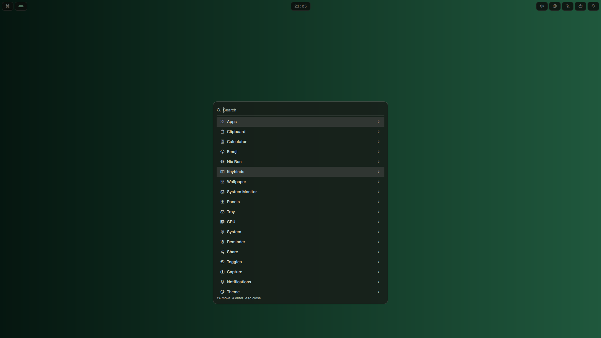
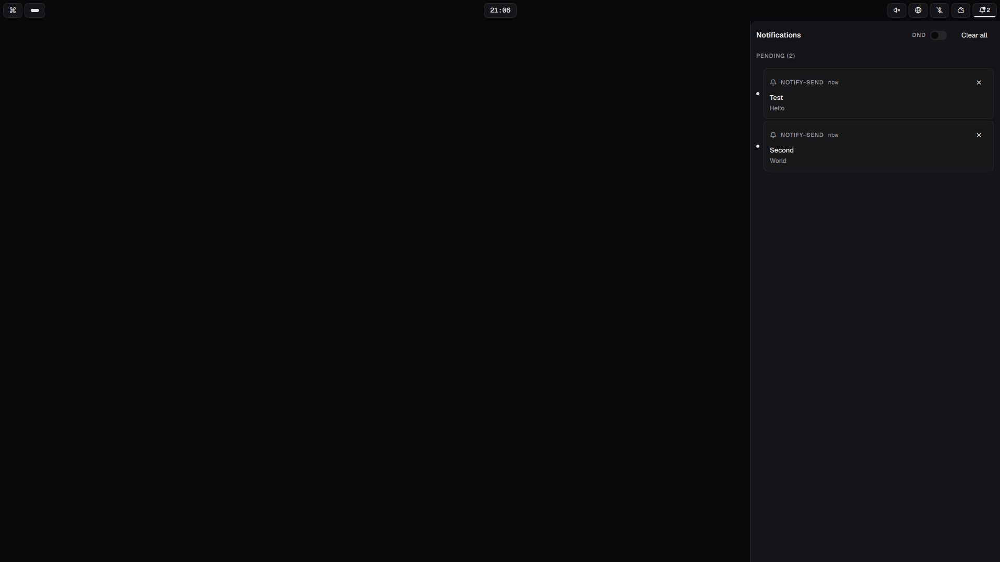
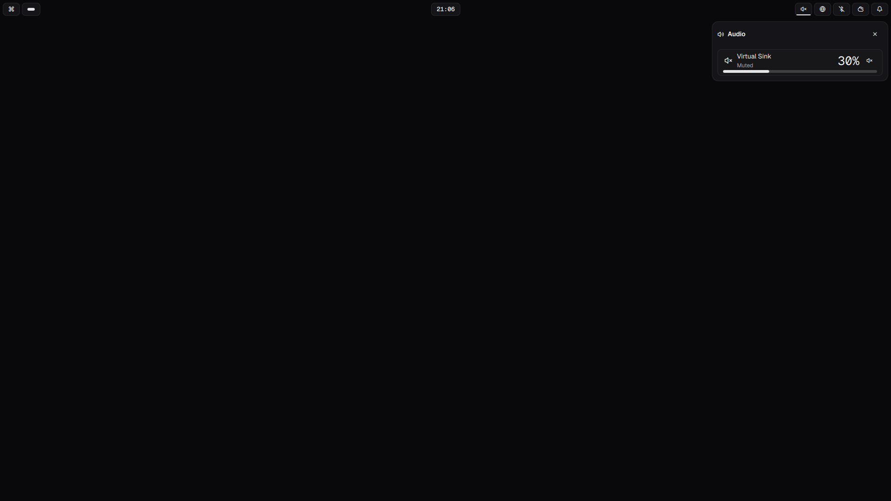
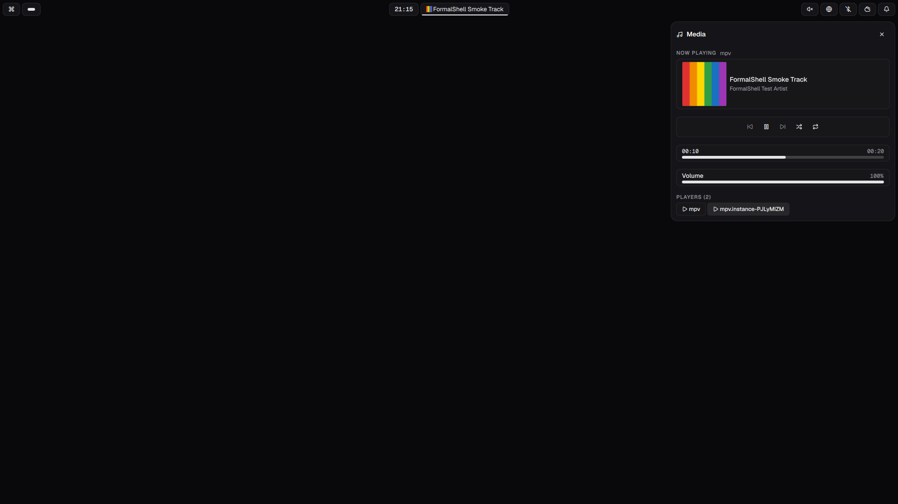
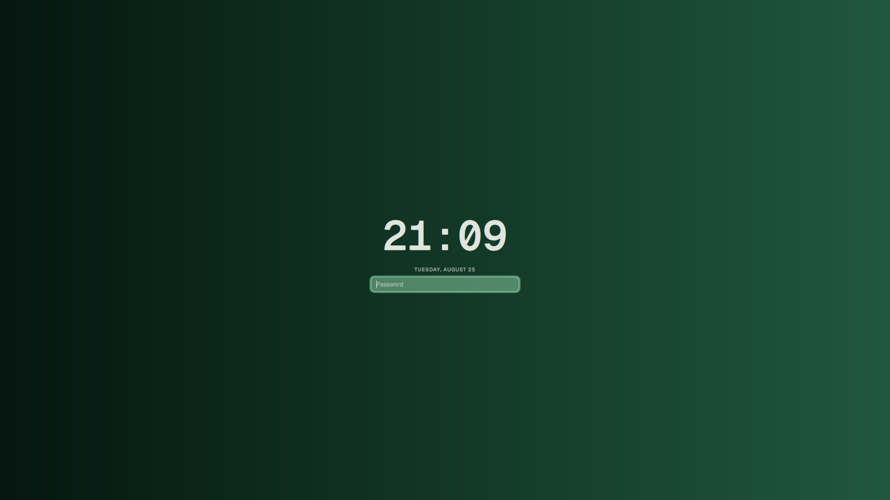
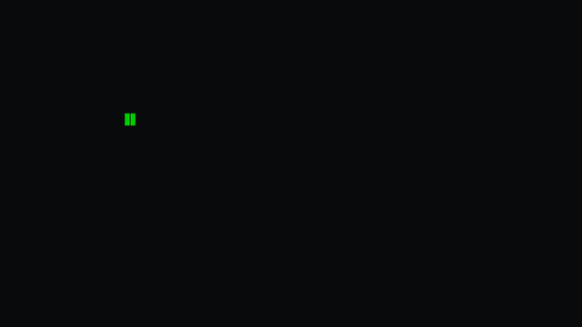
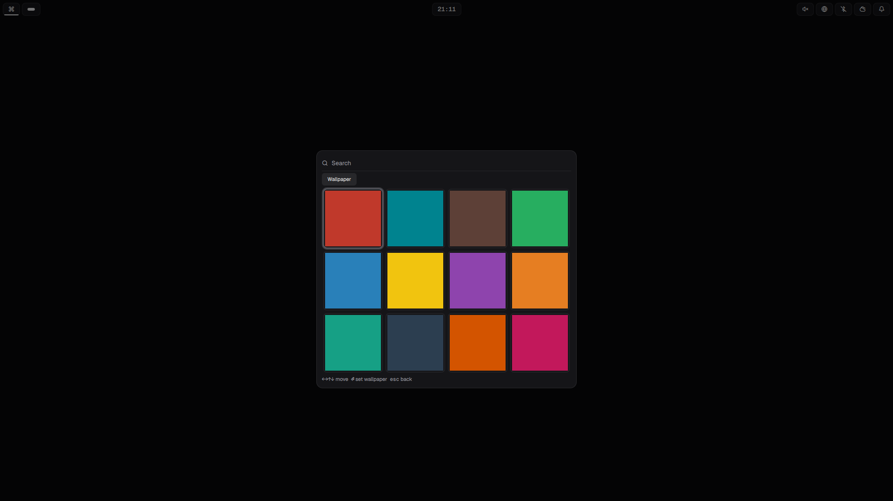

# Using FormalShell

Every surface the shell puts on screen, what you can configure about it, and
what you can drive over IPC. The product overview is in
[`README.md`](../README.md); the development and verification loop is in
[`CLAUDE.md`](../CLAUDE.md).

- [Conventions](#conventions)
- [Keybinds](#keybinds)
- [Bar](#bar)
- [Theming](#theming)
- [Menu](#menu)
- [Notifications](#notifications)
- [OSD](#osd)
- [Window switcher](#window-switcher)
- [Panels](#panels)
- [System monitor](#system-monitor)
- [Mirror](#mirror)
- [Clipboard](#clipboard)
- [LocalSend](#localsend)
- [Quake console](#quake-console)
- [Calendar](#calendar)
- [Now playing](#now-playing)
- [iPhone](#iphone)
- [Keyboard lights](#keyboard-lights)
- [Lock screen](#lock-screen)
- [Polkit](#polkit)
- [Night light](#night-light)
- [Screensaver](#screensaver)
- [Caffeinate](#caffeinate)
- [Hot corners](#hot-corners)
- [Picker](#picker)
- [Screenshots](#screenshots)
- [Text and color capture](#text-and-color-capture)
- [Screen recording](#screen-recording)
- [Reminders](#reminders)
- [Plugins](#plugins)
- [Debugging](#debugging)
- [Instance lock](#instance-lock)

## Conventions

**Config.** The shell reads `~/.config/formalshell/settings.json` and never
writes to it. Every JSON sample below is a fragment of that file, so merge it
into what you already have. On NixOS the same fragment goes through the
home-manager module, which generates the file for you:

```jsonc
// ~/.config/formalshell/settings.json
{ "motion": { "enabled": false } }
```

```nix
# home-manager
programs.formalshell.settings.motion.enabled = false;
```

Attribute paths are why most of the Nix samples below fit on one line.
Anything the shell needs to remember for itself (wallpaper, mode, frecency,
pending reminders) goes to `$XDG_STATE_HOME/formalshell/state.json` instead.
That file belongs to the shell; leave it alone.

**IPC.** The shell answers on `$XDG_RUNTIME_DIR/formalshell/ipc.sock`, and
`formalshell-ipc` is its client, on PATH with the package:

```sh
formalshell-ipc call <target> <function> [args...]   # run one function
formalshell-ipc show                                  # every target and its signatures
formalshell-ipc show <target>                         # one target
```

Every argument is required: a call with too few or too many prints
`Too few arguments provided` or `Too many arguments provided` with the
function's signature, and runs nothing. Pass `""` where you want a default.
Errors print on stdout and the client still exits 0, so read the reply. With
no shell running the client prints `No running instances for "<socket>"` and
exits 255.

A short alias helps:

```sh
alias fs='formalshell-ipc call'
```

Every example from here on is written against that alias: `fs menu summon`,
`fs theme status`, and so on.

**Binds** need the whole command spelled out:

```lua
hl.bind("SUPER + Space", hl.dsp.exec_cmd("formalshell-ipc call menu toggle"))
```

Hyprland is configured in Lua (`~/.config/hypr/hyprland.lua`) and nothing
here ships in hyprlang. The shell changes the running compositor through
`hyprctl eval` and never `hyprctl keyword`.

## Keybinds

Every default bind ships as
[`docs/examples/hyprland/formalshell.lua`](examples/hyprland/formalshell.lua),
next to the blur layer rules and the read of the colours and chrome files. An
install carries the same file at
`share/formalshell/examples/hyprland/formalshell.lua`. The home-manager module
and `formalshell install` both write it to `~/.config/hypr/formalshell.lua`.
To wire it up by hand, copy it beside your own config and `dofile` it:

```lua
-- ~/.config/hypr/hyprland.lua
dofile(os.getenv("HOME") .. "/.config/hypr/formalshell.lua")
```

Each bind carries a description. A Lua bind shows up in `hyprctl binds` as an
anonymous function, so the launcher's keybinds route prints that description
as the bind's action.

| chord | action |
| --- | --- |
| `SUPER+SPACE` | `menu toggle`, the root launcher |
| `SUPER+ALT+SPACE` | `menu summon apps` |
| `SUPER+CTRL+E` | `menu summon emoji` |
| `SUPER+CTRL+C` | `menu summon capture` |
| `SUPER+CTRL+O` | `menu summon toggles` |
| `SUPER+CTRL+S` | `menu summon share` |
| `SUPER+CTRL+R` | `menu summon reminder` |
| `SUPER+ESCAPE` | `menu summon system` |
| `SUPER+K` | `menu summon keybinds`, this table as the shell sees it |
| `SUPER+CTRL+Q` | `menu summon calc` |
| `SUPER+CTRL+M` | `mirror toggle` |
| `SUPER+CTRL+SPACE` | `menu summon wallpaper`, the picker grid |
| `SUPER+SHIFT+CTRL+SPACE` | `menu summon theme` |
| `SUPER+CTRL+A` / `B` / `W` / `P` / `D` / `ALT+D` | `panel toggle audio` / `bluetooth` / `network` / `power` / `display` / `calendar` |
| `SUPER+CTRL+1..9` | `panel toggleAt n` |
| `SUPER+comma` / `SHIFT` / `ALT` / `SHIFT+ALT` | `notifications dismissOne` / `dismissAll` / `invokeLast` / `showHistory` |
| `SUPER+CTRL+comma` | `notifications toggleDnd` |
| `SUPER+CTRL+I` | `caffeinate toggle`, the idle inhibitor |
| `SUPER+CTRL+N` | `nightlight toggle` |
| `SUPER+CTRL+SHIFT+N` | `overnight toggle` |
| `SUPER+SHIFT+SPACE` | `bar chevron toggle` |
| `SUPER+CTRL+L` | `lock lock` |
| `ALT+TAB` / `ALT+SHIFT+TAB` | `switcher next` / `switcher prev`, release of Alt for `switcher commit` |
| `PRINT` | `screenshot pick smart default`, the picker with the toolbar |
| `SUPER+CTRL+PRINT` | `capture text`, OCR straight to the clipboard |
| `ALT+PRINT` | `record toggle screen none` |
| `SUPER+CTRL+V` | `menu summon clipboard` |

Media keys change the value first and then tell the OSD to show it, because
brightness is read on demand and has no signal of its own to watch:
`XF86AudioRaiseVolume` / `LowerVolume` / `Mute` run `wpctl` then
`osd volume`, `XF86MonBrightnessUp` / `Down` run `brightnessctl` then
`osd brightness`, `XF86AudioMicMute` runs `wpctl`, and `XF86AudioPlay` /
`Pause` / `Next` / `Prev` go straight to `media playPause` / `next` /
`previous`. All of them are bound with `locked = true`, so they keep working
over the lock screen.

Three of Omarchy's chords have no matching verb in this shell, so they are
bound to the nearest one: `SUPER+CTRL+SPACE` opens the wallpaper picker
instead of advancing to the next wallpaper, `SUPER+SHIFT+SPACE` collapses the
bar's chevron group instead of hiding the whole bar, and `SUPER+CTRL+I`
toggles caffeinate, which is the idle inhibitor rather than the screensaver.

## Bar

Three regions, `left`, `center` and `right`, each reorderable on its own. You
need no config at all to get the default arrangement.

```jsonc
// ~/.config/formalshell/settings.json
{
  "bar": {
    "position": "top",
    "launcherIcon": "distro",
    "layout": {
      "left": ["launcher", "workspaces", "activeWindow"],
      "center": ["clock", "nowPlaying"],
      "right": ["battery", "audio", "network", "bluetooth", "weather", "tray", "bell", "indicators", "custom:cpu"]
    },
    "modules": [
      { "id": "cpu", "type": "command", "command": ["my-cpu-script"], "interval": 5000, "timeout": 5000 }
    ]
  }
}
```

```nix
# home-manager
programs.formalshell.settings.bar = {
  layout = {
    left = [ "launcher" "workspaces" "activeWindow" ];
    center = [ "clock" "nowPlaying" ];
    right = [ "battery" "audio" "network" "bluetooth" "weather" "tray" "bell" "indicators" "custom:cpu" ];
  };
  modules = [
    { id = "cpu"; type = "command"; command = [ "my-cpu-script" ]; interval = 5000; timeout = 5000; }
  ];
};
```

The default arrangement is exactly what you see above minus `custom:cpu`.
Everything else is opt-in and never shows up until you name it: `chevron`,
`github`, `usage`, `tailscale`, `visualizer`, `microphone`,
`keyboardLayout`, `systemUpdate`, `earbuds`, `dualsense`, `display`,
`monitor`, `iphone`.

`bar.position` puts the strip on the `top` (the default), `bottom`, `left`
or `right` edge. Panels hang off its inner edge wherever it sits.

The launcher cell's mark is `bar.launcherIcon`. It defaults to your machine's
own distro logo, read from `/etc/os-release` and resolved against your icon
theme first (so an installed `nixos-icons` or a Papirus-style
`distributor-logo-*` set wins), then against the bundled font-logos table,
which covers about 65 distributions and needs no icon theme at all. An
unrecognised Linux gets Tux, and a machine with no `/etc/os-release` falls
back to the Command sign, which `"command"` also names outright. Any other
bare word is an icon name from the active set, and an absolute path, a `~`
path or a `file://` URL is an image you supply.

Naming a region replaces it wholesale, so spell out the builtins you still
want alongside the new one. Two cells are easy to lose that way: `bell` in
the right region, and `launcher` at the head of the left region, which is the
only way to open the menu with a mouse.

```jsonc
// ~/.config/formalshell/settings.json
{
  "bar": {
    "layout": {
      "right": ["microphone", "keyboardLayout", "systemUpdate", "battery", "audio", "network", "bluetooth", "weather", "tray", "bell", "indicators"]
    }
  },
  "systemUpdate": { "flakeDir": "/home/youruser/.config/nix" }
}
```

```nix
# home-manager
programs.formalshell.settings = {
  bar.layout.right = [
    "microphone" "keyboardLayout" "systemUpdate" "battery" "audio"
    "network" "bluetooth" "weather" "tray" "bell" "indicators"
  ];
  systemUpdate.flakeDir = "/home/youruser/.config/nix";
};
```

A region you leave out falls back to its default (leaving out `bar` entirely
does the same for all three). A region set to `[]` stays empty. An unknown
name, or a `"custom:<id>"` with no matching module, is dropped with a log
warning and the rest of the bar still draws. `"plugin:<id>"` places a bar
plugin, see [Plugins](#plugins).

### Labels

Most cells are an icon with an optional label beside it, switched per cell
with `bar.widgets.<cell>.showLabel`:

| cell | label | default |
| --- | --- | --- |
| `audio` | the volume percentage | off |
| `battery` | the charge percentage (a right click flips it too) | on |
| `bell` | the pending count | on |
| `weather` | the temperature | off |
| `github` | the open PR and issue counts | on |
| `usage` | the worst rate-limit window | on |
| `keyboardLayout` | the layout code | on |
| `systemUpdate` | the summary | on |
| `earbuds` | the worse bud's percentage | on |
| `dualsense` | the battery percentage | on |
| `display` | a `Display` caption | off |
| `monitor` | the CPU and memory figures | off |
| `iphone` | the phone's name | on |

```jsonc
// ~/.config/formalshell/settings.json
{ "bar": { "widgets": { "audio": { "showLabel": true }, "weather": { "showLabel": true } } } }
```

### Screen frame

`frame.thickness` (default 0) grows the bar's window to the whole output and
paints a frame of that thickness round it, reserving each edge so windows sit
inside it. `frame.radius` rounds the frame's inner corners (default 20, or 0
when `theme.radius` is 0). The `pantheon` preset draws no frame whatever
`frame.thickness` says; `debug dump`'s `frame` block reports both the value
asked for and the ring that was drawn.

```jsonc
// ~/.config/formalshell/settings.json
{ "frame": { "thickness": 10, "radius": 20 } }
```

### The band's paint

Under `theme.preset: "pantheon"` the bar is a wingpanel band rather than a
strip card: it draws no card of its own and reads the wallpaper directly
under it to decide what it wears. A calm wallpaper gets no fill at all, just
white or dark words with a text shadow under them. A busy one gets a wash,
black at 0.3 in dark mode and white at 0.5 in light, so the words stay
readable. A window covering the output turns the band solid black. The
reading is taken once, on the main display (`display.outputPriority`), and
every output's band wears it, so two monitors never disagree; a window
covering one output still blackens that band alone.

`bar.paint` overrules the reading, and the theme decides the default:
`pantheon` says `"transparent"`, so the rule above is what you get by setting
`"auto"`. `"transparent"` keeps the rule for the ink and drops the wash: a
busy wallpaper then gets dark words over a bright band and light words over a
dark one, with no fill anywhere. The five paint names, `"light"`, `"dark"`,
`"translucentLight"`, `"translucentDark"` and `"maximized"`, pin one outright
and stop the sampling mattering at all. Anything else reads as `"auto"`.

```jsonc
// ~/.config/formalshell/settings.json
{ "theme": { "preset": "pantheon" }, "bar": { "paint": "transparent" } }
```

```nix
# home-manager
programs.formalshell.settings.bar.paint = "transparent";
```

`fs bar paint` reports what each band settled on, whether it was pinned, and
the three numbers the rule read off the wallpaper. The key does nothing under
the other presets, whose bar is a strip with nothing to sample.

### Custom modules

`bar.modules[]` entries are placed by `"custom:<id>"`, and `type` is
`command`. It runs the `command` argv every `interval` ms (default 5000) and
parses stdout as Waybar-compatible JSON: `{"text": "…", "tooltip": "…",
"class": "…"}`. `text` is the cell, `tooltip` is that cell's hover card,
used verbatim. `class: "warning"` fills the cell with the accent, `"critical"`
or `"urgent"` fills it with the urgent color, anything else renders plain. A
non-zero exit, a run past `timeout` (ms, default 5000), malformed JSON, or a
binary that isn't there all render the same `MODULE ERROR` cell, never a
stale value.

A cell that needs clicks, scrolling or a panel of rows is a
[plugin](#plugins) instead.

### What each cell does

**Workspaces** shows one chip per workspace on this output, in the
compositor's own per-output order: the persistent slots 1 to
`workspaces.persistent` (default 5, at most 10), plus any other workspace that
holds a window or has focus. A persistent slot with no workspace behind it
yet still draws, and clicking it goes there. Each occupied chip carries the
icons of its windows, up to `workspaces.maxIcons` (default 8).
`workspaces.showApps` picks which chips show them: `all` (the default),
`active` (the focused workspace only) or `hover` (the focused one, and any
other while the pointer is on it). A wheel notch over the cell moves focus
one workspace either way.

Hovering a chip opens a preview of that workspace with every window captured
live; it closes when the pointer leaves. `workspaces.preview: false` turns
that off. With herdr running, a window whose agent is working or blocked
carries a badge on its icon; `workspaces.agents: false` hides the badges.

```sh
fs workspaces peek 2    # open the preview of workspace 2, as a hover would
fs workspaces close
fs workspaces status    # {"output":…,"slots":[…],"preview":…}
```

**Active window** leads with the focused window's themed icon and app name,
title following in dim. No matching desktop entry falls back to the raw app
id with the title in front; nothing focused hides the cell.

**Tray** renders every `org.kde.StatusNotifierItem` on the session bus. Left
click activates, middle click secondary-activates, right click opens the
item's DBusMenu, and an item whose `ItemIsMenu` flag says so gets the menu on
left click too. The menu is drawn by the shell as a card under the cell:
disabled rows dim, a checked row takes the cursor fill, and submenus expand
in place instead of cascading.

By default the strip carries one dots toggle and the whole tray opens in a
second bar under it. `tray.maxVisible` changes that: `-1` puts every icon on
the strip, and a positive number puts them there while there are no more
than that many. It is all or nothing: the strip carries every icon or the
toggle alone, and a strip with no room for all of them falls back to the
toggle.

**Chevron** collapses the cells on one side of itself behind a single cell,
and expands them into a second bar on click. In a left or center region it
governs what follows it; in a right region it governs what precedes it, so
the group opens inward and nothing outboard of the chevron ever moves.

```jsonc
// ~/.config/formalshell/settings.json
{ "bar": { "layout": { "right": ["bluetooth", "weather", "tray", "bell", "indicators", "chevron", "battery", "audio", "network"] } } }
```

```nix
# home-manager
programs.formalshell.settings.bar.layout.right = [
  "bluetooth" "weather" "tray" "bell" "indicators" "chevron" "battery" "audio" "network"
];
```

Only the first chevron in a region survives, and a chevron with nothing on
its governed side is dropped, both with a warning.

```sh
fs bar chevron status              # which regions collapse, and which one is open
fs bar chevron toggle              # expand | collapse | toggle | status
fs bar chevronAt expand right      # name the region when several have a chevron
fs bar room                        # per screen: slack, each region's cells and hidden ones, nowPlaying budget
fs bar paint                       # per screen: the band's paint, whether it was pinned, and the numbers behind it
```

**Room on the bar.** A crowded end region never cuts a cell in half. The
`nowPlaying` cell gives ground first, its label shrinking toward its cover or
icon alone as the strip's own slack falls, down to 220px and no smaller when
there is room to spare. What still does not fit past that hides whole cells
from the end region's own inner edge, and every cell returns the moment room
does. A hidden cell is not moved into the chevron; it is off the strip until
there is room. `fs bar room` reports the numbers behind it, one entry per
screen.

**Bell** is always visible: a bell glyph, bell-off while DND is on, plus a
count of whatever is sitting in the pending tier. Left click toggles the
notification center, right click flips DND.

**Indicators** appear only while something is true, and the slot vanishes
otherwise. In order: a live screen recording (the one urgent-filled cell
here, click to stop, elapsed time in the tooltip so a ticking label can't
relayout the bar), the soonest pending reminder as a countdown (`12:30 / 3`
once more than one is set, click fires the summary), caffeinate, night light
and overnight.

**Weather** shows a condition glyph, plus the rounded current temperature
(`14°`) with its label on, refreshed every `weather.intervalMs` (default
900000) and on every panel open. The glyph has day and night variants. Before
the first fetch, or with no location fix, the cell stays a dim glyph rather
than inventing a reading.

**GitHub** polls one `gh api graphql` call every `github.intervalMs`
(default 300000) for open PRs you authored and open issues assigned to you.
Click opens the panel rather than a browser. No `gh` on PATH hides the cell;
`gh` present but logged out reads `NO AUTH`; anything else reads `NO GH`.

**Tailscale** is one glyph, dim while stopped, normal while connected,
polling `tailscale status --json` every `tailscale.intervalMs` (default
60000). A missing binary or an unreachable daemon keeps the cell hidden until
a real answer lands. Anything short of `Running`, `NeedsLogin` included, stays
dim.

**Usage** shows the worst rate-limit window across Claude Code and Codex,
each switched with `usage.claude` and `usage.codex` (both default true),
polled every `usage.intervalMs` (default 900000). At 90% or more the cell
goes fully urgent.

**Visualizer** puts a live six-bar spectrum next to `nowPlaying`, driven by a
shared `cava` process reading real audio over PipeWire, the same process the
media panel's spectrum reads (`media.visualizer`, see
[Now playing](#now-playing)). One process runs while something is playing,
motion is enabled, and either a bar cell showing it is on screen or the panel
is open with its spectrum enabled; otherwise the process is killed and a
visible cell falls back to its flat baseline rather than freezing on a last
frame. cava delivers 120 frames a second and every consumer eases toward the
newest one on every screen frame, so the bars move at the monitor's refresh
rate. No `cava` on PATH reads `NO CAVA`.

The generated `cava.conf` is tuned and none of it is configurable: `autosens`
off in favour of a fixed 200% sensitivity, low enough that a loud track does
not clip, `monstercat = 1.5` so six bars read as one spectrum,
`noise_reduction = 35` to catch transients, and a 12kHz top cutoff so the
last bar has cymbals to draw. The shell levels cava's output itself: every
band is divided by a running peak of the loudest band (0.12s attack, falling
20dB every 4s), so a loud track and a quiet one both settle with their
loudest band around three quarters of the column, and only a hit louder than
the recent peak reaches the top. Anything under 5 of cava's 1000 steps snaps
flat.

**Microphone** is one glyph for the default capture source. Click mutes,
middle click opens the audio panel, and there is no percentage or wheel
handler because a mic reads as on or off. No capture device at all reads
`NO MIC`, and the cell stays visible.

**Keyboard layout** shows the short code of the active layout, read-only. It
follows Hyprland's `activelayout` event. Fewer than two configured layouts
hides the cell, and a compositor that can't be asked reads `NO LAYOUT`.

**System update** counts how many of a flake's direct inputs are behind
upstream and fills the cell with the warning color while any are. It answers
one question, whether your flake inputs are behind their upstream refs. It
does not compare your running system with a rebuild. An unset `flakeDir`
reads `No flake`.

```jsonc
// ~/.config/formalshell/settings.json
{ "systemUpdate": { "flakeDir": "/home/youruser/.config/nix", "intervalMs": 10800000 } }
```

```nix
# home-manager
programs.formalshell.settings.systemUpdate = {
  flakeDir = "/home/youruser/.config/nix";
  intervalMs = 10800000;
};
```

Three hours is the default cadence because learning upstream's rev costs one
network round trip per input: a GitHub API call per github input, a
`git ls-remote` per git forge. Unauthenticated GitHub allows 60 requests an
hour per IP, and a 403 lands in the unknown bucket rather than in current.
Input types with no cheap probe (`path`, `tarball`, `indirect`, sourcehut)
stay `?`.

**Earbuds** shows a headphones glyph and the worse of the two buds as `NN%`
for the active device. The case is left out of that number (a full case next
to a dead bud would read backwards) but joins the tooltip. Until a bud
reports a level the cell is hidden, so a host with no earbuds pays nothing.

**DualSense** shows a gamepad glyph and battery percent, polled every 30
seconds, hidden with no controller present, warning-filled at 20% or less and
urgent at 10% or less. The panel behind it is read-only: the shell never
writes the lightbar or the player LEDs.

**Display** is a single monitor glyph that opens the display panel. It is
always visible once placed.

**Monitor** shows CPU and memory, adding the GPU only when some card
actually reports a busy fraction (amdgpu, or NVIDIA with `nvidia-smi` on
PATH; i915 and xe never do). Any of them can read as a dash on the first
tick, because a delta needs two samples.

**iPhone** appears once the iPhone bridge is installed and opens the
[iPhone](#iphone) panel.

### Tooltips

Hovering a cell for 400ms opens a card under it naming what the cell is and
what it currently reads. It tracks the value live rather than freezing at
hover time, flips to the other side when there is no room, and passes clicks
straight through to whatever is underneath. The 400ms is a delay rather than
an animation, so `motion.enabled: false` keeps it.

The card anchors to whatever owns it: a bar cell, a row inside a panel, or a
panel header's own icon button. Moving from one button to the next inside the
same group shows the next card straight away, without a second delay.

Cells with a card include workspaces, audio, battery (percent plus a
`FULL IN` or time-left estimate when UPower has one), network, bluetooth,
weather, now playing (artist plus the full title the cell is scrolling),
bell, every tray item (its own StatusNotifierItem tooltip, never reworded),
github, tailscale, the indicator glyphs, and `command` modules. Unavailable
states ride along as themselves. A cell with nothing to say shows no card.

### Clicks

| Widget | Left | Right | Middle / scroll |
| --- | --- | --- | --- |
| Clock | Calendar panel | Cycle the format ring | Middle: calendar panel |
| Weather | Forecast panel | Refresh | Middle: forecast panel |
| Audio | Audio panel | Mute | Scroll: volume |
| Battery | Power panel | Toggle the percentage | Middle: power panel |
| Network | Network panel | Toggle the Wi-Fi radio | Middle: network panel |
| Bluetooth | Bluetooth panel | Toggle the adapter radio | Middle: bluetooth panel |
| Now playing | Media panel | Next track | Scroll: previous/next |
| Microphone | Mute | none | Middle: audio panel |
| Workspaces | Go to that workspace | none | Scroll: previous/next workspace |

### Tray IPC

```sh
fs tray status              # {"items":[…]}
fs tray activate <id>       # same as left-clicking the item
fs tray menu <id>           # same as right-clicking it
fs tray menucursor <delta>  # move the open menu's cursor
fs tray menuactivate        # Enter on the cursor row
```

## Theming

Colors come out of your wallpaper, with no restart anywhere in the loop:

1. `wallpaper set` persists the path to `state.json`.
2. The theme engine builds a merged matugen config (your own
   `~/.config/matugen/config.toml`, the shell's template registrations, your
   `[templates.*]` blocks, then any `*.toml` in
   `~/.config/formalshell/matugen.d/`) and runs matugen against the image.
   Runs are serialized, and a wallpaper change mid-run supersedes the pending
   one rather than killing the one in flight.
3. The output is published atomically to
   `$XDG_STATE_HOME/formalshell/theme.json` and
   `$XDG_CONFIG_HOME/hypr/formalshell-colors.lua`.
4. The shell watches `theme.json`, so every token recolors on the next
   paint. It runs `hyprctl reload` once per publish so Hyprland re-reads the
   colours file, and only when `HYPRLAND_INSTANCE_SIGNATURE` is set.

With no wallpaper set, `theme.json` is written from the bundled shadcn zinc
palette instead, in the variant matching the current mode, so
`theme mode toggle` flips the whole shell through the same file write a
matugen run uses.

A wallpaper whose path contains a bundled palette's name (any case, so
`Moraine_Lake-flexoki.webp`, `zenbones-forest.png` or a `flexoki/` directory)
pins that palette in the current mode; rename a file to opt it in. Two are
bundled: Flexoki (stephango.com/flexoki) and Zenbones
(github.com/zenbones-theme/zenbones.nvim). Nothing on a pinned run reads
matugen's own scheme: every template the merged config points at, the
shell's GTK and Qt ones and yours alike, is rewritten before matugen sees it,
so on a Flexoki pin `{{colors.primary.default.hex}}` renders Flexoki blue and
`{{colors.surface.default.hex}}` Flexoki black. `post_hook` strings are
rewritten the same way, since matugen renders those through its own engine
too. matugen still runs, as `matugen color hex <source>` (Flexoki blue
`4385BE`, Zenbones water `6099C0`) instead of `matugen image`; it seeds
nothing a template reads.

Every role matugen emits is answered, in both schemes (`.dark`, `.light` and
`.default`) and in `hex`, `hex_stripped`, `rgb`, `rgba`, `hsl` and `hsla`, and
so is `base16.base00`..`base0F` in the palette's own base16 mapping. Eight hue
names ride along past matugen's list, for the templates Material cannot
serve. Flexoki spends its two ramp stops on them:

| role | dark | light |
| --- | --- | --- |
| `red` `orange` `yellow` `green` `cyan` `blue` `purple` `magenta` | the 400 stop | the 600 stop |
| the same eight with `_alt` | the 600 stop | the 400 stop |

Zenbones has six chromatics and no ramps, so the eight map onto rose, wood,
wood, leaf, sky, water, blossom and blossom, and `_alt` is the mode's own
bright variant (its terminal ports' ANSI 9-14) rather than the other mode's
stop.

Material has no green and no yellow, so a terminal theme reading its ANSI
slots off `primary`/`secondary`/`tertiary` paints them in the accent's own hue
and comes out one colour. Read ANSI 1-6 off the eight above and 9-14 off
their `_alt` twins, which is how Flexoki's own terminal ports spend the two
stops. Declare the same names under `[config.custom_colors]` in
`~/.config/matugen/config.toml` (`blend = false` keeps each hue and only
tones it for the mode) and the same template gets a wallpaper-derived ramp on
every other wallpaper:

```toml
[config.custom_colors]
green = { color = "#879A39", blend = false }
green_alt = { color = "#66800B", blend = false }
```

Two limits. A colour filter survives the rewrite only on a `.hex` value, as
`{{ "#4385be" | to_color | <filters> }}`: matugen rejects a filter applied
straight to a string, and `to_color` renders hex whatever went in, so an
`rgb`/`hsl`/`hex_stripped` value under a filter keeps matugen's own colour
instead of coming out in the wrong syntax. And a name no pinned role answers
(a `custom_colors` entry of your own) keeps matugen's value too. Both are
named in a log warning that the pin left them alone.

```sh
fs wallpaper set /path/to/image.jpg
fs wallpaper get              # the current path
fs theme mode toggle          # dark | light | toggle
fs theme retheme              # run matugen again on the current wallpaper
fs theme status               # {"wallpaper":…,"mode":…,"modeKey":…,"effective":…,"schedule":…,"override":…}
```

`theme.mode` decides who owns light and dark. Unset leaves it to the shell's
own state: the mode a toggle flips and the session remembers. `"dark"` and
`"light"` pin it, and a toggle then answers with the pin instead of moving.
`"auto"` follows the sun: dark from sunset to sunrise at
`location.latitude`/`location.longitude` (or wherever geoclue puts the
machine), and 20:00 to 06:00 on a machine with no location at all. Under
`"auto"` a toggle snoozes one cycle: it flips now and the schedule takes the
mode back at the next sunrise or sunset. `theme status` reports the pair, the
mode it resolves to, and the live override.

Every mode change also writes `org.gnome.desktop.interface/color-scheme` and
`gtk-theme` over `dconf`, so GTK4/libadwaita, GTK3 (through the settings
portal) and anything reading the appearance portal follow along. `gtk.theme`
(default `"adw-gtk3"`) and `gtk.themeDark` (default `"adw-gtk3-dark"`) name
the theme written for light and dark mode; leaving either `""` keeps its
default. That is how you point GTK apps at a matugen-generated theme pair:

```nix
programs.formalshell.settings.gtk.theme = "elementary-matugen-light";
programs.formalshell.settings.gtk.themeDark = "elementary-matugen-dark";
```

`theme.json` is the entire contract: shadcn's own role names, each with a
static fallback, merged per key, so an older file missing newer roles still
works:

| role | meaning |
| --- | --- |
| `background` | canvas |
| `foreground` | content ink |
| `card` | panel and popup surface step, with `cardForeground` |
| `popover` | tooltip and tray-menu surface step, with `popoverForeground` |
| `primary` | the wallpaper's own color, with `primaryForeground` |
| `secondary` | a neutral fill step, with `secondaryForeground` |
| `muted` | a dimmer neutral fill, with `mutedForeground` for meta ink |
| `accent` | the neutral hover fill (not the wallpaper color), with `accentForeground` |
| `destructive` | critical and error, with `destructiveForeground` |
| `warning` | degraded and low, the second loud color, with `warningForeground` |
| `border` | rules and control borders |
| `input` | text-field borders |
| `ring` | the keyboard-focus halo, carries the wallpaper color |
| `chart1`..`chart5` | a five-step ramp for graphs |

Anything that writes those keys themes the shell. matugen is the shipped
default, and a pywal template ships beside it at
`share/formalshell/templates/pywal-theme.json.tmpl`: drop it at
`~/.config/wal/templates/pywal-theme.json`, run `wal -i <image>`, and point
its output at `$XDG_STATE_HOME/formalshell/theme.json`. The file watch picks
up any writer.

`formalshell-colors.lua` is the same palette as a Lua table, written to your
own Hyprland config directory so window borders track the wallpaper. It is a
table a `dofile` returns:

```lua
-- ~/.config/hypr/hyprland.lua
local colors = {
  primary = "rgb(9ecafc)",
  border = "rgb(42474e)",
  destructive = "rgb(ffb4ab)",
}
local ok, loaded = pcall(dofile, os.getenv("HOME") .. "/.config/hypr/formalshell-colors.lua")
if ok and type(loaded) == "table" then colors = loaded end

hl.config({
  general = { col = { active_border = colors.primary, inactive_border = colors.border } },
})
```

The table carries seven roles: `primary`, `primaryForeground`, `background`,
`foreground`, `border`, `destructive` and `warning`. The file exists from the
shell's first run whether or not a wallpaper is set: with none, the bundled
zinc palette renders the same seven keys. Keep the literal table as a
fallback anyway; the `pcall` is what stops a missing file from killing the
rest of the config. Hyprland does not watch a `dofile`d file, so the shell
runs `hyprctl reload` itself after every publish.

### Presets

`theme.preset` picks the table of defaults the keys in the next section fall
back to. `metamorphosis` (the default) is the look documented here. `retro`
is the shell's earlier language as a setting of this one: everything square,
every word in the mono face, Nerd Font glyphs, opaque surfaces, no compositor
blur, and dithered imagery. `pantheon` is elementary OS 8's material on the
same palette: raised buttons and chips with a lit top line and a gradient
face, sunken fields and troughs, cards and toasts on a soft cast, and
elementary's own corners (3 on a control, 6 on a popover, 9 on a card). Any
key you write explicitly wins over the preset, so `retro` with `"radius": 4`
is the retro look on slightly rounded corners. Any other name resolves to
`metamorphosis`.

`pantheon` also swaps four habits beyond the chrome table: panels, the
launcher, the OSD and the notification centre drop straight out of the cell
or edge that opened them instead of budding off the bar's line; toasts and
the notification centre draw as elementary's own bubble instead of the shadcn
card; the app grid is the launcher's default; and the bar paints as a
wingpanel band that reads the wallpaper under it (see
[The band's paint](#the-bands-paint)). Its surfaces are opaque: elementary's
popovers and dialogs have nothing behind them, and the one translucent
surface is the panel, whose alpha is part of the band's paint rather than
`theme.surfaceOpacity`.

A preset is a JSON chrome table compiled into the binary plus the scalar
keys below. `retro` uses `metamorphosis`'s table, since the two share every
fill, border and radius and differ only in those scalars; `pantheon` carries a
table of its own. The table itself is not a setting, so the columns below are
the whole of what a preset changes that you can override:

| key | `metamorphosis` | `retro` | `pantheon` |
| --- | --- | --- | --- |
| `theme.radius` | 10 | 0 | 6 |
| `theme.icons` | `lucide` | `nerd` | `lucide` |
| `theme.fonts` | `pair` | `mono` | `pair` |
| `theme.surfaceOpacity` | 0.85 | 1 | 1 |
| `theme.blur` | true | false | true |
| `theme.dither` | false | true | false |

```jsonc
// ~/.config/formalshell/settings.json
{ "theme": { "preset": "retro" } }
```

```nix
# home-manager
programs.formalshell.settings.theme.preset = "retro";
```

The palette is untouched by the preset: matugen, `theme.json`, the pywal
template and the Hyprland colours files all work the same way under each
one.

### Radius, icons, fonts and translucency

`theme.radius` sets the corner radius every surface derives its
`sm`/`md`/`lg`/`xl` steps from (shadcn's own `--radius`, default 10). At 0
every step is 0 and every pill shape (switches, workspace dots, badges) is
square too.

`theme.icons` picks the glyph set icons render from: `lucide` (the default,
the bundled Lucide icon font) or `nerd` (Nerd Font glyphs from the mono
face). A name missing from a set falls back to that set's own
`circle-help`.

`theme.fonts` is `pair` (sans for words, mono for values) or `mono` (the mono
alias for both).

`theme.surfaceOpacity` (0 to 1, default 0.85) is the alpha of the bar cells,
the panels and the launcher card. The shell blurs nothing itself: that alpha
is what lets a compositor blur read through. The example Hyprland config
turns the blur on and points it at the `formalshell:bar`, `formalshell:panel`,
`formalshell:menu` and `formalshell:radio` layer namespaces. Under a compositor with blur off the
same alpha reads as a tint. Toasts and the lock screen stay opaque either
way; the OSD pill is drawn at the same alpha as the line it buds off.

The launcher and the polkit request cover the whole output and sit over a
0.5 black scrim, so their layer rules (`formalshell:menu`,
`formalshell:radio` and `formalshell:polkit`) leave anything at or below 0.6 unblurred: the scrim
darkens the desktop and the card over it keeps its blur. A `surfaceOpacity`
under 0.6 puts the card under that mark too and it loses its blur there;
lower those namespaces' `ignore_alpha` to match if you want it back.

The shell asks fontconfig for `sans-serif` and `monospace` and never names a
family, so the pair of faces is yours to pick. Geist Sans and Geist Mono are
what the design targets:

```jsonc
// ~/.config/formalshell/settings.json
{ "theme": { "radius": 10, "icons": "lucide", "fonts": "pair", "surfaceOpacity": 0.85 } }
```

```nix
# home-manager
programs.formalshell.settings.theme = { radius = 10; icons = "lucide"; fonts = "pair"; surfaceOpacity = 0.85; };

# NixOS
fonts.packages = [ pkgs.geist-font ];
fonts.fontconfig.defaultFonts.sansSerif = [ "Geist" ];
fonts.fontconfig.defaultFonts.monospace = [ "Geist Mono" ];
```

### Hyprland rounding, blur and window chrome

The shell publishes `formalshell-chrome.lua` next to the colours file, a
table a `dofile` returns. It carries `rounding` (the value of
`theme.radius`), `blur` (`theme.blur`) and the window gaps, frame and shadow
the preset's table declares (`gapsIn`, `gapsOut`, `borderSize`,
`borderColor`, `shadow`, `shadowRange`, `shadowPower`, `shadowOffset`,
`shadowColor`, `shadowInactiveColor`), rewritten whenever any of them changes
and reloaded the way the colours table is. The example config reads all of
them, so window corners, the blur behind the shell's surfaces and the chrome
round every window follow the preset: `metamorphosis` and `retro` cast no
shadow and hang the wallpaper's `primary` on the focused window, `pantheon`
casts elementary's own (range 24, offset `{ 0, 6 }`) under a quiet 1px
`border` frame. The gaps follow the same rule: 4 and 8 under `metamorphosis`
and `retro`, 4 and 6 under `pantheon`.

```lua
-- ~/.config/hypr/hyprland.lua
local colors = dofile(os.getenv("HOME") .. "/.config/hypr/formalshell-colors.lua")
local chrome = dofile(os.getenv("HOME") .. "/.config/hypr/formalshell-chrome.lua")

hl.config({
  decoration = {
    rounding = chrome.rounding,
    blur = { enabled = chrome.blur },
    shadow = {
      enabled = chrome.shadow,
      range = chrome.shadowRange,
      render_power = chrome.shadowPower,
      offset = chrome.shadowOffset,
      color = colors[chrome.shadowColor] or chrome.shadowColor,
      color_inactive = colors[chrome.shadowInactiveColor] or chrome.shadowInactiveColor,
    },
  },
  general = {
    gaps_in = chrome.gapsIn,
    gaps_out = chrome.gapsOut,
    border_size = chrome.borderSize,
    col = { active_border = colors[chrome.borderColor] or chrome.borderColor },
  },
})
```

A colour there is either an `rgba(...)` literal or the name of a role in
`formalshell-colors.lua`, so `colors[c] or c` reads both. The shipped example
already does this, with fallbacks for a first run before either file exists.

### Dither

`theme.dither` is the one texture switch: on, the launcher's app icons, the
active-window icon, notification images and album art render through the
limited-palette pass below, track grooves take a 1-bit checker, and
`wallpaper.dither` and `lock.dither` default to on. Tray icons, the wallpaper
picker and clipboard thumbnails stay true colour, since those exist to show a
picture as it is. The `retro` preset turns it on; set it by hand under
`metamorphosis` for the texture alone.

```jsonc
// ~/.config/formalshell/settings.json
{ "theme": { "dither": true } }
```

### Wallpaper dither

The wallpaper renders through a limited-palette pass: six colors are derived
from the image by median cut, each cell takes its nearest one, and a 4×4
Bayer dither mixes it with its second nearest in proportion to how far
between the two it sits. A photo comes out as flat bands with dithered
transitions, and a solid wallpaper stays flat, since its own color is in its
own palette and there is nothing to mix it with.

The grid is sized in screen pixels rather than source pixels: cells are the
screen's long edge over 480, floored at 2px, so a 4000px photo and a 1200px
one land on the same grid, and a 4K screen gets bigger cells instead of four
times as many. The image is cover-cropped first with nearest-neighbor, so the
scale never introduces a color the file didn't have.

matugen reads the wallpaper file itself, never this rendering, so the dither
can't influence the color scheme. It follows `theme.dither`, so it is off
under `metamorphosis` and on under `retro`; `wallpaper.dither` overrides that
for the wallpaper alone. Raise `wallpaper.ditherColors` for a subtler pass,
since more colors means less of the image dithers at all:

```jsonc
// ~/.config/formalshell/settings.json
{ "wallpaper": { "dither": true, "ditherColors": 12 } }
```

```nix
# home-manager
programs.formalshell.settings.wallpaper = { dither = true; ditherColors = 12; };
```

`lock.dither` is the same pass over the lock screen's own backdrop, with the
same default and its own override.

### Motion

Transitions run off a small set of tokens per preset: hover fills, surfaces
entering and leaving, and a card budding off the bar's line. End states are
pixel-identical to the unanimated shell, and full-bleed selection swaps are
states rather than transitions and stay instant.

Two carve-outs. A new wallpaper fades in with the old one still painted
underneath instead of hard-cutting. The now-playing title scrolls only when
it overflows its cell and the bar is on screen.

Wayland has no `prefers-reduced-motion` to inherit, so the shell has its own
switch. It zeroes every duration, the wallpaper fade included, and turns the
marquee back into a plain elide:

```jsonc
// ~/.config/formalshell/settings.json
{ "motion": { "enabled": false } }
```

```nix
# home-manager
programs.formalshell.settings.motion.enabled = false;
```

### Fullscreen

While a focused fullscreen window covers the bar's output, the bar, its frame
zones, its cards and the hot corners on that output leave the screen, and
come back when it does. `fullscreen.hideChrome: false` keeps them up.

## Menu

One keyboard-driven surface is the app launcher, the system menu, and a
dmenu replacement. Summon it, type, press Enter.



### The tree

The shipped tree is a flat object keyed by dotted id, so
`system.power.reboot` implies `system` and `system.power` and creates them as
submenus if nothing declares them. A node's kind comes from its keys:
`action` runs a command, `target` links to another node, `provider` is filled
in at build time (the `apps` node is how every installed `.desktop` entry
becomes a row), and anything else is a plain submenu.

`when` and `checked` are shell conditions, batched into one process per
condition after the menu closes and never per keystroke. `when: "false"`
hides a node outright; anything else has its exit code decide, which is how
`system.logout` guards on `test -n "$HYPRLAND_INSTANCE_SIGNATURE"`.

Typing at any level searches the whole tree, with one exception. A node
marked `"routeOnly": true` is searched only while you are standing inside it;
from the root, the route row itself matches but its children don't. The
shipped tree uses it for `Panels` and `Tray`, both of which name their rows
after things the launcher already lists elsewhere, so a search for `equibop`
returns the app once instead of once per route that mentions it.

Normal navigation never shows a row whose `when` hasn't resolved true, but
`menu summon <route>` reaches a node by id and skips that check. Landing on a
level whose own condition isn't satisfied gives you one dim unavailable row
rather than children that would each fail on Enter.

### Overrides

`~/.config/formalshell/menu.jsonc` merges over the shipped tree per key, so
you override one field without redeclaring a node, and `"hidden": true`
removes a shipped entry and its whole subtree:

```jsonc
// ~/.config/formalshell/menu.jsonc
{
    "system.suspend": { "hidden": true },
    "system.custom-user-node": { "label": "My Script", "action": "~/bin/my-script" }
}
```

```nix
# home-manager, if you would rather keep it in the flake
xdg.configFile."formalshell/menu.jsonc".text = builtins.toJSON {
  "system.suspend".hidden = true;
  "system.custom-user-node" = { label = "My Script"; action = "~/bin/my-script"; };
};
```

Two keys are about how a node reads rather than what it does. `section` is
the heading its row sits under, which is how the root splits into
`Suggestions` and `Commands`, and `prompt` is what the search field says
while you are standing inside that node. Both override per key like any other
field, so moving your own row into the suggestions block is one line:

```jsonc
// ~/.config/formalshell/menu.jsonc
{
    "system.custom-user-node": { "section": "Suggestions", "prompt": "Search my scripts" }
}
```

Rows are never reordered to build a group, so a `section` only reads as one
block while the entries carrying it are declared together. `fs menu refresh`
re-reads `menu.jsonc` after an editor save.

For the common case of an extra entry under `System` there is a settings key
and no jsonc. `icon` is a glyph drawn in the mono font, and `confirm: true`
makes the row wait for a second Enter before it runs:

```jsonc
// ~/.config/formalshell/settings.json
{
  "menu": {
    "customPowerButtons": [
      { "label": "Windows", "icon": "󰖳", "command": "systemctl reboot --boot-loader-entry=auto-windows", "confirm": true }
    ]
  }
}
```

```nix
# home-manager
programs.formalshell.settings.menu.customPowerButtons = [
  { label = "Windows"; icon = "󰖳"; command = "systemctl reboot --boot-loader-entry=auto-windows"; confirm = true; }
];
```

### Apps

Rows show the entry's display name and its icon-theme icon. An icon the theme
can't resolve leaves the row without a leading image rather than drawing a
broken box.

Enter on an app that already has a window focuses that window instead of
starting a second copy, and pressing it again cycles that app's windows. Such
a row carries a dim `FOCUS` note. Matching compares the desktop entry's
`StartupWMClass` exactly, then case-insensitively, then its id, and the first
tier to hit wins. There is no fuzzy fallback: Electron and wrapper-launched
apps routinely report an app id unrelated to their `.desktop` name, and a
fuzzy hit would focus the wrong window.

Rows are ordered by launch frecency, a per-entry count with a 14-day
half-life, persisted to `state.json` as `appLaunches` and capped at the 200
best records. It only decides the order equal-scoring rows come in, so a
better match still wins outright and a fresh profile browses apps in the
system's own order.

`menu.appGrid` (bool, default true) swaps the app rows for a grid of icons
with the app's name centred underneath each one. It only touches app
results: the root's frecency-ordered list and an app search draw as the grid,
and anything else the same query ranked still draws as rows underneath.
Arrows move the cursor by cell instead of by row; every other key, the
ranking and the launch path stay what they are for the row list.

```jsonc
// ~/.config/formalshell/settings.json
{ "menu": { "appGrid": false } }
```

### Getting around

The card centers on the focused output over a plain black scrim at half
opacity. The input row is a search icon, the text field, and a 1px rule
underneath; a breadcrumb chip for each level below the root sits under that
rule, hidden at the root. The empty field reads `Type a command or search...`
at the root and the level's own prompt inside one (`Search apps`,
`Type an expression`).

Rows come in groups, each under a heading: `Suggestions` then `Commands` at
the root, `Results` for a query that ranks the whole tree, and `Options` in
select mode. A level whose rows are all one group draws no heading, since its
breadcrumb chip already names it. Nothing is reordered to make a group: the
heading appears wherever the run of rows changes.

A row's icon is a name from the active icon set, mapped from the shipped
route ids. A route id with no mapping, an emoji row, a provider row carrying
its own glyph, or an entry from your own `menu.jsonc` falls back to the row's
own glyph string.

A row's right edge carries a hint where it has one: the chord that summons
that route directly (`Super+Ctrl+E` on `Emoji`), or, for a route whose
children are a listing, how many rows it holds. The chords are the ones in
[`docs/examples/hyprland/formalshell.lua`](examples/hyprland/formalshell.lua),
not a read of your live bindings, so a rebound route still shows the shipped
chord.

The bottom row of the card names what Enter will do to the row under the
cursor, then the keys that always apply. The verb comes from the row's own
kind: Select, Open, Enter, Run, Choose (`Set wallpaper` on the wallpaper
route), Copy, Paste or Share on clipboard and emoji rows, or a confirm prompt
once a confirm-gated row is armed. A row that can't be activated leaves the
verb out. `esc` reads `back` wherever there is a level to pop, `close` at the
root, and `cancel` in select or input mode. Two more hints show only when they
mean something: `Tab` names the picker's other Dark/Light set while its
switcher is up, and `Shift+Enter` names a row's alternate action (the
discrete GPU on an app row, an ssh send on a clipboard image).

| Key | Does |
| --- | --- |
| `↑` / `↓` | Move the cursor a row, or a whole row of cells on a grid |
| `←` / `→` | Move the cursor a column on a grid; the text field's cursor everywhere else |
| `Page Up` / `Page Down` | Move a page |
| `Home` / `End` | Jump to the first or last row |
| `Enter` | Submit (input mode); otherwise activate the row under the cursor |
| `Shift+Enter` | The row's alternate action, where it has one |
| `Escape` | Cancel and close (select and input mode); pop a level, or close at the root |
| `Backspace` | Pop a level, only when the search field is empty; `Ctrl+Backspace` deletes a word |
| `Tab` / `Shift+Tab` | Swap the picker's Dark/Light set, only while its switcher is showing |

Hover moves the cursor only when the pointer is what moved. Rows sliding
under a parked pointer never take the cursor, and the first real pointer
movement does.

The card's top edge stays put and only its bottom edge moves, so a row count
that changes on every keystroke grows the card downward instead of shifting
it under your eye. It stays clamped to fit on screen, and the list scrolls
past that.

### Toggles

The root `Toggles` node holds live checkmark rows: night light
(`toggles.nightlight`, hidden unless `wlsunset` is on PATH), overnight
(`toggles.overnight`), caffeinate (`toggles.caffeinate`), HDR
(`toggles.hdr`), do not disturb (`toggles.dnd`) and dark mode
(`toggles.dark-mode`). Activating one flips it and leaves the menu open, so
the checkmark changes under the cursor.

Those checkmarks are in-process state, not a polled command. A `checked`
value prefixed `@state:` is answered from the shell's own state, so it
repaints the moment the toggle lands. The list of legal paths is closed:
`nightlight.active`, `overnight.active`, `caffeinate.active`, `hdr.active`,
`notifications.dnd`, `theme.dark`. Anything else resolves false, so a typo
shows an unchecked box instead of a stale one. `@state:` works on `checked`
only; a `when` carrying it hides the node.

`"keepOpen": true` works on any action row and is what makes a toggle of your
own worth looking at:

```jsonc
// ~/.config/formalshell/menu.jsonc
{
    "toggles.my-vpn": {
        "label": "Work VPN",
        "action": "sh -c 'nmcli con up work-vpn'",
        "checked": "nmcli -t -f NAME con show --active | grep -qx work-vpn",
        "keepOpen": true
    }
}
```

That `checked` is an ordinary shell condition, resolved like any other. Only
the `@state:` paths are in-process.

**If your `menu.jsonc` predates the `Toggles` node**, three ids changed. An
override keyed on an old one does not error; it lands on a node nothing
declares, so nothing changes and nothing warns.

| Old id | New id |
| --- | --- |
| `theme` | `toggles` |
| `theme.mode-toggle` | `toggles.dark-mode` |
| `system.stay-awake` | `toggles.caffeinate` |

### Built-in routes

**Wallpaper** is a level like any other, except the menu draws it as the
[picker](#picker) grid: image cells from `picker.directory`, the search field
filtering by filename, Enter setting the wallpaper. `picker summon` and
`menu summon wallpaper` land in the same place.

**Panels** lists one row per panel and Enter opens it, so a panel stays
reachable with its bar cell left out. **Tray** does the same for live
StatusNotifierItems, Enter taking the action a left click on the item would.
An empty tray renders one dim `No tray items` row.

**Clipboard** draws as a split route: the row list keeps the left half of the
card, and a bordered inner card on the right previews the row under the
cursor, either its full text or, on a capture, the image itself at true
color, since menu thumbnails are never dithered.

`System` also carries `Console` and `Screensaver` rows and a `Plugins`
submenu (`List Plugins`, `Reload Plugins`), and the root has `Notifications`
(`Clear All`, `Mark All Seen`, `Dismiss Popups`), `Theme` (`Retheme`, `Dark
Mode`, `Light Mode`) and `Capture` nodes, so the launcher reaches every
surface.

Two routes host a whole view instead of a row list: `monitor` and `mirror`
(see [System monitor](#system-monitor) and [Mirror](#mirror)).

**Calculator.** A root query that parses as arithmetic (`+ - * / % ^`,
parentheses, unary minus, decimals, through a recursive-descent parser, never
an `eval`) leads the results with a `= <result>` row tagged `CALC`. Enter
copies and closes. `menu summon calc` opens a level showing only that live
result. A parse failure shows no row and no error.

**Emoji.** `menu summon emoji`, or `:e <query>` from anywhere, searches a
vendored Unicode dataset (Emoji 17.0, regenerated with `dev/gen-emoji.sh`,
never edited by hand). Each entry carries CLDR's English search keywords
alongside its Unicode name, the same annotations macOS and iOS type their
pickers against, so `sob` finds 😭 (`loudly crying face`), `lol` finds 😂 and
`+1` finds 👍. Names rank above keywords: exact name, name prefix, name word
start, whole keyword, name substring, keyword word start.

Inside a rank, the emoji you copy most lead, weighted by how recently, so an
empty `:e` opens on your own most-used. The ledger lives in `state.json` as
`emojiUses`.

The route draws as a grid of eight columns: the glyph fills the cell, the
arrows move in two dimensions, and the name of whatever the cursor is on
reads under the grid. Enter copies the character and, 150ms after the
surface closes, pastes it into whatever window focus returned to. That is the
same paste the clipboard history does, on the same `clipboard.paste` and
`clipboard.pasteChord` keys (see [Clipboard](#clipboard)): set `paste` to
false and Enter copies only. Without `wtype` the copy still happens and the
paste is skipped with one log warning.

**Nix package runner.** `menu summon nix`, or `:nix <query>`, runs a
debounced `nix search nixpkgs <query> --json` as you type, showing attr name
and version with a dimmed description. Enter runs the package in a one-off
console (`nix run nixpkgs#<attr>` with a `read` holding the window open) and
fires a `NIX RUN <attr>` notification straight away, since a first search can
spend tens of seconds warming evaluation caches. Every other state is one dim
row: searching, no results, a failed search, or `NO NIX`.

**Keybinds.** `menu summon keybinds`, or `:k <query>`, lists your
compositor's own bindings: the chord in content ink, padded into a column,
action and arguments dimmed behind it. Capped at 200 rows, with route-local
ranking (exact chord, chord or action prefix, word start, substring) rather
than the whole-tree scorer, because a hundred keybind rows in the root search
would drown everything else.

The source is `hyprctl binds`, whose table already has your includes and
submaps expanded, so there is no config path to set. Rows are notes: a bind
acts on the focused window, and with the menu open that is the menu, so
running one from here would fire it at the wrong window. Unavailable states
get one dim row each: `No binds` when the table is empty, `Binds
unavailable` when the call itself failed.

**Share** sends files to nearby devices over LocalSend (see
[LocalSend](#localsend)). With `localsend-cli` on PATH, `Send` lists the last
scan's peers, each a folder carrying a `Clipboard` row (the newest text entry)
and one row per clipboard image, and `Receive` is a status line for the
receiver. With only the LocalSend app (`localsend_app`) installed, `Send`
hands the newest entry to the app, `Pick From History` lists the clipboard to
choose from, and `Receive` opens the app. An empty clipboard shows
`Nothing to share`. With neither installed there is no `Share` node.

### Menu IPC

```sh
fs menu toggle                # root summon if closed, close if open
fs menu summon clipboard      # any node id or alias, "" for root
fs menu close
fs menu refresh               # re-read menu.jsonc after an editor save
fs menu status                # {isOpen, level, view, scrollTop, placeholder, sections, columns, rows, cursorId, …}
fs menu activate <index>      # Enter on that row
fs menu activateAlternate <index>   # Shift+Enter on that row
fs menu filter <text>         # type into the search field
fs menu ping                  # "pong"
```

`toggle` takes no argument on purpose: it is the verb to bind a bare menu key
to. `activate`, `activateAlternate` and `filter` answer `error: menu not open`
while it is closed.

`status`'s `scrollTop` is how far the live view is scrolled, in pixels, 0 at
the top. `placeholder` is what the empty field currently says, `sections` the
group headings in the order they appear, `rows` how many rows or cells the
level is showing, and `columns` how many cells wide it is: `1` for a row
list, the grid's own count on the wallpaper, emoji and app grids.

`select` and `input` are the dmenu replacement. `formalshell-ipc call`
answers straight away and can't wait on a UI answer, so both correlate by a
caller-supplied token and hand the answer back through a file:

```sh
fs menu select "Pick a window" ' ["a","b","c"]' tok1
fs menu input "Rename to" tok2

cat $XDG_STATE_HOME/formalshell/menu-selection.txt
# => {"token":"tok1","value":"b"}
# => {"token":"tok1","cancelled":true}     Escape, or superseded by another open
```

The leading space in `' ["a","b","c"]'` is required. `formalshell-ipc` splits
any argument that starts with `[` and ends with `]` into a list, which shreds
the array into extra arguments before the handler sees it. The space defeats
that check, and the JSON parser ignores it.

## Notifications

A mako replacement: a freedesktop notification server, a three-tier model
(`popups`, `pending`, `past`), toasts that are independent bordered cards, and
a history center you can summon.



A notification lands in `popups` unless DND is on, in which case it goes
straight to `pending`. The popup cap is 4, and the oldest overflows into
`pending` rather than disappearing. A popup that times out moves to `pending`
unseen. Opening the center marks everything pending as seen and moves it to
`past`, which prunes itself after 15 minutes.

Timeouts honour the sender's own `expire_timeout` where it falls inside the
band and clamp it otherwise: a 5s floor for low urgency, 8s otherwise, a 30s
cap either way, and no timeout at all for `urgency: critical`, which stays
until you deal with it. Hovering a popup pauses its countdown, and it resumes
when you leave.

### Cards

Summary clamps to two lines and body to three. The server does not advertise
body markup, so a sender's own `&`, `<` and `>` show as literal text rather
than being misparsed into tags that eat the rest of the body. `` tags
are always stripped, since the icon slot already carries any real image.
Chromium-derived senders (Chrome, Brave, Vivaldi, Edge, Opera) get the leading
bare-URL line those browsers glue to the front of a body stripped too, which
turns a GitHub web notification back into something readable.

The icon slot resolves four things in order, first hit wins: the
notification's own `image-data`/`image-path` hint, its `app_icon` (an
absolute path or a themed icon name), the desktop entry named by its
`desktop-entry` hint or matching the sender's name, and the card's own bell
when none of those land. A themed name no installed icon theme carries counts
as a miss and the walk continues, so a session with no icon theme gets bells
rather than broken images.

### Toast stack

`notifications.position` picks the corner, default `bottom-right`, also
`top-right`, `bottom-left` and `top-left`. An unrecognised value falls back
to the default.

```jsonc
// ~/.config/formalshell/settings.json
{ "notifications": { "position": "top-right" } }
```

```nix
# home-manager
programs.formalshell.settings.notifications.position = "top-right";
```

Toasts collapse into a depth stack: the newest sits full size at the front (a
sticky critical one wins that slot regardless of arrival order), and up to
two older popups peek out from behind it, each a real card sized narrower by
a whole step rather than scaled down. Hovering the stack, or
`notifications expand on`, reflows it into a full column and pauses every
visible countdown until you leave. The layer surface never changes size while
toasts are up, so only the cards move, and everything outside the cards
clicks through to what is under it. The history center keeps its own
right-anchored placement and full-size cards wherever the toasts are.

### History center

The center hangs off the right edge, one screen padding in, the same padding
below the bar and above the bottom of the output. It is as tall as the
history it holds, and a long one stops at the bottom padding and scrolls
inside instead of running off the screen. While it is open the toast stack is
held back. Clicking anywhere outside it closes it.

### Grouping

Identical notifications collapse into one card carrying a repeat count.
Identical means same app name and same summary, compared case and whitespace
insensitively. Body is left out of the key: a chat app fires one summary with
a different body per message, and keying on body would stop grouping exactly
there.

The popup cap of 4 counts groups, so five repeats of one thing can never
evict four unrelated toasts. Every notification keeps its own server id and
its own timeout, each member expires on its own clock, and its sender still
gets told when it closes. Hovering a grouped card pauses every member, and
dismissing it dismisses all of them.

### DND

The bypass is narrow: only `urgency: critical` notifications sent by the
literal `notify-send` CLI, or raised by the shell itself (a reminder), get
through. A chat app marking its own notifications critical does not, because
the check is on the sender and never on urgency alone.

DND persists in `state.json`, so it survives a restart. The bar's bell cell
drives the same machinery with a pointer, and the center's `Clear all` drops
everything listed there (`pending` and `past`) while leaving live popups
alone.

```sh
fs notifications showHistory    # toggle the center
fs notifications status         # dnd, pending, popups, centerOpen, …
fs notifications toggleDnd      # returns "on" | "off"
fs notifications setDnd true
fs notifications dndState
fs notifications markAllSeen    # drain pending into past
fs notifications dismissAll     # clear popups
fs notifications clearPending
fs notifications clear          # both of the above
fs notifications invokeLast     # fire the newest entry's default action
fs notifications dismissOne     # drop the front popup, leave the rest
fs notifications expand on      # reflow the stack, pause expiry
fs notifications expand off
```

## OSD

One bottom-centred pill for volume, brightness and media: an icon, a progress
track and the percentage in mono. It is the same width whatever it is
showing, and the readout column is measured against `100%` rather than the
live value, so a ticking percentage or a swapped track title never reflows
the card. A muted sink keeps its pre-mute number on the readout but draws the
crossed speaker and an empty track: the icon answers whether you will hear
anything, and the number answers where the slider is.

Volume and mute show themselves on any change to the default sink, whether it
came from here, `wpctl`, `pavucontrol` or a hardware key. Brightness and media
have no such signal to hook, so they only ever show over IPC:

```sh
fs osd volume       # show with the current audio state
fs osd brightness   # re-read brightness, then show
fs osd media "Artist - Track"
fs osd close
fs osd state        # {"visible":…,"kind":…,"mediaText":…}
```

Brightness is read on demand, so a brightness key should change it and then
poke the OSD:

```lua
hl.bind("XF86MonBrightnessUp",
  hl.dsp.exec_cmd("brightnessctl -q set 5%+ && formalshell-ipc call osd brightness"),
  { locked = true, repeating = true })
```

## Window switcher

One card in the middle of the output: a thumbnail of every mapped window
across every workspace, each with its app icon and title under it, the most
recently focused first and the selected one on an accent fill. The card opens
with its icons and the thumbnails fill in once it is up: one frame per window,
and a refreshing one for the selected window. Hyprland only copies a window
whose box overlaps its monitor, so a column scrolled off the output under the
scrolling layout keeps its app icon instead of a thumbnail. An app with no
matching desktop entry draws the generic application icon rather than an
empty tile. A window on a special workspace (the quake console) is not
offered. `switcher.currentWorkspace` (default false) narrows the card to the
focused workspace's windows. A session with nothing to switch between says
so. More windows than fit one row wrap onto balanced rows.

It exists under every theme. `switcher.enabled: false` turns it off, and the
target below then answers `error: switcher is off (switcher.enabled)` to every
verb.

```sh
fs switcher next     # open on the window before this one, or walk on
fs switcher prev     # the other way, wrapping at either end
fs switcher commit   # focus the selected window and close
fs switcher cancel   # close, focus untouched
fs switcher state    # {"open":…,"shown":…,"index":…,"count":…,"id":…,"title":…,"captured":…}
```

The card takes the keyboard while it is open: Tab, Right and Down walk the
row, Shift+Tab, Left and Up walk it back, Enter commits, Escape cancels.
Holding a modifier is the compositor's job, so the shipped Hyprland example
binds Alt+Tab to `switcher next`, Alt+Shift+Tab to `switcher prev` and the
release of Alt to `switcher commit`, with the two Tab binds `repeating` so a
held Tab keeps walking. The card maps 150ms after the first press, so a quick
Alt+Tab switches to the previous window with no card at all, the way Cmd+Tab
does on macOS. The release bind fires on every Alt release, open or not; a
commit with nothing open answers `error: nothing to commit` and does nothing.

## Panels

Popouts share one frame: a card anchored under the bar cell that opened it,
closing on Escape and on a click outside. Opened over IPC with no cell to
anchor to, it hangs at the end of the bar's line.



| Panel | Backed by | Bar cell |
| --- | --- | --- |
| `audio` | PipeWire | `audio` |
| `calendar` | local `.ics` plus EDS | `clock` |
| `network` | NetworkManager | `network` |
| `bluetooth` | BlueZ | `bluetooth` |
| `power` | UPower, power-profiles-daemon | `battery` |
| `weather` | open-meteo plus a location fix | `weather` |
| `media` | MPRIS, the radio, AirPlay, the iPhone | `nowPlaying` |
| `radio` | Radio Browser and cliamp's channel list | none (the media panel's radio button) |
| `github` | one `gh api graphql` poll | `github` |
| `usage` | Anthropic OAuth usage, `codex app-server` | `usage` |
| `tailscale` | `tailscale status --json` | `tailscale` |
| `appmenu` | the focused window's desktop entry | `activeWindow` |
| `systemupdate` | `flake.lock` plus one probe per input | `systemUpdate` |
| `display` | the compositor's own output list | `display` |
| `earbuds` | the librepods daemon (AirPods), `nothingctl` (Nothing and CMF), `openscq30` (Soundcore), `earbuds` (Samsung Galaxy Buds) | `earbuds` |
| `iphone` | `omarchy-iphone-bridge` and `omarchy-iphone-ams` | `iphone` |
| `dualsense` | sysfs, read-only | `dualsense` |
| `monitor` | `/proc`, `/sys/class/drm`, `nvidia-smi` | `monitor` |
| `trayoverflow` | the tray's second bar | `tray` (the dots toggle) |

Every bar cell draws a 2px `primary` line inside its edge while its panel is
open. Panels that poll do it in the panel rather than the cell, so opening one
over IPC works even when its bar cell was never placed.

**Audio** is a mixer. The output section is a master slider for the default
sink with a mute control, followed by one selectable row per sink. The input
section is the same for sources and is left out when there is no capture
hardware. The apps section lists playback streams with their own 0 to 1.5
overdrive track and a notch at 1.0, left out when nothing is playing. Up and
Down walk one cursor across every row, `h` and `l` step the slider under it
by 5%, `m` mutes, Enter switches the default on a device row and mutes
everywhere else. The wheel works over any track and over the bar cell.

**Network** groups connections under wired and Wi-Fi, with a power toggle,
rows sorted connected then known then by signal, and strength drawn as a
five-segment bar rather than a slider. Clicking a connected row disconnects.
A secured network with no saved credentials expands an inline passphrase row
(Escape collapses just the prompt), and 802.1x networks get an identity field
above it. The passphrase goes to `nmcli` over stdin, never argv. No `nmcli` on
PATH reads `NO NMCLI`. Known disconnected rows offer `Forget` on hover.

The speed test measures download then upload against Cloudflare's endpoints
for a fixed five seconds each, sampling `/sys/class/net/<iface>/statistics`
while parallel `curl` transfers run, and kills its workers between phases and
when the panel closes. No `curl` reads `NO CURL`.

Share expands a scannable QR code for the network this machine is on, drawn
as real squares rather than block glyphs, because a scanner reads the grid's
geometry and a monospace cell is 2:1. The payload carries the passphrase, so
it reaches `qrencode` over stdin and lives exactly as long as the expanded
row. No `qrencode` reads `NO QRENCODE`, and an 802.1x network cannot be
shared, since it authenticates against a server and has no shared secret.

Password reveals the saved secret for that network, for reading out to
someone. The read happens when you press show, and the text is dropped on
hide, on close, and on roaming. It is never logged, never written to disk,
and no IPC verb can reach it.

**Bluetooth** groups devices under connected, paired and available.
Discovery is nudged back on every second while the panel is open, since BlueZ
rejects `StartDiscovery` while the adapter is powering up and lets discovery
lapse on its own, and it stops when the panel closes. A connected row
disconnects, a paired row connects, an available row runs pair, trust,
connect. A 20 second fallback turns a stuck action into `TIMED OUT`, since
there is no failure signal to key off. Paired rows offer forget and a trust
toggle on hover.

Trust cannot confirm itself: BlueZ takes the write and a rejected one is not
rolled back, so reading the property back proves nothing. The row reads
trusting for a two second settle and then asks `bluetoothctl info <address>`:
agreement clears it, disagreement fails it to `TRUST FAILED`, and a missing
`bluetoothctl` fails it to `UNVERIFIED` rather than inventing an outcome. No
adapter reads `No adapter`, and a powered-off one `Turn on to scan`.

**Power** pairs a status row (`AC power` on a machine with no battery,
rather than a lying 0%) with a keyboard-navigable profile picker under
power-profiles-daemon, a breathing pulse while charging, and dim rows for
time to full, time to empty and charge rate wherever UPower reports them. A
`Charge limit` row appears on a laptop whose battery driver exposes
`charge_control_end_threshold` (ASUS and ThinkPad machines do), naming the
percentage the firmware parks at; UPower carries no such property, so this is
the one power reading taken from sysfs, and the row is absent on a battery
with no limit.

```jsonc
// ~/.config/formalshell/settings.json
{ "battery": { "warnPercent": 10, "criticalPercent": 5 } }
```

```nix
# home-manager
programs.formalshell.settings.battery = { warnPercent = 10; criticalPercent = 5; };
```

Crossing `warnPercent` while discharging fires a `LOW BATTERY` toast;
`criticalPercent` fires a sticky one that bypasses DND, and the bar cell goes
fully urgent at that point. Both thresholds re-arm the moment the battery
starts charging, so unplugging again while still low warns again.

**Weather** shows current conditions and a forecast list, one row per daily
period, falling back to `No location` or an unavailable row with the failure
rather than a stale forecast. The location is geoclue's, or
`location.latitude`/`location.longitude` when both are set, and it is the
same pair `theme.mode: "auto"` and the night light schedule read.

```jsonc
// ~/.config/formalshell/settings.json
{ "location": { "latitude": 28.1, "longitude": -15.4 } }
```

**GitHub** lists open PRs you authored and open issues assigned to you, the
first 15 of each, every row a title plus a dimmed repo slug. Clicking opens
the URL and closes the panel.

**Usage** shows a Claude and a Codex section, each switched with
`usage.claude` and `usage.codex`, each a tier row then one row per rate-limit
window with a percent, a fill that turns urgent at 90%, and a reset line
(`Resets 2H 14M`). Claude reads the OAuth token from
`~/.claude/.credentials.json`, which is never logged and never exposed on any
IPC or debug surface. No credentials reads `NO AUTH` without probing.

An expired token is its own state, stale: the access token lives about 12
hours while the refresh token lives about 10 days, and only a `claude` run
refreshes the pair on disk, so a machine that hasn't run Claude Code today is
still logged in with a token this shell cannot use. The shell never redeems
that refresh token itself, since Anthropic rotates it on use and doing so
would log you out of your own CLI. It runs `claude auth status --json`
instead, the cheapest call that makes the CLI refresh its own pair, which
calls no model and costs no usage. The second line then reads `Stale / ` and
what is happening or what to run, and the state always settles on the
server's answer rather than on what the CLI claimed.

The Claude rows are not a fixed set: anything in the response shaped like a
rate window renders, so a bucket the API adds later appears with no code
change. Labels derive from the key (`five_hour` to `5-hour`, `seven_day` to
`Weekly`, `seven_day_opus` to `Weekly opus`). A window with null utilization
is skipped rather than drawn as 0%. Codex speaks JSON-RPC to
`codex app-server` over stdin and stdout; a missing binary reads `NO CODEX`.

**Tailscale** pairs a status cell (connected or stopped) and your own
hostname and IP with a list of machines, one row per peer. Clicking a row
copies that IP. Enter or a click on the status cell runs `tailscale up` or
`down`; a non-operator user gets an inline `NOT OPERATOR` rather than a
pretend success (see [`SWITCHOVER.md`](SWITCHOVER.md) for
`tailscale set --operator=$USER`). No binary reads `NO TAILSCALE`.

**App menu** is the focused app's menu, in the place its name already sits.
It is sourced from what the desktop already publishes: the desktop entry's
own `Actions=` become action rows, the compositor's window list filtered by
app id becomes window rows (the current one carries the selected fill, click
another to focus it), plus a close-window row. It is not a global menu bar:
reading an app's real File and Edit menus needs `org.gtk.Menus`, the DBusMenu
registrar or KWin's appmenu protocol, and none of them covers a Wayland app
under Hyprland.

The bar cell keeps naming its app while any panel is open. Hyprland drops its
focused window the moment a layer surface takes keyboard focus, so the last
focused window is held across that gap, bounded by the focused workspace so
an empty workspace still reads as empty.

**System update** lists a flake's direct inputs, one row each: name, locked
rev, and whether upstream has moved. Reading `flake.lock` costs nothing and
re-reads the moment you run `nix flake update` yourself; the upstream probes
are queued one at a time. Only direct inputs are walked, since a nixpkgs
pinned in by a `follows` is not yours to update. States: `No flake`,
`No lock`, checking, and `?` for an input type with no cheap probe.

**Display** lists every connected output: name, an on/off switch, a status
line (its mode and scale, `Mirrors DP-1`, or `Disabled`), make and model where
reported, and a scale track from 1x to 3x in 0.25 steps. Press or wheel the
track to commit one value (there is no drag to scrub, because every step is a
real output reconfiguration), or use Up and Down, Enter to toggle, `h` and
`l` to scale.

The brightness section below carries the internal backlight plus one row per
DDC-capable external monitor `ddcutil` can reach. Detection runs once per
open rather than in a poll loop, since `ddcutil`'s I2C round trips take
seconds. Nothing controllable reads `No backlight`. Mirror points every other
enabled output at the focused one.

An open panel re-reads every 5 seconds because Hyprland's monitor events
never mention the disabled outputs this panel exists to switch back on.
States: `No outputs`, `Mirror unsupported`, `Single display`, and a dimmed
switch on the last enabled output, since the compositor would leave you with
nothing on screen and no surface left to undo it from.

**Earbuds** draws every vendor through one device shape: a backend per vendor
turns its source's state into batteries and controls, and the panel renders
those without knowing whose they are. With more than one device connected a
device choice heads the panel, and the most recently connected one is shown.
AirPods come from the `librepods` daemon, a separate GPL-3.0 project you run
yourself (see [`SWITCHOVER.md`](SWITCHOVER.md)). The backend watches the
daemon's own `status.json`, which it removes on quit, so the absent file is
the daemon-down signal. `No daemon` with no file; past that, the device name
and a state line, a battery section with up to three rows (left, right, case,
each with an `In ear` or charging hint), a `Listening mode` section listing
only the modes the device has, and on Pro models conversation awareness and
one-bud ANC switches. `Ear detection` cycles the daemon's host-side pause
policy.

Nothing and CMF devices go through `nothingctl`
(github.com/FormalSnake/nothingctl, on the shell's PATH): the CMF Headphone
Pro (model B175), with listening mode, EQ preset, the three custom EQ bands
(-6 to +6 dB, while the Custom preset is on), spatial audio and low latency.
While the panel or cell is up, each connected device gets one
`nothingctl watch` child. A device nothingctl does not support is refused
before anything is sent to it; the shell logs that once and does not try it
again until Bluetooth reports it disconnected and connected again. Any other
failure is retried after a backoff from 5 seconds up to 5 minutes.

Soundcore and Samsung Galaxy Buds are polled every 30 seconds while the panel
or cell is up, and only while BlueZ reports a matching device connected. Each
shows a listening mode row, an equalizer row and its battery rows. Soundcore
reads `openscq30`'s own device list, which you fill once per device (pair it
in Bluetooth first; `openscq30 list-models` names the model id):
`openscq30 paired-devices add -a AA:BB:CC:DD:EE:FF -m SoundcoreA3947`. A
connected Soundcore device that list does not hold is skipped. The equalizer
row carries four of Soundcore's presets (Signature, Bass boost, Treble boost,
Podcast), and none is lit while another preset is active. Samsung uses the
`earbuds` CLI, which runs its own background daemon: the shell starts it
(through its first command) only when a Galaxy Buds device is connected, and
never stops it. That daemon also pauses media when a bud comes out and
switches the PulseAudio sink; turn those off with
`earbuds config set auto-pause off` and `earbuds config set smart-sink off`.

**DualSense** is a read-only sysfs readout, tagged `Read only`: battery
percent as the headline, a lightbar swatch with its hex, and five player LED
dots, each row shown only while its sysfs node was readable. No controller
reads `No controller`.

### The main display

`display.outputPriority` names which screen the shell treats as the main one,
in preference order. The first entry with a connected output wins, so the
list below reads "the desk monitor while it's plugged in, the laptop panel
when it isn't":

```jsonc
// ~/.config/formalshell/settings.json
{ "display": { "outputPriority": ["HDMI", "internal"] } }
```

```nix
# home-manager
programs.formalshell.settings.display.outputPriority = [ "HDMI" "internal" ];
```

An entry matches a connector by exact name (`HDMI-A-1`), by the port it hangs
off (`HDMI`, `DP-2`, anchored so `DP` never means the `eDP` your laptop panel
is on), or by the aliases `internal` (`eDP`, `LVDS`, `DSI`) and `external`
(anything else). The list is re-applied whenever outputs change, so unplugging
the main monitor hands the title down the list and plugging it back in takes
it again. Unset, it is the focused output. It is read wherever one screen has
to be picked: the bar's output, the pantheon band's sample, and the monitor
panel's `Main display` row.

### Keyboard

Every panel takes keys the same way. Escape closes, Up/Down walk the cursor,
`hjkl` do the same, Tab and Shift+Tab wrap through the panel's sections,
Enter and Space activate the cursor row, `x` deletes where a row has a
delete. The cursor is the ring, and it stays hidden until the first
navigation key or the first hover, so a panel opened with the pointer shows
no stale position.

| Panel | Enter | `x` | Left/Right | Tab |
| --- | --- | --- | --- | --- |
| `audio` | Make the device default, press the device pick, or mute a stream | none | Volume by 5% on the row under the cursor, or walk the device pick | none |
| `bluetooth` | Connect or disconnect the device | Forget, on a paired row | Move the cursor | paired / available |
| `network` | Connect or disconnect, or run the speed test | none | Move the cursor | networks / speed test |
| `power` | Apply the profile under the ring | none | Walk the profile group | none |
| `calendar` | Select the day | none | Move across the week (`[` and `]` step the month) | none |
| `weather` | none | none | Move the cursor | none |
| `display` | Enable or disable the output, or toggle mirroring | none | Output scale one notch, or brightness by 5% | none |
| `media` | Press the transport button, play/pause, or switch source | none | Seek, or player volume, in the tracks section | transport / tracks / sources |
| `monitor` | Open the full monitor view | none | Move the cursor | metrics / open view |
| `appmenu` | Run the action, focus that window, or close it | none | Move the cursor | none |
| `usage` | Refresh both providers | none | Move the cursor | none |
| `github` | Open the PR or issue and close the panel | none | Move the cursor | none |
| `systemupdate` | Re-check the inputs | none | Move the cursor | inputs / check |
| `tailscale` | Toggle the connection, or copy the row's IP | none | Move the cursor | none |
| `earbuds` | The row's own action: pick the device, set the noise mode, toggle a switch, set ear detection | none | Move the ring in a group, or a level by its step | none |
| `dualsense` | none | none | Move the cursor | none |

`audio` also takes `m` to mute the row under the cursor.

Where a row holds a button group (the power profiles, the audio device pick
with two or three devices, the media transport) the group is one cursor stop:
Left and Right walk its buttons and Enter presses the one under the ring.
Where a row holds a switch (an output's enable, the mirror), Enter on the row
flips the same switch the pointer does.

### Panel IPC

```sh
fs panel open audio
fs panel toggle network
fs panel toggleAt 3   # the nth panel cell of the right region
fs panel close        # whichever is open
fs panel state        # "" | "audio" | … | "radio"
```

An unknown name returns `error: unknown panel '<name>'`.

`toggle` hangs the card under the cell that owns the panel; `open` hangs it at
the end of the bar's line. `toggleAt` counts the right region's cells from the
screen centre outward, skipping the ones that open no panel (tray, bell,
indicators) and counting the ones a collapsed chevron is currently hiding, so
with the default layout 1 to 5 are power, audio, network, bluetooth and
weather. Past the end it answers `no panel at <n>`. The example config binds 1..9 to
`SUPER+CTRL+1..9`.

```lua
hl.bind("SUPER + A", hl.dsp.exec_cmd("formalshell-ipc call panel toggle audio"))
```

Network:

```sh
fs network status        # {wifiEnabled, networks: [{name, known, connected, stateChanging, secured, signal}]}
fs network connect FORMALTEST somepassword   # empty string for open or already-known networks
fs network connectEap FORMALTEST-EAP user@domain somepassword
fs network forget FORMALTEST
fs network wifi true     # radio power
fs network speedtest
fs network speedstatus   # {running, phase, downMbps, upMbps, error}
```

`connect` and `connectEap` put the secret in argv, which is readable through
`/proc` on a multi-user box, so they exist for headless testing and keybinds
rather than as the interactive path. Type the passphrase into the panel's own
prompt instead. `speedtest` refuses a second overlapping run, and `phase` is
one of `idle`, `resolving`, `down`, `up`, `done`.

Bluetooth:

```sh
fs bluetooth status    # {available, enabled, connected, devices: [{address, name, paired, trusted, connected}]}
fs bluetooth toggle
fs bluetooth power on  # or off
fs bluetooth trust AA:BB:CC:DD:EE:FF
fs bluetooth untrust AA:BB:CC:DD:EE:FF
```

Addresses match case-insensitively. `status` answers `available: false`
where there is no adapter, and `power` rejects anything that isn't `on` or
`off`. `devices[].trusted` reports what was asked for whenever the shell and
BlueZ disagree, so it is not proof a write landed; `bluetoothctl info
<address>` is.

Earbuds:

```sh
fs earbuds status                 # the active device as the panel draws it, or {"available":false}
fs earbuds devices                # every connected device: key, backend, name, connected, active
fs earbuds select airpods         # show this device
fs earbuds set noise transparency # AirPods: off | anc | transparency | adaptive
fs earbuds set ca on              # AirPods: conversation awareness
fs earbuds set onebud off
fs earbuds set ear both           # AirPods: one | both | off
fs earbuds set adaptive 40        # AirPods: 0-100, only while noise mode is adaptive
fs earbuds set anc transparency   # Nothing: off | transparency | high | mid | low | adaptive
fs earbuds set eq custom          # Nothing: rock | electronic | pop | vocals | classical | custom
fs earbuds set eq-bass 3          # Nothing: -6 to 6 dB, also eq-mid and eq-treble, custom preset only
fs earbuds set spatial concert    # Nothing: off | concert | theatre
fs earbuds set low-latency on     # Nothing
fs earbuds set mode NoiseCanceling # Soundcore: as the model lists them
fs earbuds set eq BassBooster     # Soundcore: SoundcoreSignature | BassBooster | TrebleBooster | Podcast
fs earbuds set anc on             # Galaxy Buds: noise cancellation
fs earbuds set ambient 2          # Galaxy Buds: 0 is off
fs earbuds set eq bass            # Galaxy Buds: normal | bass | soft | dynamic | clear | treble
```

`set` acts on the active device and only on a control it lists right now. The
value is checked against that control and then against the backend's own
allow-list before anything is sent, so an unknown value or a missing control
comes back as `error: <reason>`. There is no `dualsense` target, because that
panel is read-only.

The `display` and `hdr` targets are under [Display outputs](#display-outputs)
and [HDR](#hdr).

### Dev gallery

Not a user surface: one sheet rendering the real shared components (cells,
labels, the type, spacing and color scales, the panel frame itself) so a
regression in any of them shows up in a single screenshot. It has no bar cell
and is not in the panel list, so asking for it by name is the only way in.

```sh
fs gallery open
fs gallery close
fs gallery toggle
fs gallery status
```

## System monitor

Three surfaces over one data source: an opt-in bar cell, a compact panel, and
a full view inside the launcher. The collectors are refcounted and only run
while something wants them, so a shell with the cell off and every monitor
surface closed spawns nothing.

```jsonc
// ~/.config/formalshell/settings.json
{ "monitor": { "intervalMs": 2000, "processIntervalMs": 2000 } }
```

```nix
# home-manager
programs.formalshell.settings.monitor = { intervalMs = 2000; processIntervalMs = 2000; };
```

Every delta (CPU busy, per-core busy, network rates) needs two samples, so
the first tick after a subscribe reads as a dash rather than a fabricated 0.

**The compact panel** is CPU and memory rows with a fill track each, one line
per GPU card, a `Main display` row naming whatever `display.outputPriority`
resolves to, and a closing `Open monitor` button that hands off to the full
view.

**The full view** is `menu summon monitor`, or the monitor row at the
launcher's root. A strip of tiles across the top, CPU, Memory, GPU, Disk and
Network, each a figure over a history line drawn since the view opened. The
GPU tile reads `No GPU` on a machine with none and `No metrics` on a card
that publishes no busy counter.

### Process table

The process table fills the rest of that view, busiest first. One line per
process: name, the full command line, pid, CPU and resident memory. It polls
on its own timer while the route is open.

- **The search field is the filter.** It narrows by process name, by command
  line (which is how `python` finds a script the kernel named after its
  interpreter), or by an exact pid.
- **CPU is a share of the whole machine**: a process pinning one core of
  eight reads 12.5% where `htop` says 100%. It is a delta, so it reads as a
  dash until the second poll.
- **Ending a process takes two presses.** `Enter` arms TERM on the row;
  `Enter` again sends it. Moving the cursor or retyping disarms.
- **Restart** (`monitor restart`) means TERM, wait for the pid to leave
  `/proc`, then re-run the same argv from the same working directory. It
  re-runs a command line, not a session: the environment the process had does
  not come back. A process that ignores TERM is reported as still running
  rather than escalated to KILL, and nothing is relaunched.

### GPUs

A card comes from `/sys/class/drm/cardN/device`: driver, PCI ids, PCI
address, connector list. `boot_vga` decides which card is integrated, never
the card number, because a hybrid laptop happily enumerates its discrete GPU
as `card0`. Naming prefers `nvidia-smi`'s marketing name, then the ACPI
label, then vendor plus device id, then the card id.

Metrics are uneven because the kernel is:

- **amdgpu** reports utilization, VRAM used and total, temperature and power
  draw from sysfs and hwmon.
- **NVIDIA** needs `nvidia-smi` on PATH. Without it the card still lists its
  identity and outputs. `nvidia-smi` prints a literal `[N/A]` for fan speed
  on laptop GPUs, which renders as unavailable rather than a 0% fan.
- **Intel i915 and xe** have no unprivileged utilization counter at all, so
  those cards always show identity and outputs with no busy figure.

`Shift+Enter` on an app row launches it on the discrete card; the footer
names the key whenever the cursor is on an app and the machine has one. The
launch builds argv itself and strips Exec field codes first: `nvidia-offload`
if present, else `prime-run`, else the four variables NixOS's own wrapper
exports (`__NV_PRIME_RENDER_OFFLOAD`, `__NV_PRIME_RENDER_OFFLOAD_PROVIDER`,
`__GLX_VENDOR_LIBRARY_NAME`, `__VK_LAYER_NV_optimus`). A non-NVIDIA target
gets `DRI_PRIME=pci-<slot>` in Mesa's PCI-slot form, never the positional
`DRI_PRIME=1`, which is ambiguous past two GPUs. A desktop entry that runs in
a terminal goes through `console.command`.

With `supergfxctl` on PATH the system menu carries a GPU mode row that
switches between integrated and hybrid. The switch needs a logout to take
effect, and the reply says so.

```sh
fs monitor status            # {"cpu":{…},"mem":{…},"load":{…},"uptime":{…},"temps":{…},"net":{…},"disk":{…}}
fs monitor gpu               # {"available":…,"cards":[…],"gfxMode":{…},"tools":{…}}
fs monitor launch <desktopId> ""     # "" picks the discrete card; or name one, card1
fs monitor processes ""      # the filter the search field applies
fs monitor kill <pid> TERM
fs monitor restart <pid>
```

`kill` replies that the signal was sent (`ok: TERM sent to <pid>`), never
that the process died: the outcome lands in the next `processes` dump.

## Mirror

`menu summon mirror`, or `mirror` typed in the launcher, shows the live
camera feed inside the card, flipped left to right like a mirror. `Tab` or
`Enter` steps to the next camera. Cameras are the V4L2 capture nodes on the
machine, colour ones first and IR ones last, each under the device's own name.
An IR sensor is recognised by an `IR` in its name or by offering only grey
formats. A machine with no camera shows `No camera`, and a device that will
not open shows its error as text.

The camera opens when the view is shown and is released the moment the
launcher starts closing, so the webcam light follows the card. Nothing runs
while it is closed.

An IR sensor's emitter lights every other frame while it streams, so the view
keeps only the lit frames, holding the last one while an unlit frame passes,
and levels them up for a grey near-infrared picture. Colour cameras are drawn
as they come. No UVC control is written.

Display mirroring is the Display panel's.

```sh
fs menu summon mirror
fs mirror toggle             # open the mirror, or close the launcher if it is showing
fs mirror open
fs mirror close
fs mirror next               # error while the mirror is not showing
fs mirror previous
fs mirror status             # {"showing":…,"streaming":…,"hasFrame":…,"irFilter":…,"error":…,"current":…,"cameras":[…]}
```

```lua
hl.bind("SUPER + CTRL + M", hl.dsp.exec_cmd("formalshell-ipc call mirror toggle"))
```

## Clipboard

Capture runs off a long-running `wl-paste --watch`, one process for text and a
second for images. Nothing is captured when `wl-paste` reports
`CLIPBOARD_STATE=sensitive`, which it derives from the
`x-kde-passwordManagerHint` mime. That is the whole password-manager filter.

History caps at 300 entries and de-duplicates by content: re-copying something
already in history moves it to the front, keeping its original id. It persists
to `$XDG_STATE_HOME/formalshell/clipboard.json`.

Images are stored under `clipboard-images/` and content-addressed as
`<sha256>.png`, so an identical image reuses the stored file. Copying an image
entry back writes the file as `image/png`. Eviction deletes any newly orphaned
image, and only a path already confirmed to be under `clipboard-images/`.

`menu summon clipboard` opens history as menu rows, newest first, and typing
filters them by their full text rather than searching the whole menu tree.
Image rows render a thumbnail with the capture time.

Enter on a row copies the entry and then pastes it into whatever window focus
returns to, the way Raycast does. The paste is a synthesized keystroke through
`wtype`, fired once the menu surface has closed; without `wtype` the copy
still happens and a warning is logged. Two keys control it:

```jsonc
// ~/.config/formalshell/settings.json
{
  "clipboard": {
    "paste": true,
    "pasteChord": "ctrl+v"
  }
}
```

`paste: false` copies only, with no keystroke. `pasteChord` is one key,
optionally prefixed by modifiers from wtype's own vocabulary: `shift`,
`capslock`, `ctrl`, `logo`, `win`, `alt`, `altgr`. That list is exact, and
`logo` is the Windows/Command key: wtype rejects `super` and `meta`. Use
`"ctrl+shift+v"` for a terminal-first session. A chord naming something wtype
does not know pastes nothing and warns, rather than sending some other
keystroke.

Both keys also govern the launcher's emoji rows, which copy and paste the same
way.

### Sending an image over ssh

`clipssh` reads whatever image is on the clipboard, pipes it over ssh, and puts
the remote path back on the clipboard. Shift+Enter on an image row in history
is the shortcut for it: the file goes on the clipboard and straight to a host.
The footer names it `Send over SSH` whenever the cursor is on an image.

Which host depends on `clipssh.alias`:

```jsonc
// ~/.config/formalshell/settings.json
{
  "clipssh": {
    "alias": "box",
    "autoSendImages": false
  }
}
```

Unset with exactly one alias in `~/.clipssh/aliases` sends there. Unset with
none or several, or the literal `"ask"`, means Shift+Enter copies the image and
opens the alias route so you pick the host with Enter; an empty store shows
the `clipssh alias add <name> <user@host>` line.

`autoSendImages` makes the shortcut the default: every image landing in
history, a screenshot included, goes over ssh by itself, and the clipboard
holds a URL a moment later instead of a picture. It is off by default because
it turns every copied image into network traffic. It cannot prompt, so it
needs `clipssh.alias` to resolve to a name; with none it says so once per
session and sends nothing.

```sh
fs clipboard list          # newest first, with kind/path/mime on image entries
fs clipboard copy <id>
fs clipboard remove <id>
fs clipboard clear
```

## LocalSend

The shell talks to nearby LocalSend devices through `localsend-cli`. With
`localsend.receive: true` it runs a receiver for as long as the session does,
restarted on a backoff, and each file that lands raises a `RECEIVED` toast with
open and show-in-folder actions. Files something else drops into the same
directory raise nothing.

```jsonc
// ~/.config/formalshell/settings.json
{ "localsend": { "receive": true, "alias": "laptop", "dir": "/home/youruser/Downloads" } }
```

`alias` is the name other devices see (default: the hostname), and `dir` is
where received files land (default: `~/Downloads`). Sending is the launcher's
Share route (see [Built-in routes](#built-in-routes)) or IPC:

```sh
fs localsend scan                     # error when localsend-cli is not installed
fs localsend peers                    # the last scan's devices
fs localsend send <peer> /path/to/file
fs localsend status
```

`send` takes a peer the last scan found; an unknown one answers
`error: unknown peer '<name>'` and raises a failure toast.

## Quake console

One terminal that drops over whatever workspace you are on and goes away again
with the session inside it still running. The window is the terminal's own,
since this shell has no emulator to embed, so what the shell owns is spawning
it once, placing it, and moving it in and out of view.

Visibility is derived rather than stored: the console is showing when the
compositor reports its window on the focused workspace. A restarted shell
therefore adopts the console already running instead of spawning a second one.

`toggle` has three arms. No window yet: spawn the command, wait up to five
seconds for a window announcing the right app id, float it, place it, focus
it. Window on this workspace: park it. Window anywhere else, parked or on a
workspace you walked away from: bring it here and focus it. That last arm is
what makes one keybind work from anywhere.

Hiding uses Hyprland's special workspace: the console lives there and showing
it is the compositor toggling that overlay in and out, which is where the
drop-down animation comes from. The bar's workspace strip leaves special
workspaces out.

Placement is recomputed on every show: full width less one margin either side,
top edge under the bar, covering `console.share` of what is left.

```jsonc
// ~/.config/formalshell/settings.json
{
  "console": {
    "command": ["ghostty", "--class=dev.formalshell.console"],
    "appId": "dev.formalshell.console",
    "share": 0.5
  }
}
```

```nix
# home-manager
programs.formalshell.settings.console = {
  command = [ "ghostty" "--class=dev.formalshell.console" ];
  appId = "dev.formalshell.console";
  share = 0.5;
};
```

`command` is argv with no shell interpolation, and it has to make the terminal
announce `appId`. Every emulator spells that flag differently
(`foot --app-id`, `alacritty --class`, `kitty --class`, `ghostty --class`),
which is why this is argv rather than a command name. Change one without the
other and the console never finds its own window, and says so rather than
spawning a second terminal on the next toggle. `share` is clamped to 0.2
through 1.

Seed it with whatever you want in there:
`["ghostty", "--class=dev.formalshell.console", "-e", "claude"]` gives you an
agent console.

```sh
fs console toggle
fs console show
fs console hide
fs console status   # {available, appId, windowId, visible, spawning}
```

`windowId` is `""` when no console window exists, which is a different answer
from a hidden console.

```lua
hl.bind("SUPER + plus", hl.dsp.exec_cmd("formalshell-ipc call console toggle"))
```

**Keep it out of your layout.** The shell spawns the terminal and then floats
it, so for the frames in between it is an ordinary new window and Hyprland
tiles it into whatever you were looking at. This rule has it map floating
from the start. It is optional.

```lua
hl.window_rule({
  name = "formalshell-console",
  match = { class = "^(dev.formalshell.console)$" },
  float = true,
  workspace = "special:formalshell-console silent",
})
```

## Calendar

A month grid with a year-progress bar under it, plus a dated list of the
selected day's events.

Every day cell is clickable: the rows below list that day's events under a
`Today` or date label. The selected cell takes the selected fill and today's
cell the active one, so both are visible when they differ. Clicking a padding
day from an adjacent month selects it and aligns the view to that month. Month
navigation resets the selection to today, and so does reopening the panel.

```sh
fs calendar select 2026-07-31   # strict YYYY-MM-DD, invalid dates rejected
fs calendar status              # {"open":…,"selected":…,"today":…,"view":…}
```

**Life progress.** Double-clicking the progress bar asks, through the
launcher's input mode, for a birth year and an expected lifespan. Both persist
to `state.json`, and both can be set in settings, in which case settings win
over the stored value:

```jsonc
// ~/.config/formalshell/settings.json
{ "calendar": { "birthYear": 1996, "lifeExpectancy": 80 } }
```

```nix
# home-manager
programs.formalshell.settings.calendar = { birthYear = 1996; lifeExpectancy = 80; };
```

Once both resolve, the bar shows `LIFE` (percent of life lived) instead of
`YEAR`. Another double-click switches back.

### Events

Two backends are merged by UID.

**Local `.ics` files** come from a khal or vdir style directory. Unset means no
local files:

```jsonc
// ~/.config/formalshell/settings.json
{ "calendar": { "icsDir": "/home/youruser/.calendars", "eds": true } }
```

```nix
# home-manager
programs.formalshell.settings.calendar = {
  icsDir = "/home/youruser/.calendars";
  eds = true;
};
```

**EDS and GNOME Online Accounts** (`calendar.eds`, default true) read Evolution
Data Server over D-Bus through the `formalshell-eds` helper, which prints raw
ICS into the same parser the local files use. Any calendar EDS knows about,
Google and Nextcloud accounts added through GNOME Online Accounts included,
shows up with no shell config at all. On NixOS the host needs
`services.gnome.evolution-data-server.enable` and
`services.gnome.gnome-online-accounts.enable`.

The helper exists because EDS reaps its backend the moment the calling
connection closes, so the `OpenCalendar`, `Open`, `GetObjectList` handshake
has to run over one held bus connection, which a chain of `gdbus` one-shots
cannot do. An unreachable EDS degrades to ics-only after the first failed
run: one warning, no error cell, no retry storm.

```
formalshell-eds sources                       # JSON [{uid, displayName, backend}]
formalshell-eds events [--days N] [--source UID ...]   # raw ICS, yesterday..today+N (default 45)
formalshell-eds seed <summary> <YYYY-MM-DD>   # test helper, writes one real VEVENT
```

`events` exits 0 with no output when there are no events, and exits 1 with a
stderr line only when the bus or EDS is unreachable. Both backends refresh on
an `icsDir` change, every 5 minutes, and on panel open.

Recurring events expand into concrete instances inside the query window:
`FREQ=DAILY/WEEKLY/MONTHLY/YEARLY`, `INTERVAL`, `COUNT`, `UNTIL`, `BYDAY` on
weekly rules, and `EXDATE` as simple date matches. Anything outside that
subset (`BYSETPOS`, `BYMONTHDAY`, ordinal `BYDAY` like `1MO`) leaves the event
as a single occurrence at its start, which under-expands rather than guessing
an instance.

## Now playing

The media service picks a source that is playing over the rest when several
are there, otherwise the first one, otherwise nothing. A source is an MPRIS
player, the radio while a station is tuned (see Radio below), AirPlay while a
client is connected, the iPhone's now playing, or, picked by hand only, an app
playing audio with no MPRIS, which offers nothing but its own stream volume.
With no source at all the bar cell is a dimmed icon, and the panel it opens
offers the radio.



The panel is laid out across rather than down: album art beside the source,
title, artist and album, with the live spectrum inline at the end of that row;
the elapsed time, a progress track you can drag to seek where the player
supports it, and the total on one line; the transport and the player's own
volume on the next. Shuffle and loop are the outer two cells of the transport
cluster, and `Raise` and the radio button sit in the title band. Two small
menus head the panel: the source (Auto, or one source pinned for the bar
cell, the panel and the IPC routes until it goes away) and, once there is more
than one output and a stream to move, the output that source plays on. With
synced lyrics the panel widens and the lyrics take their own pane beside the
now-playing column, already loaded by the time the panel opens.

Every control is gated on the player's own capability flag, so a player that
implements none of them renders a plain panel. A toggle that is on carries the
active fill, so a filled shuffle cell means shuffle is on. Volume here is the
player's own, separate from the sink volume the audio panel owns.

**There is no like button.** MPRIS has no set-rating call, so a like button
would be a per-application D-Bus dialect rather than a feature of the
protocol.

**Apple Music animated album art** is opt-in and off by default:

```jsonc
// ~/.config/formalshell/settings.json
{ "media": { "appleMusicArt": true } }
```

```nix
# home-manager
programs.formalshell.settings.media.appleMusicArt = true;
```

It resolves through iTunes Search plus amp-api's `editorialVideo` field, an
undocumented API, so every failure path (no match, an expired scraped token, no
network) falls back to the static art, and the setting off means no network
call happens at all. A hit downloads an MP4 to
`~/.cache/formalshell/applemusic-art/`, a miss is cached too so a track without
animated art is not re-fetched every play, and a 30-day prune runs at startup.
A paused track keeps its animated cover on the frame it stopped at.

**Synced lyrics** are on by default (`media.lyrics`) and start looking a second
after the active source's title or artist changes, panel open or closed. Four
sources, in this order: a sibling `.lrc` beside the track file when the player
exposes one, Apple Music and YouTube through paxsenix (word-level timing when
either hits, run together), then [lrclib.net](https://lrclib.net) by tag and
duration. The first hit with word timing wins outright; otherwise the
highest-quality answer across all of them does, line timing beating none. A
result is cached at `~/.cache/formalshell/lyrics/<key>.json` once every source
has answered; a track nothing has timing for gets an empty `.miss` marker,
re-asked once it is seven days old. Only synced lyrics are shown, so a track
with nothing timed draws no lyrics pane at all.

The active line rests 42% down the pane rather than at centre, and a duet turn
or a background vocal can light more than one line at once. Every lit line's
words wipe through with a soft glow whether or not the source gave word timing
(an untimed line gets its words split evenly across its span), and every other
line dims and, with `media.lyricsBlur` on (default true), blurs by its distance
from the lit one; `media.lyricsBlurStrength` (0 to 200, default 100) scales
that blur. The pane reads 100ms ahead of the position the player reports, and
then holds back by the latency of the output the player is on, read off
PipeWire, so a Bluetooth headset's codec and transport delay does not put the
words ahead of the sound; `media.lyricsOffsetAuto: false` turns that off.
`media.lyricsOffsetMs` (-5000 to 5000, default 0) shifts the whole pane from
there, positive holding the lyrics back.

Clicking a line seeks there; Up and Down walk the lines from the keyboard and
Enter seeks. A wheel over the pane scrolls it instead of the song, clamped to
its own ends, until the resync button, a new track, or the keyboard cursor
hands it back.

```jsonc
// ~/.config/formalshell/settings.json
{ "media": { "lyricsBlur": false, "lyricsBlurStrength": 60, "lyricsOffsetMs": -150 } }
```

**The spectrum** is on by default (`media.visualizer`): columns inline beside
the title whenever the panel is open with a track playing, the same shared
`cava` process the bar's `visualizer` cell reads. With the iPhone as the
active source, whose audio never reaches this machine, the spectrum is drawn
off the track's tempo instead.

**Its style** is one of the ids `visualizer styles` lists
(`media.visualizerStyle`, default `"bars"`; an unknown id falls back to
`bars`, reported by `visualizer status`'s `configuredKnown`):

```jsonc
// ~/.config/formalshell/settings.json
{ "media": { "visualizerStyle": "led" } }
```

Clicking the spectrum steps to the next style and a wheel notch over it steps
either way, both in memory only: the shell never writes settings.json, so a
restart goes back to the configured style. The full id list and what each one
draws are in the [README](../README.md#a-tour).

```sh
fs visualizer style led    # an id, "next", "prev", or "config" to drop the override
fs visualizer styles       # every id
fs visualizer status       # {style, override, configured, configuredKnown, running, state, levels, levelsLeft, levelsRight}
fs media playPause
fs media next
fs media previous
fs media shuffle toggle   # on | off | toggle
fs media loop cycle       # none | track | playlist | cycle
fs media volume 30        # percent, the player's own
fs media raise
fs media players          # [{"id":…,"kind":…,"identity":…,"label":…,"isPlaying":…}]
fs media select org.mpris.MediaPlayer2.mpv   # or radio, stream:<id>, "" for auto
fs media outputs          # [{"id":<sink name>,"label":…}]
fs media output <sink>    # move the source's stream there
fs media status
fs media lyrics           # {state, source, quality, active, secondary, blur, follow, lines, position}
```

A route acting on something the player doesn't implement answers with an
error naming it rather than `ok` over a call that went nowhere, and `select`
rejects an id no source answers to.

### Radio

Radio Atlas is built in: the radio button in the media panel's title band (or
`fs panel toggle radio`) opens a globe of Radio Browser's stations beside a
list with four tabs. **World** is the most-listened stations, a country click
narrows it, and search covers names, countries and tags. **cliamp** is
[cliamp](https://github.com/bjarneo/cliamp)'s own channels, read from the list
cliamp itself uses, minus the Omarchy channel. **Favorites** and **Recent**
hold stations from both. Playback runs through the shell's own mpv, so the
radio is a source in the media panel and the bar's now-playing cell like any
player, and the `media` keybinds drive it. Favourites, recent stations, the
volume and the output live in `$XDG_STATE_HOME/formalshell/radio-atlas.json`.
Press `?` in the atlas for its keys.

```sh
fs panel toggle radio
fs radio play <id>        # a favourite's, a recent station's or a cliamp channel's id
fs radio toggle
fs radio random
fs radio stop
fs radio status
```

### AirPlay

With `airplay.enable: true` the shell runs a UxPlay receiver advertised under
`airplay.name`, and a connected Apple device shows up as a media source with
its track metadata and cover art. UxPlay takes no remote command and reports
no pause state, so the source is read-only: there is no transport.

```jsonc
// ~/.config/formalshell/settings.json
{ "airplay": { "enable": true, "name": "Living room" } }
```

```sh
fs airplay status
```

## iPhone

An iPhone paired over Bluetooth LE mirrors its notifications into the shell
and shows up as a now-playing source. The shell drives
`omarchy-iphone-bridge` (notifications, through ancs4linux) and
`omarchy-iphone-ams` (the phone's media), restarting each on a backoff. With
no bridge on PATH, `iphone status` reports `installed: false` and the bar cell
never appears. `iphone.enable: false` turns the whole thing off.

The panel shows the phone's name and connection, its recent notifications and
what it is playing. A phone whose LE link is down while BlueZ still holds a
bond for it (a phone that forgot this laptop) offers to pair again.

Phone notifications land in the shell's own stack with an iPhone mark, and
their actions reach the phone. Three keys shape that:

```jsonc
// ~/.config/formalshell/settings.json
{
  "iphone": {
    "notifications": {
      "enable": true,
      "focus": "respect",
      "block": ["com.example.noisy"],
      "dedupe": [{ "phone": "com.apple.MobileSMS", "local": ["Messages"], "window": 30 }]
    }
  }
}
```

`focus` decides what happens to a notification the phone's Focus held back:
`respect` (the default) puts it in the center's pending tier with no toast,
`hide` keeps it out of the center entirely, `ignore` toasts it like any other.
`block` lists bundle ids that never reach the shell. `dedupe` collapses a
phone notification and the same message raised locally (a desktop messaging
client) within `window` seconds into one card, keeping the local one; the
default rule pairs `com.apple.MobileSMS` with `Messages`.

```sh
fs iphone status                      # installed, connected, device, recent, now playing
fs iphone invoke <id> positive        # or negative: the phone's own action
fs iphone dismiss <id>
fs iphone clear
fs iphone markRead
fs iphone pair                        # pair again, or show a pairing code
```

## Keyboard lights

On an ASUS laptop with `asusd` running, the shell drives the keyboard's RGB
through `asusctl`. The effect, colour and brightness are read back from asusd
after every change. With the colour source on `wallpaper`, a colour-taking
effect is repainted with the theme's `primary` each time the palette settles;
picking a colour switches the source to `custom`. Without asusctl or an Aura
object on the bus, every verb answers
`error: no keyboard lights (asusctl/asusd not found)`.

```sh
fs lights status
fs lights toggle              # off, and back to the last level
fs lights effect breathe      # static | breathe | rainbow-cycle | rainbow-wave | stars | rain | highlight | laser | ripple | pulse | comet | flash
fs lights color ff8800
fs lights source wallpaper    # wallpaper | custom
fs lights speed med           # low | med | high
fs lights brightness 2        # 0 to 3
fs lights refresh             # read asusd again
```

An effect the keyboard does not support answers `error: refused '<id>'`.

## Lock screen

A session lock on the `ext-session-lock` protocol, one surface per output,
authenticating through PAM directly with no external binary, against a
dedicated `formalshell-lock` service rather than `login`, whose
console-specific checks a lock screen has no business inheriting.



**A real deployment needs the `formalshell-lock` PAM service.**
`nixosModules.formalshell` declares it (`security.pam.services.formalshell-lock`),
and `formalshell install` writes `/etc/pam.d/formalshell-lock` with your
consent; see [`README.md`](../README.md#install). The home-manager module
cannot create a PAM service.

The backdrop is the current wallpaper under a black scrim at half opacity.
`lock.dither` puts the dither pass over it; it follows `theme.dither`. The
backdrop never captures the screen: a screencopy-based one would fail open on
a security-critical surface.

On top of it is a centred column: your picture (`avatar.path`, default
`~/.face`), the clock, the date, and one input. Failed auth turns the input's
border destructive and prints the reason under it (`Wrong password`,
`Account locked`), with no shake. With media playing, the now-playing block
sits under the field with its cover and transport, reachable with Tab. The
greeter draws the same column.

```jsonc
// ~/.config/formalshell/settings.json
{ "lock": { "blankAfterSeconds": 30, "dither": false }, "avatar": { "path": "/home/youruser/.face" } }
```

```nix
# home-manager
programs.formalshell.settings.lock = {
  blankAfterSeconds = 30;
  dither = false;
};
```

The screen blanks after `lock.blankAfterSeconds` once locked, ignoring
inhibitors, because a locked screen should blank whatever an app claims. A
suspend gap blanks immediately on wake instead of trusting a stale countdown.

### Using another locker

`lock.command` is an argv list naming an external locker. Set it and every
lock trigger in the shell spawns that instead of raising the built-in surface:
`lock lock` over IPC, locking before sleep, the `lock` hot corner, the
`screensaver.lockAfterSeconds` chain and the launcher's Lock row all go
through one place. Empty (the default) keeps the built-in one, and so does a
command that is not on PATH, with a log line saying so.

```jsonc
// ~/.config/formalshell/settings.json
{ "lock": { "command": ["hyprlock"] } }
{ "lock": { "command": ["swaylock", "-f", "-c", "000000"] } }
{ "lock": { "command": ["loginctl", "lock-session"] } }
```

```nix
# home-manager
programs.formalshell.settings.lock.command = [ "hyprlock" ];
```

A foreign locker owns the session on its own terms and never reports back, so
`lock isLocked` answers `unknown` and `lock status` reports `external: true`
with a null `locked` while one is configured. Nothing else changes: the
keybind, the corner and the menu row all still work.

```sh
fs lock lock
fs lock isLocked   # "true" | "false" | "unknown" (an external locker)
fs lock status     # {"external":…,"locked":…,"secure":…,"authError":…,"blanked":…,"beforeSleep":…}
```

### Lock before sleep

The shell locks itself before every suspend or hibernate. It listens for
logind's `PrepareForSleep` on the system bus and holds a delay inhibitor
(listed as `FormalShell` in `systemd-inhibit --list`) that it lets go once the
lock surface reports `secure`, so the machine never sleeps with the desktop
showing. A lock that fails or takes too long lets suspend go ahead unlocked
rather than holding it up, and logind's own `InhibitDelayMaxSec` caps the
wait even if the shell hangs. Nothing needs installing: no systemd unit is
involved. `lock.beforeSleep: false` turns it off.

```jsonc
// ~/.config/formalshell/settings.json
{ "lock": { "beforeSleep": false } }
```

```sh
systemd-inhibit --list        # FormalShell … sleep … delay
fs lock status | jq .beforeSleep
```

The greeter is optional in the same way. It ships as its own NixOS module
(`nixosModules.formalshell-greeter`, see [`README.md`](../README.md#install)),
so anyone happy with SDDM or GDM never enables it and loses nothing else.

There is no `unlock` verb. A headless "type this password" shortcut would
bypass exactly the input and PAM path a real unlock goes through.

## Polkit

The shell registers a polkit agent and shows one centred card over a
half-opacity scrim for as long as an authentication request is in flight: an
`Authentication required` label, the requesting action's own message, the
identity being asked for, your picture (`avatar.path`), a masked field, and
Cancel beside Authenticate. Enter submits and Escape cancels; a wrong password
puts the field into its error state with `Wrong password` under it. The typed
password only ever reaches the agent's own response: never logged, never
mirrored into state, never visible on the debug dump.

**Only one polkit agent can register per session.** If your desktop already
runs one, this agent stays unregistered, logs one line, and never has anything
to show. See [`SWITCHOVER.md`](SWITCHOVER.md) for what to drop from a host
config first.

There is no IPC target, because a polkit request is raised by the OS rather
than by the shell.

## Night light

An opt-in warm filter driving a `wlsunset` process held at one temperature.
`wlsunset` has no fixed-temperature mode, so the service uses its documented
`SIGUSR1` control to pin the low temperature the moment it starts, each signal
sent only after wlsunset's own stderr confirms the previous one landed.

```jsonc
// ~/.config/formalshell/settings.json
{ "nightlight": { "startOn": false, "temp": 4000, "schedule": "sun" } }
```

```nix
# home-manager
programs.formalshell.settings.nightlight = { startOn = false; temp = 4000; schedule = "sun"; };
```

`temp` is the temperature in kelvin (default 4000). `schedule` is `"sun"` (the
default) or `"off"`: under `"sun"` the night light turns on at sunset and off
at sunrise, off the same sun pair `theme.mode: "auto"` reads. Only a crossing
acts, so an enable or a disable in between holds until the next one.
`startOn: true` starts the session with it on.

The bar's indicators slot shows a glyph while it is active. No `wlsunset` on
PATH, or a compositor with no gamma-control protocol, reports `active: false`
with `lastError` filled in.

```sh
fs nightlight enable
fs nightlight disable
fs nightlight toggle
fs nightlight status   # {"active":…,"temp":…,"lastError":…}
```

### Display outputs

The Display panel's scale track, output switch and mirror control send an
`hl.monitor{...}` call through `hyprctl eval`, restating the output's mode,
transform, vrr and colour settings so only the changed field moves. The same
three are available without the panel:

```sh
fs display scale eDP-1 1.5
fs display mirror DP-1 eDP-1   # DP-1 shows eDP-1; an empty source clears it
fs display enable DP-1 false
```

### HDR

The Display panel gets an HDR switch for each lit output whose EDID lists
BT.2020 and the PQ transfer function, the check Hyprland makes itself before
it honours `cm = hdr`. Any other output shows `HDR unavailable` and the reason
under its name instead. On sets `cm = hdr`, `bitdepth = 10` and the SDR level
below, restating the output's mode, position, scale, transform and vrr so
nothing moves; off puts back the colour settings it found. The choice is kept
in `state.json` and re-applied at shell start, on hotplug and after a config
reload.

```jsonc
// ~/.config/formalshell/settings.json
{ "display": { "hdr": { "sdrBrightness": 1.2, "sdrSaturation": 1 } } }
```

```sh
fs hdr toggle      # every HDR-capable output; "no output supports HDR" if none
fs hdr enable
fs hdr disable
fs hdr setOutput eDP-1 true
fs hdr rule eDP-1  # the monitor rule an enable would send, unsent
fs hdr status
```

A configured `vrr` of 2 or 3 is restated as 1, since `hyprctl monitors -j`
only reports whether VRR is on.

### Overnight

For leaving the machine to build overnight. Enabling it drops a Performance
power profile to Balanced (power-saver would also set the CPU's energy
preference to `power` under tuned-ppd, which slows a long build far more than
it quiets the fans; on an ASUS laptop Balanced is the platform profile that
sets the fan curve), sets the backlight and every DDC monitor to 1%, turns off
every LED with no kernel trigger (a keyboard backlight, not the Wi-Fi or
lock-key LEDs), and with `asusctl` on PATH switches every Aura zone off. What
it changed is written to `state.json`, so disabling it puts each value back
even after a shell restart. The bar shows a moon while it is on; clicking it
ends overnight.

```sh
fs overnight enable
fs overnight disable
fs overnight toggle
fs overnight status   # {"active":…,"restore":{profile,backlight,ddc,leds,aura}}
```

## Screensaver

After `screensaver.timeoutSeconds` of idle, an ASCII banner converges into
place on a canvas in the shell's own mono font. No terminal window is spawned.



The engine is [ttfx](https://github.com/omacom-io/ttfx), the terminal-effect
binary Omarchy's screensaver runs, bundled and on the wrapper's PATH, invoked
with Omarchy's own flags. The shell runs it against a canvas measured in this
screen's own cells, splits its stdout into frames, and paints each frame's
truecolor runs itself: the animation is ttfx's, the glyph rendering is the
shell's. That buys all 37 of its effects and their colors, since each arrives
in its own upstream gradient (decrypt amber, matrix green, rain blue), which
is what makes a random effect change the color too.

The canvas is black with a white default foreground, at Omarchy's own banner
size, since every ttfx gradient upstream is authored against black. A screen
too narrow for the banner at that size shrinks the font until it fits rather
than clipping it.

The block characters the banner is built from are painted as rectangles on
the cell grid rather than as glyphs, so the banner is solid in whatever font
fontconfig resolves `monospace` to. Everything else on the canvas is the
font's own glyph.

`beams` `binarypath` `blackhole` `bouncyballs` `bubbles` `burn` `colorshift`
`crumble` `decrypt` `errorcorrect` `expand` `fireworks` `highlight`
`laseretch` `matrix` `middleout` `orbittingvolley` `overflow` `pour` `print`
`rain` `randomsequence` `rings` `scattered` `slice` `slide` `smoke`
`spotlights` `spray` `swarm` `sweep` `synthgrid` `thunderstorm` `unstable`
`vhstape` `waves` `wipe`

Without ttfx on PATH the shell falls back to five convergence effects of its
own (`decrypt`, `rain`, `expand`, `slide`, `scatter`), drawn in the accent
color. `screensaver frameInfo` says which engine is live.

```jsonc
// ~/.config/formalshell/settings.json
{
  "screensaver": {
    "timeoutSeconds": 300,
    "effect": "random",
    "frameRate": 120,
    "holdSeconds": 4,
    "guardMediaPlayback": true,
    "lockAfterSeconds": 0,
    "asciiPath": ""
  }
}
```

```nix
# home-manager
programs.formalshell.settings.screensaver = {
  timeoutSeconds = 300;
  effect = "random";
  frameRate = 120;
  holdSeconds = 4;
  guardMediaPlayback = true;
  lockAfterSeconds = 0;
  asciiPath = "";
};
```

`effect` defaults to `random`, picking a fresh one on every activation. Pin it
to any name the live engine knows; an unknown name falls back to random with a
warning. `frameRate` is how fast ttfx is asked to produce frames, 120 like
Omarchy's own screensaver; lower it on a machine where a full-screen canvas
can't keep up.

After converging, the banner holds for `holdSeconds`, then rerolls and
animates again until real input dismisses it. `random` never repeats the
previous effect, and a pinned name replays with a fresh seed. The loop takes
no idle inhibitor, so suspend fires as it would otherwise.

`asciiPath` points at any UTF-8 text file to use instead of the bundled logo.
The path must be absolute: a leading `~` is not expanded, and an unreadable
path falls back to the bundled banner with a log line.

`guardMediaPlayback` is a live condition, so a track starting or ending
mid-idle flips it immediately either way. Any real input dismisses the
screensaver, and `lockAfterSeconds` (0 disables) chains into the lock screen
after it has been showing that long.

**Which screens animate.** All of them, one ttfx run per output, the way
Omarchy opens one screensaver terminal per monitor. Every screen carries the
same effect, seed and cycle counter, so a multi-head session animates in step.
Lower `frameRate` if a multi-monitor session can't keep up.

```sh
fs screensaver start
fs screensaver stop
fs screensaver status     # {"active":…,"isIdle":…,"guardMediaPlayback":…,"mediaPlaying":…,"caffeinated":…}
fs screensaver frameInfo  # {"engine":…,"effect":…,"convergenceFrame":…,"cycles":…}
```

## Caffeinate

Caffeinate keeps the session from going idle. While it is on the shell maps a
1px transparent layer surface holding a Wayland idle inhibitor
(idle-inhibit-unstable-v1), so nothing listening on ext-idle-notify sees the
session idle: not the screensaver, and not an outside `swayidle` or `hypridle`
that locks or suspends. The bar shows a coffee glyph while it is on; clicking
it ends caffeinate. A media player keeping the screensaver at bay shows no
glyph, because you didn't ask for it.

It is not persisted. A restart comes back to `caffeinate.onStartup` (default
false), which is how an unattended host stays awake from login:

```jsonc
// ~/.config/formalshell/settings.json
{ "caffeinate": { "onStartup": true } }
```

```nix
# home-manager
programs.formalshell.settings.caffeinate.onStartup = true;
```

```sh
fs caffeinate enable
fs caffeinate disable
fs caffeinate toggle
fs caffeinate status   # {"active":…,"inhibiting":…,"isIdle":…}
```

`inhibiting` is true once the inhibitor's surface is mapped and the
compositor has been asked to honour it.

## Hot corners

Throw the pointer into a screen corner and that corner fires its action. Each
active corner is its own tiny layer surface (`hotCorners.size` pixels square,
transparent, on every output), so a corner set to `none` maps nothing at all.

```jsonc
// ~/.config/formalshell/settings.json
{
  "hotCorners": {
    "enabled": true,
    "size": 4,
    "delayMs": 400,
    "topLeft": "none",
    "topRight": "none",
    "bottomLeft": "screensaver",
    "bottomRight": "lock"
  }
}
```

```nix
# home-manager
programs.formalshell.settings.hotCorners = {
  bottomLeft = "screensaver";
  bottomRight = "lock";
};
```

The four corner keys are `topLeft`, `topRight`, `bottomLeft` and
`bottomRight`, and the defaults are the ones shown: `bottomLeft` shows the
screensaver, `bottomRight` locks. Both top corners default to `none`, because
the bar owns that edge and a trigger square up there would take pixels out of
the bar's own input region.

The actions that fire are `screensaver` and `lock`, and `none` maps no
surface. Any other value is accepted and logged when the corner fires, and
does nothing.

`size` is the trigger square in pixels (default 4, clamped to 64) and
`delayMs` the dwell before the action fires (default 400, clamped to 10000),
so a pointer passing through a corner never locks the session. A click on the
square fires straight away. `enabled: false` maps no corner surfaces at all.

A corner that has fired stays disarmed until the pointer has left it and
400ms have passed since the action ended. Unlocking with the cursor still
parked in the corner therefore does not lock the session straight back. An
external locker (`lock.command`) never reports its own unlock, so on that
path the 400ms runs from the moment the corner fired and the leave is the
whole guard.

There is no IPC target: every action a corner fires has its own verb.

## Picker

The picker is a route inside the menu rather than a surface of its own. The
`Wallpaper` row, `menu summon wallpaper` and `picker summon` all descend into
a level whose rows are the images in a directory, drawn as a grid of thumbnail
cells; the cursor is a ring around the cell rather than a fill, since the
thumbnail already covers it.



Everything else is the menu's: the search field filters by filename, the
arrow keys move the cursor in 2D, Enter confirms, Escape pops back out, and
the footer names what Enter will do.

```jsonc
// ~/.config/formalshell/settings.json
{ "picker": { "directory": "/home/youruser/Pictures/Wallpapers" } }
```

```nix
# home-manager
programs.formalshell.settings.picker.directory = "/home/youruser/Pictures/Wallpapers";
```

The listing is scanned on every entry into the route, so a directory edited
between visits is picked up. Thumbnails come from a prerendered cache, so a
large photo costs a small decode per cell. An empty or unset directory is an
empty grid.

**Dark and Light variants.** The scan looks one level down for `Dark` and
`Light` subdirectories (either name, any case). If either exists, the grid
shows one variant at a time with a two-way `Dark` / `Light` switch between the
search field and the grid, `Tab` swaps it, and the route opens on whichever
matches the current mode. Choosing an image out of a set also switches the
theme to that set's mode. Files sitting directly in the directory are not
listed in that case. A directory with neither subdirectory is listed flat and
shows no switch.

The route does two jobs. In **wallpaper mode** choosing an image makes the
same call `wallpaper set` makes, so the retheme runs through one path. In
**select mode** (`picker select <dir> <token>`) it scans any directory you
point it at and writes the answer to
`$XDG_STATE_HOME/formalshell/picker-selection.txt`, the same handshake the
menu's `select` uses but a file of its own, so one answer can never satisfy
the other's poll.

```sh
fs picker summon                        # wallpaper mode
fs picker select /path/to/dir tok1      # select mode, correlated by token
fs picker choose /path/to/dir/img.png   # same as Enter or a click on that cell
fs picker variant light                 # same as Tab or the Dark / Light switch
fs picker close
fs picker status   # {"open":…,"mode":…,"directory":…,"count":…,"variant":…,"hasVariants":…,"cursor":…}

cat $XDG_STATE_HOME/formalshell/picker-selection.txt
```

## Screenshots

One IPC target holds every capture. `full` grabs the whole output with no
interaction, `pick` opens the shell's own region picker (the one you want on
your main capture chord), and `region` runs bare `slurp` for anyone who
prefers it.

However the rectangle is chosen, the capture lands as
`<screenshot.directory>/screenshot-<timestamp>.png` and on the clipboard as
`image/png`, and a `SCREENSHOT SAVED` notification carries the path.

All three take a processing argument for that: `default` is disk and
clipboard both, `copy` is the clipboard alone and writes no file, `save` skips
the clipboard. It is required on every call, so a capture never inherits what
the previous one asked for.

With `clipssh.autoSendImages` on (see [Clipboard](#clipboard)) the clipboard
copy triggers the upload, so a screenshot ends up as a URL ready to paste.

```jsonc
// ~/.config/formalshell/settings.json
{
  "screenshot": {
    "directory": "/home/youruser/Pictures/Screenshots",
    "editor": "tensaku-edit",
    "timeoutSeconds": 90
  }
}
```

```nix
# home-manager
programs.formalshell.settings.screenshot = {
  directory = "/home/youruser/Pictures/Screenshots";
  editor = "tensaku-edit";
  timeoutSeconds = 90;
};
```

The directory is created on first capture. `region`'s slurp overlay is styled
from the live theme. Escape or a right click inside slurp is a cancel rather
than an error: no toast, no `lastError`. An unanswered selection auto-cancels
after `timeoutSeconds` with a `SCREENSHOT CANCELLED` notification.

The IPC reply is the path the capture is writing toward, not a completion
signal, since the call answers straight away while slurp waits on you. A real
failure fires `SCREENSHOT FAILED` and lands in `status`'s `lastError`.

### The region picker

`pick` opens a full-screen overlay holding exclusive keyboard focus. Before it
maps, every output is grabbed and the surface renders those frames 1:1, so
screen content cannot shift while you choose, and the capture then photographs
that freeze. The overlay never appears in its own screenshot.

Four modes, named the same as Omarchy's so a ported keybind reads the same:
`smart` (freeform drag with window and display rectangles hinted, and a bare
click snapping to whatever it landed in), `region` (freeform only), `windows`
(snap to a window), and `fullscreen` (the focused output, no interaction at
all).

The toolbar along the bottom is this shell's answer to macOS's Cmd+Shift+5
panel: one surface where you choose what to capture, whether to shoot or
record it, and commit. Its two rows are Shot and Rec, each with Screen, Window
and Region:

| Key | Row | Selects |
| --- | --- | --- |
| `1` | Shot | Screen: the display under the pointer |
| `2` | Shot | Window: a window, highlighted or named |
| `3` | Shot | Region: freeform drag, snapping on a bare click |
| `4` | Rec | Screen, recorded |
| `5` | Rec | Window, recorded |
| `6` | Rec | Region, recorded |

| Key | Does |
| --- | --- |
| `Return` | Capture or record what is selected |
| `Ctrl+Return` | Capture the whole display under it |
| `Tab`, `Shift+Tab` | Cycle windows in reading order |
| Arrows | Move the selection spatially |
| `1` to `6` | Select a toolbar cell |
| `Escape`, right click | Cancel |

Recording starts through the same path `record start` uses: the same
wf-recorder child, destination, `RECORDING SAVED` notification and
`recording.audio` setting. Unlike a shot, the picker unmaps itself before the
recorder starts, because wf-recorder records live content and an overlay still
on screen would be the first thing in the file.

The second argument picks what happens with the result: `default` saves to
disk and the clipboard and then offers the editor, `copy` is clipboard only,
`save` writes the file and stops. **Both arguments are required**:
`screenshot pick smart` is rejected before the handler runs, so a keybind
written that way does nothing.

**A window the compositor reports no box for cannot be taken.** Hyprland
reports a rectangle for every window it does not hide; an unfocused member of
a tabbed group is the case that has none. grim crops with a rectangle and
wf-recorder takes nothing else, so those windows can be neither shot nor
recorded. They stay listed under a `Cannot capture: no compositor geometry`
header, dimmed and unselectable.

### Annotating

The `SCREENSHOT SAVED` notification carries an `EDIT` action, and clicking
the card body does the same. Both hand the PNG to `screenshot.editor`, as does
`screenshot edit` from a keybind. The default is
[Tensaku](https://tensaku.dev), a Wayland annotation editor this flake
packages; it takes its input as a flag rather than a positional argument,
which is what the `tensaku-edit` wrapper adapts. Any editor accepting
`<editor> <path>` works. A launch failure is its own `EDITOR FAILED`
notification and never reports the capture as failed, since by then the PNG is
saved and on the clipboard.

```sh
fs screenshot full default          # whole output, no interaction
fs screenshot pick smart default    # mode then processing, both required
fs screenshot pick windows copy     # snap to a window, clipboard only
fs screenshot region default        # bare slurp rectangle, same pipeline
fs screenshot edit ""               # "" opens the last capture, a path opens that file
fs screenshot cancel
fs screenshot status                # {"capturing":…,"lastPath":…,"lastError":…,"lastCancelled":…}
fs screenshot pickerStatus          # {"open":…,"mode":…,"action":…,"tool":…,"drawableWindows":…,"namedWindows":…,"selection":…}
fs screenshot key tab               # return | ctrl-return | tab | shift-tab | left | right | up | down | escape | 1..6
```

`pickerStatus`'s `drawableWindows` and `namedWindows` are how many windows the
picker can draw against how many it can only name.

**Which one to bind.** `pick smart default` is the route with the toolbar,
keyboard window selection and recording, so it belongs on your main capture
chord. `region` and `full` are non-interactive: no toolbar, no recording.

```lua
hl.bind("Print", hl.dsp.exec_cmd("formalshell-ipc call screenshot pick smart default"))
hl.bind("SHIFT + Print", hl.dsp.exec_cmd("formalshell-ipc call screenshot full default"))
hl.bind("SUPER + Print", hl.dsp.exec_cmd("formalshell-ipc call screenshot edit ''"))
```

## Text and color capture

The third leg of the capture family has its own target because of what it
leaves behind:

| Target | Leaves behind |
| --- | --- |
| `screenshot` | a PNG on disk, and on the clipboard |
| `capture` | nothing on disk: recognized text, or one pixel's color, on the clipboard |
| `record` | video |

**`capture text`** drags a region, grabs it, runs `tesseract` over the PNG and
puts the result on the clipboard, with a `TEXT COPIED` notification carrying
what it read. A region with nothing readable answers `NO TEXT FOUND`, with no
clipboard write and no `lastError`.

**`capture color`** picks one pixel with slurp's point mode, reads it back
through `grim -t ppm`, and copies `#RRGGBB`. Hyprland has no pick-colour
request of its own, and `grim -t ppm` output needs no image library to read.

```jsonc
// ~/.config/formalshell/settings.json
{ "capture": { "ocrLanguage": "eng", "timeoutSeconds": 90 } }
```

```nix
# home-manager
programs.formalshell.settings.capture = { ocrLanguage = "eng"; timeoutSeconds = 90; };
```

Escape or a right click inside slurp is a decline, not an error. An
unanswered selection auto-cancels after `timeoutSeconds`, and
`capture cancel` does the same on demand.

`textAt` and `colorAt` run the same two pipelines against a rectangle you
already have. The argument is slurp's own format, `X,Y WxH`, quoted for the
space. `colorAt` reads the rectangle's top-left pixel, so `"640,360 1x1"` is
how you ask for one.

```sh
fs capture text
fs capture color
fs capture textAt "0,0 1276x693"
fs capture colorAt "640,360 1x1"
fs capture cancel
fs capture status   # {"capturing":…,"mode":…,"lastHex":…,"lastText":…,"lastError":…,"lastCancelled":…}
```

`text` and `color` share one busy flag and one watchdog, so they never race
each other for the pointer. Nothing coordinates this target with
`screenshot`'s own slurp: firing `screenshot region` and `capture text` at the
same moment puts two overlays on screen and the second one gets the click. The
menu's `Capture` node carries both as rows.

## Screen recording

One `wf-recorder` child behind the `record` target. wf-recorder speaks
`wlr-screencopy-unstable-v1`, which Hyprland implements nested as well as on
real hardware, so the path that ships is the path the test rig exercises.

Two scopes, `screen` (the focused output) and `region` (a slurp rectangle),
and three audio modes:

| Audio mode | Records |
| --- | --- |
| `none` | no audio |
| `desktop` | the default sink's own monitor |
| `desktopmic` | both, mixed |

`desktopmic` exists because wf-recorder stores exactly one audio source. The
shell builds a transient null sink plus two loopbacks with `pactl`, records
that, and unloads every module it loaded on stop, including when a later setup
step fails partway. Asking for it where the default source is itself a
monitor fails with `no microphone: the default source is a monitor` rather
than recording desktop audio twice.

Stopping sends SIGTERM, one of wf-recorder's own graceful termination signals,
so the container is finalized rather than truncated. A recorder that ignores
it for five seconds is killed and the notification says `RECORDING TRUNCATED`.
Recordings land at `<recording.directory>/screenrecording-<timestamp>.mp4`,
and the `RECORDING SAVED` notification carries a frame from the finished
file, a `PLAY` action and a `GIF` action.

`record gif` is a two-pass ffmpeg transcode that writes next to its source
rather than into `recording.directory`, because the everyday case is an mp4
someone sent you sitting in `~/Downloads`.

| Key | Default | Meaning |
| --- | --- | --- |
| `recording.directory` | `~/Videos` | where recordings land, created on first use |
| `recording.framerate` | `30` | wf-recorder `-r` |
| `recording.codec` | `""` | wf-recorder `-c`, empty leaves its own default |
| `recording.audioBackend` | `""` | wf-recorder `--audio-backend`, only sent when a device is recorded |
| `recording.noDmabuf` | `false` | the fallback for a driver whose dmabuf path is broken |
| `recording.timeoutSeconds` | `90` | auto-cancel an unanswered `region` selection |
| `recording.audio` | `"none"` | audio mode the picker's Rec tools start with |
| `recording.gifFps` | `12` | GIF frame rate |
| `recording.gifWidth` | `640` | GIF width, height follows the aspect |
| `recording.player` | `"xdg-open"` | what the `PLAY` action hands the file to |
| `recording.finalize` | `true` | trim the PipeWire warmup click and loudnorm the audio before the notification fires |
| `recording.maxHeight` | `0` | downscale height in pixels, `0` for no cap |
| `recording.webcam` | `false` | spawn an mpv overlay of a capture device before recording |
| `recording.webcamDevice` | `""` | a specific `/dev/video*`, empty auto-detects |
| `recording.webcamSize` | `"medium"` | `small`, `medium` or `large` |

```jsonc
// ~/.config/formalshell/settings.json
{ "recording": { "directory": "/home/youruser/Videos/screencasts", "framerate": 60 } }
```

```nix
# home-manager
programs.formalshell.settings.recording = {
  directory = "/home/youruser/Videos/screencasts";
  framerate = 60;
};
```

A webcam overlay anchors bottom-right of the captured region, sized as a
proportion of it so the camera takes up the same share of the frame at any
resolution. A missing device or a placement that never settles falls back to
recording without one, with a `WEBCAM UNAVAILABLE` or `WEBCAM UNPLACED`
notification saying why.

```sh
fs record start screen none
fs record start region desktopmic
fs record startAt "0,0 1280x720" none    # a rectangle you already have
fs record startCapped screen none 720    # downscale regardless of recording.maxHeight
fs record toggle screen none
fs record stop            # also cancels a pending region selection
fs record gif ""          # transcode the last recording
fs record gif /path/to/clip.mp4
fs record status          # {"active":…,"scope":…,"audio":…,"path":…,"elapsedMs":…,"transcoding":…,"finalizing":…,"lastGifPath":…,"lastError":…}
```

Every argument is required, so pass `""` to take a default rather than leaving
it out. `start` answers with the destination path rather than a completion
signal, the same contract `screenshot region` has. An unknown scope or audio
mode comes back as an error naming what is accepted.

While a recording runs, the bar's indicators slot carries an urgent cell and
clicking it stops the recording. `active` is the live child process and
nothing else: never persisted, and never derived from `pgrep`.

```lua
hl.bind("SUPER + SHIFT + R", hl.dsp.exec_cmd("formalshell-ipc call record toggle screen none"))
```

**There is no `record start window`**: wf-recorder takes an output or a
geometry, never a window id. Recording a window goes through the picker's Rec
Window tool, which resolves the box and hands that rectangle to `startAt`.
That is a geometry snapshot taken once: move the window mid-recording and the
frame stays where the window was.

## Reminders

A countdown plus a message, fired through the shell's own notification stack.

```sh
fs reminder set 25m "coffee break"
fs reminder set 1h30 ""    # message falls back to reminders.defaultMessage
fs reminder show           # notification listing what is pending
fs reminder clear          # "ok: cleared 3"
fs reminder status         # {"count":…,"reminders":[{id,message,dueAt,remainingSeconds,remaining}]}
```

Both arguments to `set` are required. It answers with the stored entry
including the wall-clock time it lands, and a duration that doesn't parse is
an error naming what was rejected.

**Duration syntax** is tokens of digits plus `h`, `m` or `s`, run together
with no spaces. A token with no unit takes the next unit smaller than the one
before it, and the first defaults to minutes:

| Written | Means |
| --- | --- |
| `10` | 10 minutes |
| `45s` | 45 seconds |
| `2h` | 2 hours |
| `1h30` | 1 hour 30 minutes |
| `5m30` | 5 minutes 30 seconds |
| `1h30m15s` | 1 hour 30 minutes 15 seconds |

There is no rule for a bare number after seconds, so `30s10` is a parse
failure. Whitespace inside the duration is a parse failure too. The ceiling is
30 days.

The menu's `Reminder` node has a set row that takes duration and message on
one line (`25m coffee break`) with the same grammar, with `Show Reminders` and
a clear row beside it.

A due reminder is sent at critical urgency and marked as shell-authored, which
is the narrow case the DND bypass exists for: you asked for this one. That
also makes its toast sticky. Every reminder shares one summary, so two landing
close together collapse into one card with a repeat count and the newest
message.

Pending reminders live in `state.json`, so one whose time passed while the
shell was down fires on the first tick after state loads.

```jsonc
// ~/.config/formalshell/settings.json
{ "reminders": { "defaultMessage": "Time's up" } }
```

```nix
# home-manager
programs.formalshell.settings.reminders.defaultMessage = "Time's up";
```

While anything is pending the bar's indicators slot carries a countdown: the
soonest one alone, or `12:30 / 3` once there is more than one. Clicking it
fires the summary notification.

## Plugins

A plugin is an executable in `~/.config/formalshell/plugins/<id>/`, named by a
manifest, no rebuild needed. Any language works. It runs as its own process,
and nothing of it runs inside the shell.

```
~/.config/formalshell/plugins/
  cpu-temp/
    manifest.json
    run.sh            chmod +x
```

```json
{
  "apiVersion": 1,
  "id": "cpu-temp",
  "kind": "bar",
  "entry": "run.sh",
  "name": "CPU temperature",
  "region": "right"
}
```

Exactly eight keys are legal:

| Key | Type | Required | Meaning |
| --- | --- | --- | --- |
| `apiVersion` | number | yes | must be `1`, anything else drops the plugin |
| `id` | string | yes | must equal the directory name; lowercase, digits, dashes |
| `kind` | string | yes | `bar`, `panel`, `overlay` or `service` |
| `entry` | string | yes | an executable inside the plugin directory, never an absolute path |
| `name` | string | no | display name, defaults to `id` |
| `region` | string | `bar` only | `left`, `center` or `right`, default `right` |
| `keepLoaded` | bool | `panel` and `overlay` | start the plugin with the shell, default false |
| `width` | string | `panel` only | `narrow`, `default`, `wide` or `menu` |

- **`bar`** is one cell in a region. Place it with `"plugin:<id>"` in
  `bar.layout` like a builtin. A bar plugin named in no region is appended to
  the one its manifest asks for, sorted by id, so dropping the directory in is
  enough to see it. An explicit placement wins, and a plugin named somewhere
  is never appended twice.
- **`service`** has no surface. It starts with the shell and keeps running.
- **`panel`** is a card on the panel host, opened with `panel open
  plugin:<id>` or `panel toggle plugin:<id>` like a builtin panel. The header
  carries `name` and the card's width follows `width`. The body is the rows the
  plugin printed, with the same keyboard cursor as any panel: arrows walk the
  rows, Enter or Space activates one, Escape closes the card.
- **`overlay`** is the same rows on a centred modal card over a scrim, summoned
  with `panel open plugin:<id>`, taking the keyboard while open. Escape or a
  click outside closes it.

A plugin that is not `keepLoaded` runs only while its card is open: the shell
starts it on open and ends it on close, so its rows start from nothing each
time. `plugin:<id>` answers `error: unknown panel` for an id that is not a
panel or overlay plugin.

Bar and service plugins, and `keepLoaded` panels and overlays, start with the
shell. The shell starts `entry` with
the plugin directory as its working directory and talks JSON, one object per
line, both ways.

**stdout, what the plugin shows.** Each line replaces everything the last one
said, and a key a line leaves out is empty. Lines that are not JSON objects
are skipped.

| Key | Type | Meaning |
| --- | --- | --- |
| `text` | string | the cell's label |
| `icon` | string | an icon name from the active set (`lucide` by default) |
| `tooltip` | string | the hover text |
| `class` | string | `warning` tints the cell, `critical` and `urgent` mark it destructive |
| `rows` | array | for a panel or overlay: the row objects below |

A bar cell with neither `text` nor `icon` is hidden, and one that has not
printed anything yet takes no room.

**Rows.** A panel or overlay shows `rows` top to bottom. Each row is an object:

| Key | Type | Meaning |
| --- | --- | --- |
| `type` | string | `row` (default), `button`, `toggle` or `label`; a row of any other type is dropped |
| `id` | string | names the row in the `activate` event; every type but `label` needs one, and a row without one is dropped |
| `text` | string | the row's words |
| `icon` | string | an icon name from the active set, left of the text |
| `detail` | string | `row` only: a dim value at the end |
| `checked` | bool | `toggle` only: the switch's state, default false |

`row` is an icon, the text and the detail. `button` is a button carrying the
text, with the icon beside it when there is one. `toggle` is a row with a
switch at the end. `label` is a dim section heading with no keyboard stop and
no `id`. Every other type is one keyboard stop and one click target. Before the
first line a panel reads Loading, a plugin that printed no rows reads No rows,
and an exited plugin reads PLUGIN ERROR with its reason.

```json
{"rows": [
  {"type": "label", "text": "Fans"},
  {"id": "profile", "icon": "gauge", "text": "Profile", "detail": "balanced"},
  {"type": "toggle", "id": "turbo", "icon": "zap", "text": "Turbo", "checked": false},
  {"type": "button", "id": "refresh", "text": "Refresh"}
]}
```

**stdin, what the shell tells the plugin.**

```json
{"event": "click", "button": "left"}
{"event": "scroll", "direction": "up"}
{"event": "activate", "id": "profile"}
{"event": "activate", "id": "turbo", "checked": true}
```

`button` is `left`, `right` or `middle`, `direction` is `up` or `down`, and
`activate` carries the `id` of the row that was activated, by Enter, Space or
a click. On a toggle it also carries `checked`, the state the user asked for.
The shell does not flip the switch itself: the plugin prints its rows again
with the new `checked`, or without it to refuse. A plugin that does not read
stdin never hears about any of them.

```sh
#!/usr/bin/env bash
# run.sh: a clock that flips format on a right click
fmt='%H:%M'
while true; do
  printf '{"text": "%s", "icon": "clock"}\n' "$(date +"$fmt")"
  if read -r -t 30 line && [ "$(jq -r .button <<<"$line")" = right ]; then
    fmt='%a %H:%M'
  fi
done
```

**Failure.** A plugin that exits, for any reason, or cannot be started renders
as the dim `PLUGIN ERROR` cell, with its exit status in the tooltip and in
`plugins status`'s `errors`, and is started again after one second, then two,
doubling to thirty. A run that stayed up thirty seconds starts the next
backoff over. The first line it prints clears the error. Events sent while it
is down are dropped. The plugin's stderr goes to the shell's own log.

**Cost.** While a plugin prints nothing the shell does nothing for it: no
timer, no polling, one read parked on its stdout. A plugin that wants a
cadence keeps its own `sleep` loop. For a cell that only polls a command, a
`command` module (see [Custom modules](#custom-modules)) is lighter.

**Nothing here is fatal.** A manifest that cannot be addressed at all
(unparsable JSON, a missing required key, the wrong `apiVersion`, an id that
doesn't match its directory, an unknown kind, an entry path escaping the
directory) drops that one plugin with one warning. Anything smaller drops one
key back to its default and keeps the plugin. An absent or empty plugins
directory is zero plugins and zero warnings.

```sh
fs plugins list     # the resolved manifests
fs plugins status   # {"directory":…,"loaded":…,"count":…,"bar":…,"surface":…,"service":…,"errors":[…],"warnings":[…]}
fs plugins reload   # scan again and restart every plugin
```

Nothing watches the plugins directory, so a newly dropped plugin appears after
`plugins reload` or a restart.

```jsonc
// ~/.config/formalshell/settings.json
{ "plugins": { "disabled": ["cpu-temp"] } }
```

```nix
# home-manager
programs.formalshell.settings.plugins.disabled = [ "cpu-temp" ];
```

A disabled id is skipped with no warning.

## Debugging

The `debug` target is for checking what the shell resolved, and for the test
rig.

```sh
fs debug dump              # the whole state: compositor, bar edge and frame, theme, …
fs debug query "fire"      # how the launcher ranks a query, without opening it
fs debug motionScale 1000  # run every animation at a tenth speed (percent, 1 to 5000)
fs debug motionScale 100   # back to normal
fs debug join top 10 20    # publish a fake join on an edge at x and width
fs debug joinClear
```

## Instance lock

Launching `formalshell` replaces any instance already running, so there is no
"two bars" state after a rebuild and respawn. On startup the shell binds a
lock at `$XDG_RUNTIME_DIR/formalshell/instance-$WAYLAND_DISPLAY.sock`; if a
live instance holds it, the new process asks it to quit, waits, and takes over
the same lock. That works however the shell was launched and survives
rebuilds, since the lock lives in the runtime directory rather than under
whichever store path a given build has.

The lock is scoped to one compositor rather than one login: a shell in a
nested test session shares the host's `XDG_RUNTIME_DIR` but has its own
`WAYLAND_DISPLAY`, so it never asks your real bar to quit.
