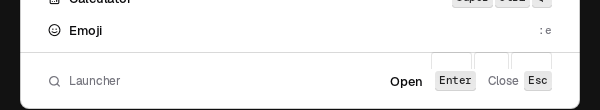

# Real use findings, 2026-10-09

An exploratory pass driving the shell by hand rather than by IPC: real keys through compositor binds (wtype), a real virtual pointer (wlrctl), frame bursts read by eye and by frame diff. One run on g815 nested (r1, before g815 dropped off the network at 08:29), the rest on the mac VM rig under `--pantheon`, with and without `FS_CPU_QUOTA=10% FS_CPU_QUOTA_PERIOD=2ms`. The session is replayed by `dev/smoke.d/use.sh` (`--use`), which asserts every fixed glitch below.

Final runs: `dev/vm-lock.sh just vm-smoke --pantheon --use` passes, and passes again under the quota.

## Fixed

| What you see | Cause | Commit |
| --- | --- | --- |
| Press the launcher key after closing the launcher with Escape: nothing opens, and what you type next lands in the focused window. | Escape at the root returned `Close` from `pop` without closing the model, so the next toggle "closed" an invisible launcher. | `fix(rs): close the launcher's model when Escape at the root closes the card` |
| Click one bar cell, then another: every second click does nothing, the open panel just closes. | The panel's full-output Overlay surface covers the bar and took the click as an outside dismiss. | `fix(rs): leave the bar strip out of an open panel's input region instead of re-routing its clicks` (replaces the earlier re-routing commit) |
| Click a cell three times fast: one round in five ends with the panel shut. | Same surface: the third click landed on it while it unmapped and was lost. | same commit |
| Change the wallpaper or flip the theme: the whole bar blanks for a frame, then every cell grows back out of nothing. | `Bar::set_theme` rebuilt every slot and the next read animated each one in from width 0. | `fix(rs): place rebuilt bar cells at once instead of growing every one on a theme change` |
| Flip dark/light with the launcher or a panel open: the card keeps its old fill under the new ink, so its words vanish. | `Card`'s look was resolved once at build; nothing restyled an open card (the launcher's compositor-carried corners included). | `fix(rs): restyle an open launcher, panel or second bar card on a theme change` |
| Click the chevron: its tooltip pops up over the second bar it just opened. | The tooltip's dwell kept running through the open, and nothing held a bar tooltip off an open card. | `fix(rs): keep a bar tooltip off the card a cell just opened` |

## Not fixed

### Launcher footer shows blank key chips under its rule

Three empty key-chip outlines sit between the footer rule and the footer row, in both modes, at rest. They line up with the next suggestion row's chips, which is past the body's clip.

Not root-caused. The body draws under `viewport ∩ clip` and the scene honours node clips, so the likeliest cause is stale pixels from the card's entrance (a clip that was larger mid-emerge, and no later damage over that band). That is the launcher open path, which another agent owns today.

### First entry into the Emoji level stalls the event loop

Under the quota, the first Enter on Emoji spent 240 ms in launcher layout (`event loop: slow launcher t=19800ms layout_us=239918`, `present_us=263300`), right after `text: face "Noto Color Emoji Regular" 26px` loaded. 47 ms on the unthrottled VM. The face and the grid's glyphs are shaped on the loop on first use; the text warmer does not cover the emoji face.

### A theme flip takes about 4 s to reach an open panel under the quota

The launcher card takes the new fill in 0.5 to 0.9 s with or without the quota; the calendar card took 3.6 to 4.0 s under it (0.8 to 0.9 s without), with a wallpaper change's matugen run a few seconds ahead of it. matugen runs inside the shell's own CPU scope, so on e1504g in power saver a second recolour queues behind the first. Measured, not investigated further.

### Slow presents

Over one `--use` run: 71 slow presents on the VM (p50 12 ms, p90 26 ms, max 220 ms), 178 to 198 under the quota (p50 22 ms, p90 82 ms, max 331 ms at startup, 263 ms on the Emoji entry above, 175 ms on a calendar open over a closing media panel). The VM renders on llvmpipe, so these are relative, not budgets.

## Not glitches, noted

- A panel stays open under the launcher, and is still there after Escape closes the launcher. Behaviour call, left as is.
- With a normal and a critical toast stacked, the collapsed stack shows the critical alone. Matches `--notify`'s front-slot rule.
